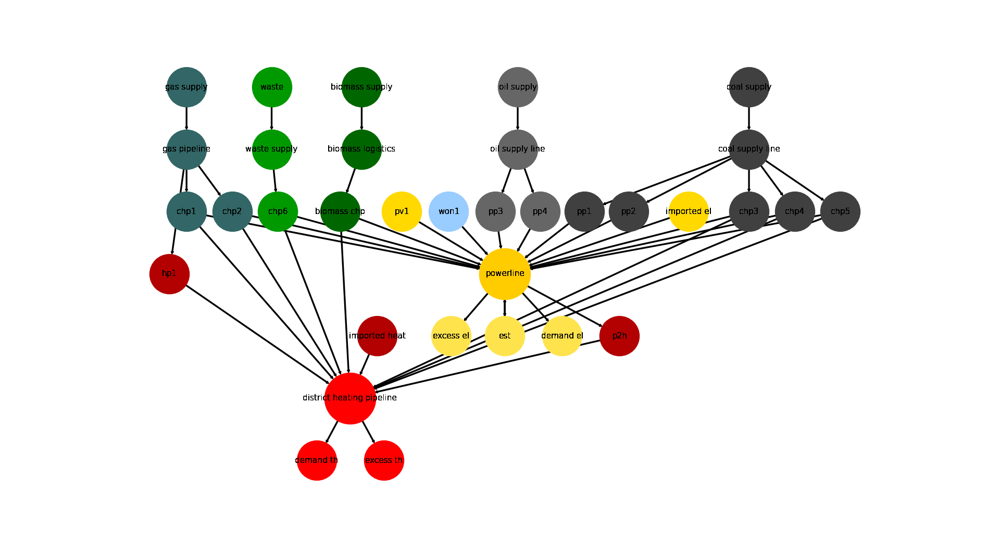

.. _Energy_Supply_Systems:

*******************************
Modelling Energy Supply Systems
*******************************

.. note::
   This section was copied from the :ref:`Introduction`, to make it easy to address the question
   'What is an energy supply system?'. For more context please take the time to read the :ref:`Introduction`.
   
In the context of tessif, an energy supply system is seen as a `graph <https://en.wikipedia.org/wiki/Graph_(discrete_mathematics)>`__. Meaning it consists of nodes and directed edges,where nodes represent abstract or generic :ref:`energy system components <Models_Tessif_Concept_ESC>` (like a powerplant, a storage unit, a houshold demanding electricity, ...) and are characterized by a certain amount of fixed parameters describing these components. Whereas the edges are representing flows between those components. In general these flows are intepreted as energy flows, but that is not enforced and could be seen as any kind of flow. For a more detailed description on the components and their possible edges, please refer to the :ref:`technical documentation of tessif's energy system model <Models_Tessif>`

.. figure:: images/6n-graph.png
   :align: center
   :alt: Image showing a 6-Node, 7-Edge Graph; Taken from Wikipedia
   :scale: 80 %
           
   A 6-Node, 7-Edge Graph; Taken from `Wikipedia <https://en.wikipedia.org/wiki/Graph_(discrete_mathematics)>`__   

This general approach implies, that tessif is suited best for modelling medium to large scale energy systems on a flow based description. Which is also what tessif's currently underlying :ref:`Energy Supply System Modelling and Optimisation Software Tools (ESSMOS tools) <SupportedModels>` are suited best for. Possible applications would range from optimizing a singular house hold's energy system up to something like the integrated European network.

           
   The visualized energy system, taken from the :ref:`Hamburg Energy System Example <AutoCompare_HH>`
   
On the most (sensible) level of detail, singular participants are represented by an individual node, like a power plant, a solar panel, a battery electric vehicle, etc. On the other end of scale it is also possible aggregating multiple individual participants into a single component, like for example the aggrgation of all german hard coal fired power plants into a single component (node). Which is a common technique in energy supply system modelling.

Although possible, it does not really make sense, to model complex electromechanical systems, like i.e. a micro-chp. Because the currently :ref:`SupportedModels` (which are actually conducting the optimization) are not made for this.

Optimization in this context usually means trying to anwer one or both of the following questions:

  1. Which of the available and controllable components is used when and how much to fullfill a certain amount of energy demand, while minimizing costs and respecting component and energy transportation constraints as well as potential secondary objectives like an emission-goal? These kind of problems are roughly desribed as `unit commitment problem <https://en.wikipedia.org/wiki/Unit_commitment_problem_in_electrical_power_production>`_ or short ``commitment problem``.

  2. Which of the available or new components have to be expanded to reach certain secondary objectives like an emission goal, whil minimizing the costs to do so, as well as respecting given component and transportation constraints, while still meeting all the energy demands? These kind of problems can described as `expansion planning <https://en.wikipedia.org/wiki/Generation_expansion_planning>`_ or ``expansion problem``.

For additional information on typical use cases of energy supply system optimisations see the guide on :ref:`Visualization`. The use cases are discussed there, showing the python code (using tessif) with which they were created as well as how their results can be visualized (again using tessif). A brief exaplanation on how and why those topics are of interest preceeds each of the use cases.

As mentioned in :ref:`the section describing tessif's purpose <Introduction_Purpose>`, tessif itself actually focuses on creating a framework (much like a common ground), rather than on energy supply system optimisation model. It's main focus lies on data in- and output unifications as well as data transformation, to provide a unifrom, powerfull and engineer's friendly interface to conduct energy supply system simulation and :ref:`compare <Comparison>` popular free open source models addressing this task. For more details, on data handling, please refer to the user guide (see navigation bar to the left).
