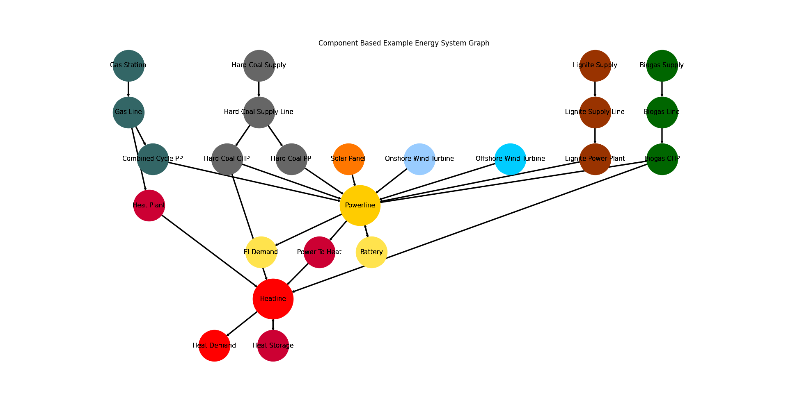

.. _Examples_Application_Components:

Component Focused Model Scenario Combinations
*********************************************
When comparing energy system simulation models it makes sense to establish a
common test base on which they can actually be compared.

The :mod:`Application/scenarios <tessif.examples.application.component_scenarios>`
example module aggregates explanatory details on how to use tessif's
:mod:`comparing <tessif.analyze>` utilities on a set of component based bench
mark scenarios to obtain meaningful results.

Further more it illustrates how these utilities can be used in a scientific context.

.. contents:: Contents
   :local:
   :backlinks: top

Introduction
============
This section provides two scenarios as component based scenarios trying to answer question
regarding the most cost efficient commitment of all the installed components and the 
most cost efficient commitment as well as expansion with given CO2-emission constraints.

These scenarios do not try to mimic any existing energy supply systems, 
but rather follow a more general approach to cover the most common use cases.
Thus the energy system contains fossil energy sources as well as renewable and 
a heat sector next to the power sector which are coupled through combined heat 
and power plants and a power to heat transformer. 

These scenarios are simulated using native oemof and pypsa as well as oemof
and pypsa through tessif and then compared among one another. 

Reference Energy Systems
========================
Both scenarios are developed into one tessif energy system. In native pypsa they are managed to
be put into one energy system as well. Native oemof needs them to be two separat energy systems
due to oemofs parametrisation when using investment. The energy system contains
four renewable energy sources (solar power, wind on- and offshore and biogas), three 
fossil energy sources (hard coal, lignite and gas), a storage at each sector and one 
sector coupling power-to-heat transformer. The biogas source is feeding a combined heat 
and power biogas plant, while the other renewable sources are directly connected 
to the powerline. The lignite source is feeding a common lignite power plant. The hard coal 
source feeds a common hard coal power plant as well as a combined heat and power plant.
The gas source feeds a heat plant and a combined cycle power plant.
The buses are assumed to be ideal, without any costs nor losses.

The default when creating the component based energy system is the dispatch scenario with
3 time steps. 
:mod:`create_component_es <tessif.examples.data.tsf.py_hard.create_component_es>` - 
For further explanation on the inputs and their defaults.

Energy System Graph
-------------------
>>> import matplotlib.pyplot as plt
>>> import tessif.visualize.nxgrph as nxv
>>> import tessif.examples.data.tsf.py_hard as tsf_py

>>> tsf_es = tsf_py.create_component_es()
>>> grph = tsf_es.to_nxgrph()
>>> drawing_data = nxv.draw_graph(
...     grph,
...     node_color={
...        'Hard Coal Supply': '#666666',
...        'Hard Coal Supply Line': '#666666',
...        'Hard Coal PP': '#666666',
...        'Hard Coal CHP': '#666666',
...        'Solar Panel': '#FF7700',
...        'Heat Storage': '#cc0033',
...        'Heat Demand': 'Red',
...        'Heat Plant': '#cc0033',
...        'Heatline': 'Red',
...        'Power To Heat': '#cc0033',
...        'Biogas CHP': '#006600',
...        'Biogas Line': '#006600',
...        'Biogas Supply': '#006600',
...        'Onshore Wind Turbine': '#99ccff',
...        'Offshore Wind Turbine': '#00ccff',
...        'Gas Station': '#336666',
...        'Gas Line': '#336666',
...        'Combined Cycle PP': '#336666',
...        'El Demand': '#ffe34d',
...        'Battery': '#ffe34d',
...        'Powerline': '#ffcc00',
...        'Lignite Supply': '#993300',
...        'Lignite Supply Line': '#993300',
...        'Lignite Power Plant': '#993300',
...      },
...     node_size={
...        'Powerline': 5000,
...        'Heatline': 5000
...    },
...      title='Component Based Example Energy System Graph',
... )
>>> # plt.show()  # commented out for simpler doctesting

Component Dispatch
------------------
Within the component dispatch question there is no expansion allowed neither is 
there a CO2-emission constraint. The simulation aims to present the most cost efficient
commitment of the given installed capacities of power and heat plants including renewable
energy sources. The energy grid is assumed to be ideal without any costs nor losses and beeing
capable of handling all energy flows.

Component Expansion
-------------------
Within the component expansion there is the same given capacities like in the dispatch scenario,
but with capacity expansion beeing allowed. The simulation aims to present the most cost efficient
installed capacities while meeting a given CO2-emission constraint. The CO2-emission constraint is
choosen after the analysis of the emission results of the dispatch scenario. The limit is 250000 tons
of CO2, which is round about 4 % of the emissions of the dispatch scenario.

Model Results
=============
The results will be split into the component dispatch problem results which are provided first
and the components expansion problem results which are provided after.

Component Dispatch
------------------
Native oemof and tessif oemof
^^^^^^^^^^^^^^^^^^^^^^^^^^^^^
>>> # Import hardcoded tessif and oemof energy systems as well as transformation utilities
>>> import tessif.examples.data.tsf.py_hard as tsf_py
>>> import tessif.examples.data.omf.py_hard as omf_py
>>> from tessif.transform.es2es import omf as tsf2omf

>>> # create dispatch problem energy system
>>> tsf_es = tsf_py.create_component_es(expansion_problem=False, periods=8760)
>>> # native oemof will already do the simulation which might take a minute
>>> native_omf_es = omf_py.create_commitment_scenario(periods=8760)

>>> # transform tessif energy system into oemof energy system
>>> tessif_oemof_es = tsf2omf.transform(tsf_es)

>>> # Import the simulation utility and simulate
>>> # Oemof needs like a minute for this simulation
>>> import tessif.simulate as simulate
>>> optimized_oemof_es = simulate.omf_from_es(tessif_oemof_es)

>>> # Import the post processing utilities and conduct the post processing:
>>> from tessif.transform.es2mapping import omf as post_process_oemof
>>> tessif_oemof_load_results = post_process_oemof.LoadResultier(optimized_tessif_oemof_es)

>>> # Tessif outputs are negative for flows inside the bus (Powerline)
>>> # and positive for outflows
>>> print(tessif_oemof_load_results.node_load['Powerline'].sum())
Powerline
Battery                  0.000000e+00
Biogas CHP               0.000000e+00
Combined Cycle PP       -3.194906e+04
Hard Coal CHP           -1.107094e+06
Hard Coal PP            -2.067862e+06
Lignite Power Plant     -4.132600e+06
Offshore Wind Turbine    0.000000e+00
Onshore Wind Turbine    -2.081333e+06
Solar Panel             -3.886681e+05
Battery                  0.000000e+00
El Demand                9.809506e+06
Power To Heat            0.000000e+00

>>> # native oemof system outputs are usually positive
>>> from oemof import solph
>>> print(solph.views.node(native_omf_es.results['main'], "electricity")["sequences"].sum())
((battery, electricity), flow)               0.000000e+00
((chp_biogas, electricity), flow)            0.000000e+00
((chp_hard_coal, electricity), flow)         1.107094e+06
((electricity, battery), flow)               0.000000e+00
((electricity, electricity_demand), flow)    9.809506e+06
((electricity, p2h), flow)                   0.000000e+00
((pp_gas, electricity), flow)                3.194906e+04
((pp_hard_coal, electricity), flow)          2.081319e+06
((pp_lignite, electricity), flow)            4.132600e+06
((pv, electricity), flow)                    3.752107e+05
((wind_off, electricity), flow)              0.000000e+00
((wind_on, electricity), flow)               2.081333e+06

>>> print(tessif_oemof_load_results.node_load['Heatline'].sum())
Heatline
Biogas CHP       0.000000e+00
Hard Coal CHP   -1.107094e+06
Heat Plant      -1.009905e+04
Heat Storage    -2.448138e+03
Power To Heat    0.000000e+00
Heat Demand      1.116163e+06
Heat Storage     3.478824e+03

>>> print(solph.views.node(native_omf_es.results['main'], "hot_water")["sequences"].sum())
((chp_biogas, hot_water), flow)        0.000000e+00
((chp_hard_coal, hot_water), flow)     1.107094e+06
((heat_plant, hot_water), flow)        1.009905e+04
((heat_storage, hot_water), flow)      2.448138e+03
((hot_water, heat_storage), flow)      3.478824e+03
((hot_water, thermal_demand), flow)    1.116163e+06
((p2h, hot_water), flow)               0.000000e+00

>>> ig_resultier = post_process_oemof.IntegratedGlobalResultier(optimized_tessif_oemof_es)
>>> print(ig_resultier.global_results)
{'emissions (sim)': 6813556.0, 'costs (sim)': 688509325.0, 'opex (ppcd)': 688509325.0, 'capex (ppcd)': 0.0}
>>> print(native_omf_es.results['global'])
{'emissions': 6823648.713791143, 'costs': 688509325.3305503}

Emissions vary due to the Solar Panels and Hard Coal PP having same costs but different emissions. Flow
results as well as the global results costs are the same.

Native pypsa and tessif pypsa
^^^^^^^^^^^^^^^^^^^^^^^^^^^^^
>>> # Import hardcoded tessif and pypsa energy system as well as transformation utilities
>>> import tessif.examples.data.tsf.py_hard as tsf_py
>>> import tessif.examples.data.pypsa.py_hard as ppsa_py
>>> from tessif.transform.es2es import ppsa as tsf2pypsa

>>> # create dispatch problem energy system
>>> tsf_es = tsf_py.create_component_es(expansion_problem=False, periods=8760)
>>> # native pypsa will already do the simulation which might take a minute
>>> native_ppsa_es = ppsa_py.create_component_scenario(expansion_problem=False, periods=8760)

>>> # PyPSA handles chp's different and needs the emissions to be in the source to be recognised
>>> # thus for the tessif system chp emissions are removed from chp and relocated in source with a hook
>>> reparameterized_es = reparameterize_components(
...     es=tsf_es,
...     components={
...         'Hard Coal CHP': {
...             'flow_emissions': {'Hard_Coal': 0, 'electricity': 0, 'hot_water': 0},
...         },
...         'Hard Coal Supply': {
...             'flow_emissions': {'Hard_Coal': 0.8 * 0.4 + 0.06 * 0.4},
...         },
...         'Biogas CHP': {
...             'flow_emissions': {'biogas': 0, 'electricity': 0, 'hot_water': 0},
...         },
...         'Biogas Supply': {
...             'flow_emissions': {'biogas': 0.25 * 0.4 + 0.01875 * 0.5},
...         },
...     },
... )

>>> # transform tessif energy system into pypsa energy systems
>>> tsf_pypsa_es = tsf2pypsa.transform(reparameterized_es)

>>> # Import the simulation utility and simulate
>>> # Pypsa needs like a minute for simulation
>>> import tessif.simulate as simulate
>>> optimized_tsf_pypsa_es = simulate.ppsa_from_es(tsf_pypsa_es)

>>> # Import the post processing utilities and conduct the post processing:
>>> from tessif.transform.es2mapping import ppsa as post_process_pypsa
>>> tsf_pypsa_load_results = post_process_pypsa.LoadResultier(optimized_tsf_pypsa_es)

>>> # tessif prints out inflows in bus (here Powerline) negative and outflows positive
>>> print(tsf_pypsa_load_results.node_load['Powerline'].sum())
Powerline
Battery                  0.000000e+00
Biogas CHP               0.000000e+00
Combined Cycle PP       -3.194906e+04
Hard Coal CHP           -1.107094e+06
Hard Coal PP            -2.094457e+06
Lignite Power Plant     -4.132600e+06
Offshore Wind Turbine    0.000000e+00
Onshore Wind Turbine    -2.081333e+06
Solar Panel             -3.620733e+05
Battery                  0.000000e+00
El Demand                9.809506e+06
Power To Heat            0.000000e+00

>>> print(tsf_pypsa_load_results.node_load['Heatline'].sum())
Heatline
Biogas CHP       0.000000e+00
Hard Coal CHP   -1.107094e+06
Heat Plant      -1.009905e+04
Heat Storage    -2.448138e+03
Power To Heat    0.000000e+00
Heat Demand      1.116163e+06
Heat Storage     3.478824e+03

>>> # native pypsa doesnt sort them by bus but by node class
>>> # Note: hard_coal_source and biogas_source are the sources for the chp's
>>> print(native_ppsa_es.generators_t.p.sum())
name
PV                  3.920436e+05
Wind_onshore        2.081333e+06
Wind_offshore       0.000000e+00
lignite_pp          4.132600e+06
gas_pp              3.194906e+04
heat_plant          1.009905e+04
hard_coal_pp        2.064487e+06
hard_coal_source    2.767736e+06
biogas_source       0.000000e+00
>>> # for links the chp's have source as bus 0, powerline as 1 and healine as 2.
>>> # power to heat has powerline as bus 0 and healine as 1 (pX is flow in bus X)
>>> print(native_ppsa_es.links_t.p1.sum())
name
hard_coal_chp   -1.107094e+06
biogas_chp       0.000000e+00
power_to_heat    0.000000e+00
>>> print(natives_ppsa_es.links_t.p2.sum())
hard_coal_chp   -1.107094e+06
biogas_chp       0.000000e+00
power_to_heat    0.000000e+00

>>> # need some adjustment to make sum of in and outflow of storages
>>> battery_in = 0
>>> battery_out = 0
>>> heatstorage_in = 0
>>> heatstorage_out = 0
>>> for i in range(len(native_ppsa_es.storage_units_t.p['Battery'])):    
...     if natives_ppsa_es.storage_units_t.p['Battery'][i] < 0:
...         battery_in += native_ppsa_es.storage_units_t.p['Battery'][i] 
...     else:
...         battery_out += native_ppsa_es.storage_units_t.p['Battery'][i] 
...     if natives_ppsa_es.storage_units_t.p['Heat_Storage'][i] < 0:
...         heatstorage_in += native_ppsa_es.storage_units_t.p['Heat_Storage'][i]
...     else:
...         heatstorage_out += native_ppsa_es.storage_units_t.p['Heat_Storage'][i]
>>> print(f'battery_in {battery_in}' '\n' f'battery_out {battery_out}' '\n' f'heatstorage_in {heatstorage_in}' '\n' f'heatstorage_out {heatstorage_out}')
battery_in 0
battery_out 0.0
heatstorage_in -3478.8239894759986
heatstorage_out 2448.1375449000006

>>> # native pypsa only has the cost optimum output
>>> ig_resultier = post_process_pypsa.IntegratedGlobalResultier(optimized_tsf_pypsa_es)
>>> print(ig_resultier.global_results)
{'emissions (sim)': 6833502.0, 'costs (sim)': 688509325.0, 'opex (ppcd)': 688509325.0, 'capex (ppcd)': 0.0}
>>> print(native_ppsa_es.objective)
688509325.3

Flows only vary due to the Solar Panels and Hard Coal PP having same costs but different emissions. 
Other flow
results as well as the global results costs are the same.

Component Expansion
-------------------
Native oemof and tessif oemof
^^^^^^^^^^^^^^^^^^^^^^^^^^^^^
>>> # Import hardcoded tessif and oemof energy system as well as transformation utilities
>>> import tessif.examples.data.tsf.py_hard as tsf_py
>>> import tessif.examples.data.omf.py_hard as omf_py
>>> from tessif.transform.es2es import omf as tsf2omf

>>> # create expansion problem energy system
>>> tsf_es = tsf_py.create_component_es(expansion_problem=True, periods=8760)
>>> # native oemof will already do the simulation which might take like 25 minutes
>>> native_omf_es, natives_model = omf_py.create_expansion_scenario(periods=8760)

>>> # transform tessif energy system into oemof energy system
>>> tsf_oemof_es = tsf2omf.transform(tsf_es)

>>> # Import the simulation utility and simulate
>>> # Note that simulation of 8760 time steps take some time 
>>> # Oemof needs like 25 min
>>> import tessif.simulate as simulate
>>> optimized_tsf_oemof_es = simulate.omf_from_es(tsf_oemof_es)

>>> # Import the post processing utilities and conduct the post processing:
>>> from tessif.transform.es2mapping import omf as post_process_oemof
>>> tsf_oemof_load_results = post_process_oemof.LoadResultier(optimized_tsf_oemof_es)

>>> # Tessif outputs are negative for flows inside the bus (Powerline)
>>> # and positive for outflows
>>> print(tsf_oemof_load_results.node_load['Powerline'].sum())
Powerline
Battery                 -5.914256e+04
Biogas CHP              -6.647068e+04
Combined Cycle PP       -1.151262e+04
Hard Coal CHP            0.000000e+00
Hard Coal PP             0.000000e+00
Lignite Power Plant      0.000000e+00
Offshore Wind Turbine   -4.796681e+05
Onshore Wind Turbine    -1.009042e+07
Solar Panel             -2.420605e+05
Battery                  6.968114e+04
El Demand                9.809506e+06
Power To Heat            1.070092e+06

>>> # native oemof system outputs are usually positive
>>> from oemof import solph
>>> print(solph.views.node(natives_omf_es.results['main'], "electricity")["sequences"].sum())
(('battery', 'electricity'), 'flow')               5.914263e+04
(('chp_biogas', 'electricity'), 'flow')            6.647069e+04
(('chp_hard_coal', 'electricity'), 'flow')         0.000000e+00
(('electricity', 'battery'), 'flow')               6.968190e+04
(('electricity', 'electricity_demand'), 'flow')    9.809506e+06
(('electricity', 'p2h'), 'flow')                   1.070091e+06
(('pp_gas', 'electricity'), 'flow')                1.151262e+04
(('pp_hard_coal', 'electricity'), 'flow')          0.000000e+00
(('pp_lignite', 'electricity'), 'flow')            0.000000e+00
(('pv', 'electricity'), 'flow')                    2.420606e+05
(('wind_off', 'electricity'), 'flow')              4.796968e+05
(('wind_on', 'electricity'), 'flow')               1.009040e+07

>>> print(tsf_oemof_load_results.node_load['Heatline'].sum())
Biogas CHP       -8.308835e+04
Hard Coal CHP     0.000000e+00
Heat Plant        0.000000e+00
Heat Storage     -1.099285e+05
Power To Heat    -1.059391e+06
Heat Demand       1.116163e+06
Heat Storage      1.362450e+05

>>> print(solph.views.node(natives_omf_es.results['main'], "hot_water")["sequences"].sum())
(('chp_biogas', 'hot_water'), 'flow')        8.308836e+04
(('chp_hard_coal', 'hot_water'), 'flow')     0.000000e+00
(('heat_plant', 'hot_water'), 'flow')        0.000000e+00
(('heat_storage', 'hot_water'), 'flow')      1.099286e+05
(('hot_water', 'heat_storage'), 'flow')      1.362440e+05
(('hot_water', 'thermal_demand'), 'flow')    1.116163e+06
(('p2h', 'hot_water'), 'flow')               1.059390e+06

>>> ig_resultier = post_process_oemof.IntegratedGlobalResultier(optimized_tessif_oemof_es)
>>> print(ig_resultier.global_results)
{'emissions (sim)': 250000, 'costs (sim)': 42289118239, 'opex (ppcd)': 734140362, 'capex (ppcd)': 41554977878}
>>> print(natives_omf_es.results['global'])
{'emissions': 249999.9999789219, 'costs': 42289107830.93603, 'capex': 41554966192.375}

Differenzes in flow and costs results are very small and most likely due to different rounding.

Native pypsa and tessif pypsa
^^^^^^^^^^^^^^^^^^^^^^^^^^^^^
>>> # Import hardcoded tessif energy system as well as transformation utility
>>> import tessif.examples.data.tsf.py_hard as tsf_py
>>> import tessif.examples.data.pypsa.py_hard as ppsa_py
>>> from tessif.transform.es2es import ppsa as tsf2pypsa

>>> # create expansion problem energy system
>>> tsf_es = tsf_py.create_component_es(expansion_problem=True, periods=8760)
>>> # native pypsa will already do the simulation which might take like 10 minutes
>>> natives_ppsa_es = ppsa_py.create_component_scenario(expansion_problem=True, periods=8760)

>>> # PyPSA handles chp's different and needs the emissions to be in the source to be recognised
>>> # thus tessif system chp emissions are removed from chp and relocated in source with a hook
>>> reparameterized_es = reparameterize_components(
...     es=tsf_es,
...     components={
...         'Hard Coal CHP': {
...             'flow_emissions': {'Hard_Coal': 0, 'electricity': 0, 'hot_water': 0},
...         },
...         'Hard Coal Supply': {
...             'flow_emissions': {'Hard_Coal': 0.8 * 0.4 + 0.06 * 0.4},
...         },
...         'Biogas CHP': {
...             'flow_emissions': {'biogas': 0, 'electricity': 0, 'hot_water': 0},
...         },
...         'Biogas Supply': {
...             'flow_emissions': {'biogas': 0.25 * 0.4 + 0.01875 * 0.5},
...         },
...     },
... )

>>> # transform tessif energy system pypsa energy system
>>> tsf_pypsa_es = tsf2pypsa.transform(reparameterized_es)

>>> # Import the simulation utility and simulate
>>> # Pypsa needs like 10 minutes for this simulation
>>> import tessif.simulate as simulate
>>> optimized_tsf_pypsa_es = simulate.ppsa_from_es(tsf_pypsa_es)

>>> # Import the post processing utilities and conduct the post processing:
>>> from tessif.transform.es2mapping import ppsa as post_process_pypsa
>>> tsf_pypsa_load_results = post_process_pypsa.LoadResultier(optimized_tsf_pypsa_es)

>>> # tessif prints out inflows in bus (here Powerline) negative and outflows positive
>>> print(tsf_pypsa_load_results.node_load['Powerline'].sum())
Powerline
Battery                 -2.422750e+05
Biogas CHP              -7.381685e+04
Combined Cycle PP       -1.819117e+04
Hard Coal CHP            0.000000e+00
Hard Coal PP             0.000000e+00
Lignite Power Plant      0.000000e+00
Offshore Wind Turbine   -7.330595e+05
Onshore Wind Turbine    -9.880008e+06
Solar Panel             -2.282730e+05
Battery.1                2.902818e+05
El Demand                9.809506e+06
Power To Heat            1.075836e+06

>>> print(tsf_pypsa_load_results.node_load['Heatline'].sum())
Heatline
Biogas CHP       -9.227106e+04
Hard Coal CHP     0.000000e+00
Heat Plant        0.000000e+00
Heat Storage     -1.507452e+05
Power To Heat    -1.065078e+06
Heat Demand       1.116163e+06
Heat Storage.1    1.919312e+05

>>> # native pypsa doesnt sort them by bus but by node class
>>> # Note: hard_coal_source and biogas_source are the sources for the chp's
>>> print(natives_ppsa_es.generators_t.p.sum())
name
PV                  2.282730e+05
Wind_onshore        9.880008e+06
Wind_offshore       7.330595e+05
lignite_pp          0.000000e+00
gas_pp              1.819117e+04
heat_plant          0.000000e+00
hard_coal_pp        0.000000e+00
hard_coal_source    0.000000e+00
biogas_source       1.845421e+05

>>> # for links the chp's have source as bus 0, powerline as 1 and healine as 2.
>>> # power to heat has powerline as bus 0 and healine as 1 (pX is flow in bus X)
>>> print(natives_ppsa_es.links_t.p1.sum())
name
hard_coal_chp    0.000000e+00
biogas_chp      -7.381685e+04
power_to_heat   -1.065072e+06
>>> print(natives_ppsa_es.links_t.p2.sum())
hard_coal_chp        0.000000
biogas_chp      -92271.058575
power_to_heat        0.000000

>>> # need some adjustment to make sum of in and outflow of storages
>>> battery_in = 0
>>> battery_out = 0
>>> heatstorage_in = 0
>>> heatstorage_out = 0
>>> for i in range(len(natives_ppsa_es.storage_units_t.p['Battery'])):    
...     if natives_ppsa_es.storage_units_t.p['Battery'][i] < 0:
...         battery_in += natives_ppsa_es.storage_units_t.p['Battery'][i] 
...     else:
...         battery_out += natives_ppsa_es.storage_units_t.p['Battery'][i] 
...     if natives_ppsa_es.storage_units_t.p['Heat_Storage'][i] < 0:
...         heatstorage_in += natives_ppsa_es.storage_units_t.p['Heat_Storage'][i]
...     else:
...         heatstorage_out += natives_ppsa_es.storage_units_t.p['Heat_Storage'][i]
>>> print(f'battery_in {battery_in}' '\n' f'battery_out {battery_out}' '\n' f'heatstorage_in {heatstorage_in}' '\n' f'heatstorage_out {heatstorage_out}')
battery_in -290287.44188449
battery_out 242275.03165515
heatstorage_in -191931.22201674985
heatstorage_out 150750.83110155998

>>> # native pypsa only has the cost optimum output
>>> ig_resultier = post_process_pypsa.IntegratedGlobalResultier(optimized_tsf_pypsa_es)
>>> print(ig_resultier.global_results)
{'emissions (sim)': 265508.0, 'costs (sim)': 37727776780.0, 'opex (ppcd)': 823007842.0, 'capex (ppcd)': 36904768288.0}
>>> print(natives_ppsa_es.objective)
37727776780.0

Differenzes in flow and costs results are very small and most likely due to different rounding.
Not matching the emission constraint of 250000 because pypsa calculates storage and links emissions different.

Conclusion
==========
The tessif to oemof energy system transformation works as expected which can be seen at the 
similar and constraints fitting restults. The tessif to pypsa energy system transformation 
also works, but pypsa handles emissions way different causing the results as tessif analisys 
them to differ from the constraints. This results from pypsa only calculating the source and 
storage emissions following in the sector coupling power to heat components emission beeing 
ignored. Also the storage emissions are not calculated as flow emissions in pypsa but as stored 
emissions. Meaning the inital and final state of charge (soc) beeing compared and then multiplied
by the emission factor. This causes pypsa to have higher storage soc in the final time step than 
in the start making the storage component store emissions as the calculation 
((inital_soc - final_soc)*emission) results in negativ overall emissions.

Used Utilities
==============

.. automodule:: tessif.examples.application.component_scenarios
   :members:
