.. _Application_Statistical:

Identifcation of Differences
****************************

When comparing energy supply system modelling results between different
softwares, load results for the exact same component may differ between those
softwares,

The :mod:`Application/timeseries_comparison <tessif.examples.application.timeseries_comparison>`
example module aggregates explanatory details on how to use tessif's
:mod:`comparing <tessif.analyze>` utilities for comparing load differences
between energy supply system modelling softwares modelling the same energy
supply system scenario combination.

.. contents:: Contents
   :local:
   :backlinks: top

Introduction
============
In order to work out differences between the results of different energy supply
system modelling tools several steps are proposed, which are laid and discussed
in the following sections.

Analyzed System-Model-Scenario-Combination
==========================================
A system-model-scenario combination (from here on `combination` or `msc`) is
represented by the tessif ennergy system :class:`class
<tessif.model.energy_system.AbstractEnergySystem>` which combines the model
itself (i.e its components, most of their parameters as well as their
interconnection) as well as the scenario formulation (i.e. timeframe,
commitment/expansion problem related parameters, as well as secodnary
constraints).

The used combination is deliberatey simple and called :attr:`statistical example msc
<tessif.examples.application.timeseries_comparison.create_hhes_basic>`.

A :attr:`generic graph representation
<tessif.visualize.dcgrph.draw_generic_graph>` of this combination can bee seen
in the figure below.

Generic Energy System Graph
---------------------------

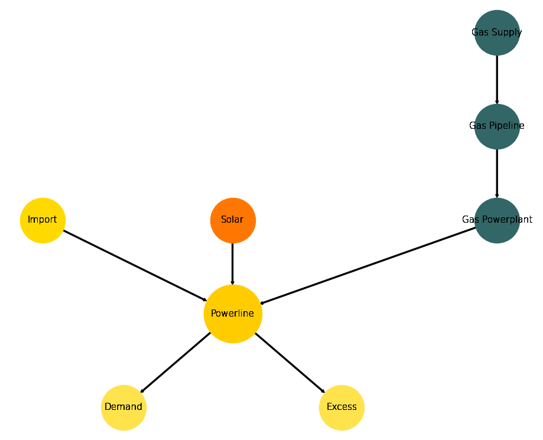

Structrured Comparison
======================

Initial code to do the comparison
---------------------------------

>>> # change spellings_logging_level to debug to declutter output
>>> import tessif.frused.configurations as configurations
>>> configurations.spellings_logging_level = 'debug'

>>> # Import hardcoded tessif energy system using the example hub:
>>> from tessif.examples.application import timeseries_comparison

>>> # Choose the underlying energy system
>>> msc = timeseries_comparison.create_statistical_example_msc()

>>> # write it to disk, so the comparatier can read it out
>>> import os
>>> from tessif.frused.paths import write_dir
>>> #
>>> output_msg = msc.to_hdf5(
...     directory=os.path.join(write_dir, 'tsf'),
...     filename='statistical_example.hdf5',
... )

>>> # let the comparatier to the auto comparison:
>>> import tessif.analyze, tessif.parse
>>> #
>>> comparatier = tessif.analyze.Comparatier(
...     path=os.path.join(write_dir, 'tsf', 'statistical_example.hdf5'),
...     parser=tessif.parse.hdf5,
...     models=('oemof', 'pypsa', 'calliope'),
... )

.. _Statistical_IGR:

Integrated Global Results
-------------------------
The poposed first step in any software based comparison is to compare
the ``high priority`` or :attr:`integrated global results
<tessif.analyze.Comparatier.integrated_global_results>`:

>>> igr_results = comparatier.integrated_global_results.drop(
...     ['time (s)', 'memory (MB)'], axis='index')
>>> igr_results
                       cllp         omf        ppsa
emissions (sim)      9881.0      9881.0      6587.0
costs (sim)      14965855.0  14965855.0  15391316.0
opex (ppcd)      14900503.0  14900503.0  15385335.0
capex (ppcd)        65348.0     65348.0      5986.0

Visualize these results as bar plots seperated in costs and emissions:

>>> # make results relative to oemof
>>> igr_relative_results = igr_results.div(igr_results['omf'], axis='index')

>>> # configure the plot
>>> mpl_config = {
...     "title": "Integrated Global Results Relative to 'Oemof'",
...     "ylabel": "",
...     "xlabel": "Result Values",
...     "rot": 0,
... }

>>> # do the plotting
>>> from tessif.visualize import igr
>>> handle = igr.plot(
...     igr_df=igr_relative_results,
...     plt_config=mpl_config,
...     ptype="bar",
... )

>>> # handle["costs"].show()

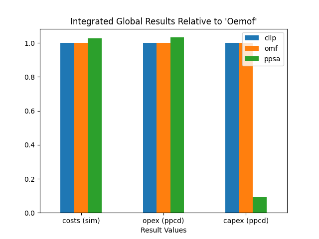

>>> # handle["non_costs"].show()	 

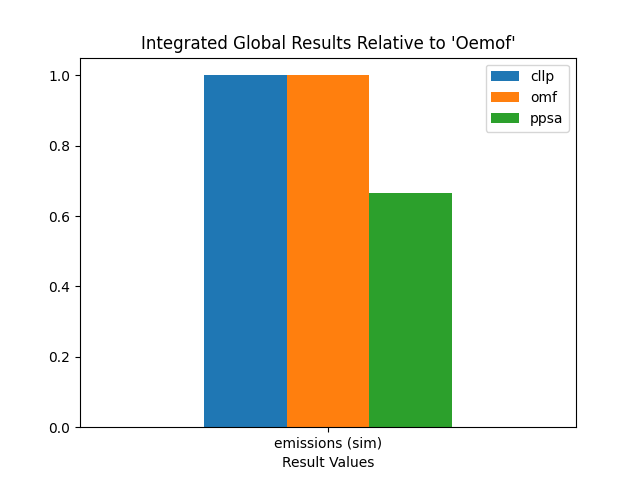

This initial comparison reveals that ``oemof`` and ``calliope`` are likely
to come to the exact same result. Whereas ``pypsa`` seems to optimize the
msc differently.
    
.. _Statistical_AGS:

Advanced Graphs
---------------

In cases general deviations are detected via the
:ref:`Integrated Global Results <Statistical_IGR>`, comparing the
attr:`Advanced Graph <tessif.visualize.dcgrph.draw_advanced_graph>` of each
software is the next proposed step. These graphs as well as their respective
code creation snippets are shown below.

Pypsa
^^^^^
Using the demand capacity and net energy flow as reference, since they are
the same among all softwares, thus facilitating inter software comparison:

>>> import tessif.transform.es2mapping.ppsa as post_process_ppsa
>>> demand_capacity = post_process_ppsa.CapacityResultier(
...     optimized_es=comparatier.energy_systems["ppsa"]).node_installed_capacity[
...         "Demand"]

>>> demand_net_energy_flow = post_process_ppsa.FlowResultier(
...     optimized_es=comparatier.energy_systems["ppsa"]).edge_net_energy_flow[
...         ("Powerline", "Demand")]

>>> print(demand_capacity)
1389.632

>>> print(demand_net_energy_flow)
27905.41

Draw the advanced graph / advanced system visualization (AGS/AVS):

>>> import tessif.visualize.dcgrph as dcv  # nopep8
>>> app = dcv.draw_advanced_graph(
...     optimized_es=comparatier.energy_systems["ppsa"],
...     # layout='style',
...     # layout_nodeDimensionsIncludeLabels=True,
...     node_shape="circle",
...     node_color={
...         'Demand': '#ffe34d',
...         'Excess': '#ffe34d',
...         'Gas Supply': '#336666',
...         'Gas Pipeline': '#336666',
...         'Gas Powerplant': '#336666',
...         'Solar': '#FF7700',
...         'Powerline': '#ffcc00',
...         'Import': '#ffd900',
...     },
...     reference_node_width=demand_capacity,
...     reference_edge_width=demand_net_energy_flow,
... )
>>> # app.run_server()

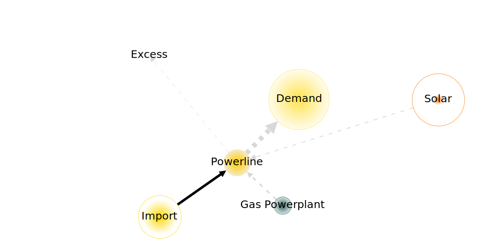

Oemof
^^^^^
Using the demand capacity and net energy flow as reference, since they are
the same among all softwares, thus facilitating inter software comparison:

>>> import tessif.transform.es2mapping.omf as post_process_omf
>>> demand_capacity = post_process_omf.CapacityResultier(
...     optimized_es=comparatier.energy_systems["omf"]).node_installed_capacity[
...         "Demand"]

>>> demand_net_energy_flow = post_process_omf.FlowResultier(
...     optimized_es=comparatier.energy_systems["omf"]).edge_net_energy_flow[
...         ("Powerline", "Demand")]

>>> print(demand_capacity)
1389.632

>>> print(demand_net_energy_flow)
27905.41

Draw the advanced graph / advanced system visualization (AGS/AVS):

>>> import tessif.visualize.dcgrph as dcv  # nopep8
>>> app = dcv.draw_advanced_graph(
...     optimized_es=comparatier.energy_systems["omf"],
...     # layout='style',
...     # layout_nodeDimensionsIncludeLabels=True,
...     node_shape="circle",
...     node_color={
...         'Demand': '#ffe34d',
...         'Excess': '#ffe34d',
...         'Gas Supply': '#336666',
...         'Gas Pipeline': '#336666',
...         'Gas Powerplant': '#336666',
...         'Solar': '#FF7700',
...         'Powerline': '#ffcc00',
...         'Import': '#ffd900',
...     },
...     reference_node_width=demand_capacity,
...     reference_edge_width=demand_net_energy_flow,
... )
>>> # app.run_server()
	 
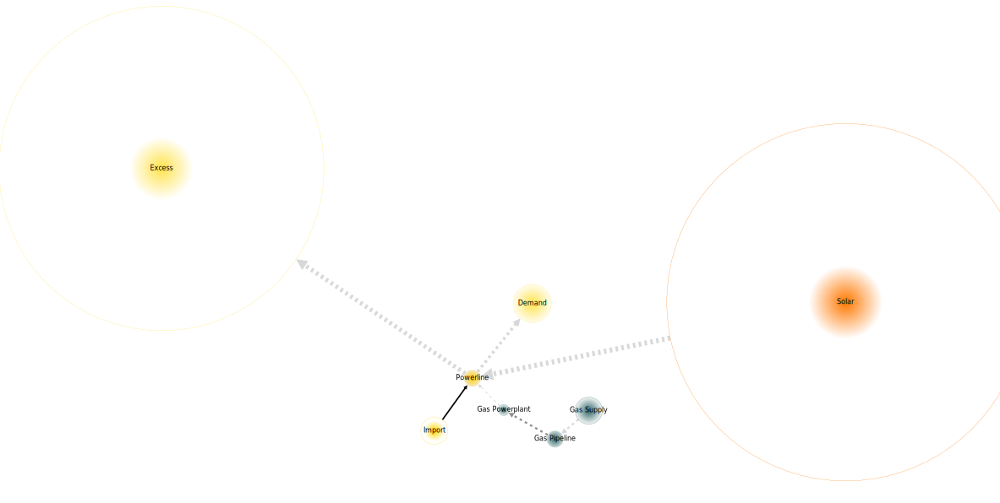
	 

Identifying Key Differences
---------------------------
Next on the list of proposed steps for inter software comparisons is the
identifcation of key differences. Wich breaks down into the tasks of
identifying differing components, as well as timeframes on which they differ.

Identifying Differing Components
^^^^^^^^^^^^^^^^^^^^^^^^^^^^^^^^
There are two different approaches to identify differing components,
synergizing well with each other. The first is to visually detect discrepancies
using the :ref:`advanced graphs <Statistical_AGS>`. The second is to use
tessif's statistical identification tools using a combination of
correlation coefficients and normalize error values.

Visual Comparison on Advanced Graphs
<<<<<<<<<<<<<<<<<<<<<<<<<<<<<<<<<<<<
Comparing the advanced graph visualizations, following deviations can be observed:

    - ``oemofs`` installed ``Solar`` capacity is far greater than that
      of ``pypsa``
    - ``omeof`` uses the  ``Excesss`` sink far more than ``pypsa``

Leading to the conclusion, that the flows ``Solar -> Powerline`` and
``Powerline -> Excess`` are probably the ones differing the most.

As well as the respective installed capacities of those two components.

Statistical Identification
<<<<<<<<<<<<<<<<<<<<<<<<<<

In order to work out differences between the results of different energy supply
system modelling softwares, several steps are necessary. First, a set of
reference results has to be declared to which the obtained results are compared
to. These reference results can be either one of the used software results or
a fictional set of average/medium results. The latter is obtained by averageing
the results of each each software for each component and timestep.

For automated identifcation :class:`tessif.identify.TimevaryingIdentificier` is
used which clusters the interest of inter component flows by calculating a
correlation coefficient (usually the `Pearson correlation Coefficient (PCC)
<https://en.wikipedia.org/wiki/Pearson_correlation_coefficient>`_) in
conjunction with a statistical error value (usually the
`Normalized Mean Average Error
<https://en.wikipedia.org/wiki/Mean_absolute_error>`_) applied to a
:paramref:`Clustering Matrix <tessif.identify.Identificier.conditions_dict>`.
In combination with respective threshold values for correlation coefficient
and error value, a level of interest is estimated in the sense of giving an
estimate of the value of futher investigations.

For the design case, the pearson correlation in conjunction with the normalized
mean average error is used on following conditions and levels of interest:

1. PCC < 0.7 and N M AE > K = 10%; High interest / significantly different:
   
   This case is of most interest to detect and diagnose differences between software
   models. A PCC of less then 0.7 implies differing dynamic component behaviour
   and a NMAE of greater equal 5% indicates that on top of the differing dynamics,
   the actually resulting differences are worth noting.

2. PCC < 0.7 and NMAE < K = 10%; Medium interest / boderline significantly different:
   
   This case can be of interest to detect and diagnose differences between software
   models but is often just a side-effect. Like above, the P CC value less than 0.7
   indicates differing diynamics. In this case however, these differences amount to
   only less than 5% in total.

3. PCC > 0.7 and NMAE > K = 10%; Medium interest / boderline significantly different:

   Like the case above, this one describes also one of potential interest. A PCC value
   greater 0.7 indicates a somewhat synchronous dispatch pattern. In conjunction
   with a relatively high NMAE of greater 5% however, this means one component
   provides significantly more energy than the other. This is often just a side-effect
   of less emitive and/or cheaper components beeing more heavily constraint (be it
   direct or indirect) within some softwares.

4. PCC > 0.7 and N M AE < K = 10%; Least interesting / most likely of no interest:
   
   This case marks the least interesting one. A PCC value greater 0.7 again implies
   a relatively synchronous dispatch pattern. In combination with a low NMAE
   this most often indicates, that the components behave very similar between the
   softwares compared.

During the identifcation process, the data is  sorted and filtered, since
particularities of certain tessif-software implementations may lead to
discrepancies in actual components present inside the supply system model. This
filtering ensures that only components are compared, that are actually present
in all supply system models.   

>>> from tessif.identify import TimevaryingIdentificier
>>> idf = TimevaryingIdentificier(
...     data=comparatier.comparative_results.all_loads,
...     error_value="nmae",
...     error_value_threshold=0.1,
...     correlation="pearson",
...     correlation_threshold=0.7,
...     # igr from above show oemof~calliope, hence reference=omf
...     reference="omf",
... )

>>> print(idf.clustered_interest)
                         cllp  omf    ppsa
Gas Powerplant Powerline  low  low    high
Import         Powerline  low  low     low
Powerline      Demand     low  low     low
               Excess     low  low    high
Solar          Powerline  low  low  medium

>>> print(idf.high)
                          ppsa
Gas Powerplant Powerline  high
Powerline      Excess     high

>>> print(idf.medium)
                   ppsa
Solar Powerline  medium

In addition to the prior identified flows ``Solar -> Powerline`` and
``Powerline -> Excess`` the flow ``Gas Powerplant -> Powerline`` is also
recommended to be worth investigating.

Timevarying Result Data of Identified Components
<<<<<<<<<<<<<<<<<<<<<<<<<<<<<<<<<<<<<<<<<<<<<<<<
To inspect the time varying result data (load results in this case) tessif
offers two options:

>>> high_interest_flows = tuple(idf.high.index)
>>> print(high_interest_flows)
(('Gas Powerplant', 'Powerline'), ('Powerline', 'Excess'))

1. Use the :attr:`Identificier
   <tessif.identify.Identificier.high_interest_results>`:

   >>> print(idf.high_interest_results[('Gas Powerplant', 'Powerline')])
                         cllp    omf       ppsa
   2019-01-01 00:00:00  400.0  400.0  400.00000
   2019-01-01 01:00:00  400.0  400.0  400.00000
   2019-01-01 02:00:00  400.0  400.0  400.00000
   2019-01-01 03:00:00  400.0  400.0  400.00000
   2019-01-01 04:00:00  400.0  400.0  400.00000
   2019-01-01 05:00:00  400.0  400.0  400.00000
   2019-01-01 06:00:00  400.0  400.0  400.00000
   2019-01-01 07:00:00  400.0  400.0  400.00000
   2019-01-01 08:00:00  400.0  400.0  400.00000
   2019-01-01 09:00:00  400.0  400.0  400.00000
   2019-01-01 10:00:00    0.0    0.0  400.00000
   2019-01-01 11:00:00    0.0    0.0  277.13932
   2019-01-01 12:00:00    0.0    0.0    0.00000
   2019-01-01 13:00:00    0.0    0.0  159.99420
   2019-01-01 14:00:00    0.0    0.0  379.51340
   2019-01-01 15:00:00  400.0  400.0  400.00000
   2019-01-01 16:00:00  400.0  400.0  400.00000
   2019-01-01 17:00:00  400.0  400.0  400.00000
   2019-01-01 18:00:00  400.0  400.0  400.00000
   2019-01-01 19:00:00  400.0  400.0  400.00000
   2019-01-01 20:00:00  400.0  400.0  400.00000
   2019-01-01 21:00:00  400.0  400.0  400.00000
   2019-01-01 22:00:00  400.0  400.0  400.00000
   2019-01-01 23:00:00  400.0  400.0  400.00000

2. Index the comparative results directly in case you are only interested
   in the results of certain softwares:

   >>> print(comparatier.comparative_results.all_loads[
   ...     "ppsa"][('Gas Powerplant', 'Powerline')])
   2019-01-01 00:00:00    400.00000
   2019-01-01 01:00:00    400.00000
   2019-01-01 02:00:00    400.00000
   2019-01-01 03:00:00    400.00000
   2019-01-01 04:00:00    400.00000
   2019-01-01 05:00:00    400.00000
   2019-01-01 06:00:00    400.00000
   2019-01-01 07:00:00    400.00000
   2019-01-01 08:00:00    400.00000
   2019-01-01 09:00:00    400.00000
   2019-01-01 10:00:00    400.00000
   2019-01-01 11:00:00    277.13932
   2019-01-01 12:00:00      0.00000
   2019-01-01 13:00:00    159.99420
   2019-01-01 14:00:00    379.51340
   2019-01-01 15:00:00    400.00000
   2019-01-01 16:00:00    400.00000
   2019-01-01 17:00:00    400.00000
   2019-01-01 18:00:00    400.00000
   2019-01-01 19:00:00    400.00000
   2019-01-01 20:00:00    400.00000
   2019-01-01 21:00:00    400.00000
   2019-01-01 22:00:00    400.00000
   2019-01-01 23:00:00    400.00000
   Name: (Gas Powerplant, Powerline), dtype: float64

Visualizing Timevarying Result Data of Identified Components
<<<<<<<<<<<<<<<<<<<<<<<<<<<<<<<<<<<<<<<<<<<<<<<<<<<<<<<<<<<<
Plotting the results for manual inspection:

>>> from tessif.visualize import component_loads

>>> axes = component_loads.step(
...     idf.high_interest_results[('Gas Powerplant', 'Powerline')])
>>> # axes.figure.show()  # commented out for doctesting

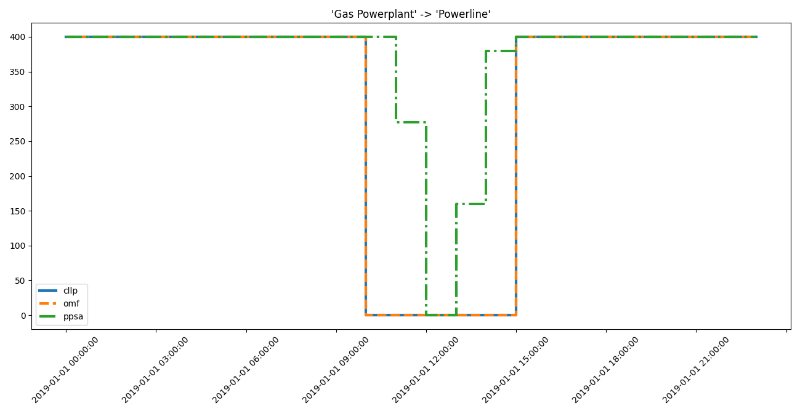

>>> axes = component_loads.step(
...     idf.high_interest_results[('Powerline', 'Excess')])
>>> # axes.figure.show()  # commented out for doctesting

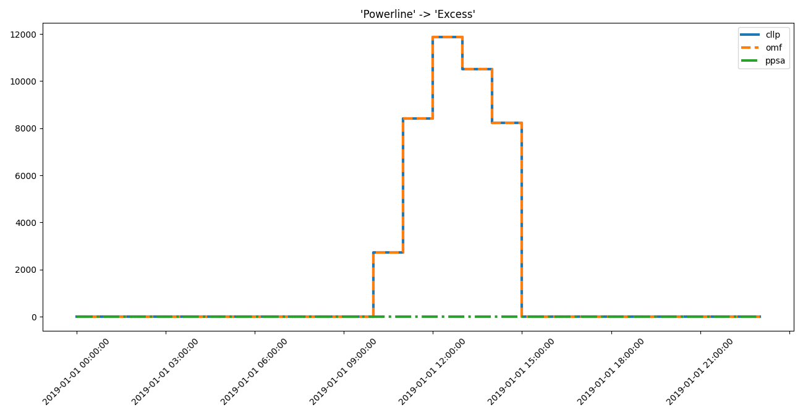

>>> axes = component_loads.step(
...     idf.medium_interest_results[('Solar', 'Powerline')])
>>> # axes.figure.show()  # commented out for doctesting

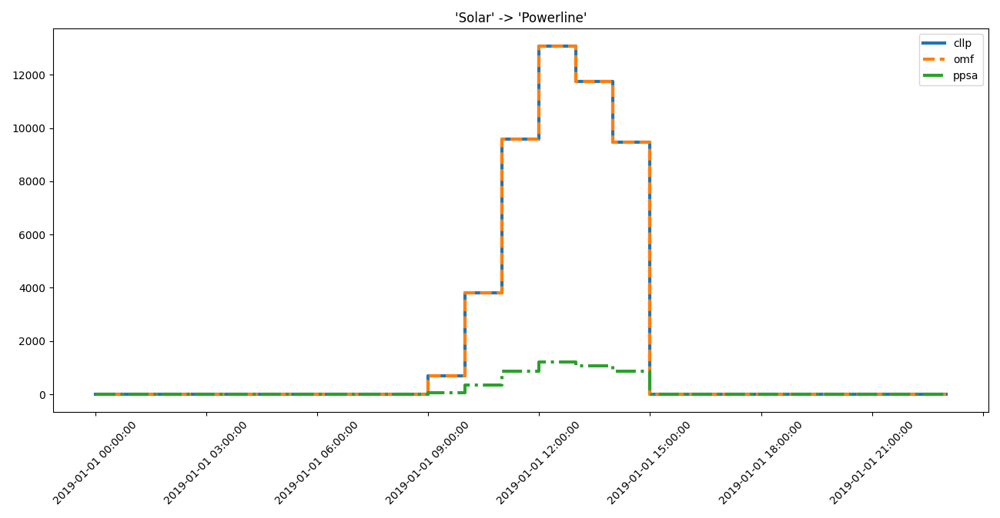

	 
Identifying Differing Timeframes
^^^^^^^^^^^^^^^^^^^^^^^^^^^^^^^^
On large scale data sets of many timesteps (e.g 8760 for a whole year of hourly
resolved results), the above method may not be the first, since there are
potentially a lot of data points where the results actually do not differ.
The :attr:`Identificier
<tessif.identify.core.Identificier.high_interest_timeframes>` however, provides
a convenient method to identify timeframes of significant difference:

>>> for dtf in idf.high_interest_timeframes[('Gas Powerplant', 'Powerline')]:
...     print(dtf)
...     print(59*"-")
                      cllp    omf       ppsa
2019-01-01 09:00:00  400.0  400.0  400.00000
2019-01-01 10:00:00    0.0    0.0  400.00000
2019-01-01 11:00:00    0.0    0.0  277.13932
2019-01-01 12:00:00    0.0    0.0    0.00000
-----------------------------------------------------------
                      cllp    omf      ppsa
2019-01-01 12:00:00    0.0    0.0    0.0000
2019-01-01 13:00:00    0.0    0.0  159.9942
2019-01-01 14:00:00    0.0    0.0  379.5134
2019-01-01 15:00:00  400.0  400.0  400.0000
-----------------------------------------------------------

>>> for dtf in idf.high_interest_timeframes[('Powerline', 'Excess')]:
...     print(dtf)
                           cllp         omf  ppsa
2019-01-01 09:00:00      0.0000      0.0000   0.0
2019-01-01 10:00:00   2720.0957   2720.0957   0.0
2019-01-01 11:00:00   8413.8899   8413.8899   0.0
2019-01-01 12:00:00  11872.4380  11872.4380   0.0
2019-01-01 13:00:00  10502.7870  10502.7870   0.0
2019-01-01 14:00:00   8221.1174   8221.1174   0.0
2019-01-01 15:00:00      0.0000      0.0000   0.0

>>> for dtf in idf.medium_interest_timeframes[('Solar', 'Powerline')]:
...     print(dtf)
                           cllp         omf         ppsa
2019-01-01 08:00:00      0.0000      0.0000     0.000000
2019-01-01 09:00:00    680.6120    680.6120    62.645926
2019-01-01 10:00:00   3821.6497   3821.6497   351.758100
2019-01-01 11:00:00   9572.0769   9572.0769   881.047680
2019-01-01 12:00:00  13075.9990  13075.9990  1203.561000
2019-01-01 13:00:00  11743.7140  11743.7140  1080.932800
2019-01-01 14:00:00   9472.5144   9472.5144   871.883600
2019-01-01 15:00:00      0.0000      0.0000     0.000000

Use :attr:`pandas.DataFrame.index` if your really only interested in the actual
timeframes:

>>> for dtf in idf.medium_interest_timeframes[('Solar', 'Powerline')]:
...     print(dtf.index)
DatetimeIndex(['2019-01-01 08:00:00', '2019-01-01 09:00:00',
               '2019-01-01 10:00:00', '2019-01-01 11:00:00',
               '2019-01-01 12:00:00', '2019-01-01 13:00:00',
               '2019-01-01 14:00:00', '2019-01-01 15:00:00'],
              dtype='datetime64[ns]', freq=None)

Visualizing Timevarying Result Data of Identified Components and Narrowed Down Timeframes
<<<<<<<<<<<<<<<<<<<<<<<<<<<<<<<<<<<<<<<<<<<<<<<<<<<<<<<<<<<<<<<<<<<<<<<<<<<<<<<<<<<<<<<<<
Plotting the results for manual inspection:

>>> from tessif.visualize import component_loads
>>> for dtf in idf.high_interest_timeframes[('Gas Powerplant', 'Powerline')]:
...     axes = component_loads.step(dtf)
...     # axes.figure.show()  # commented out for doctesting

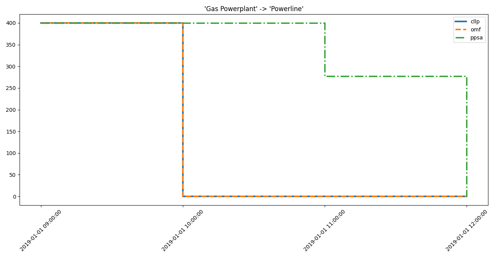

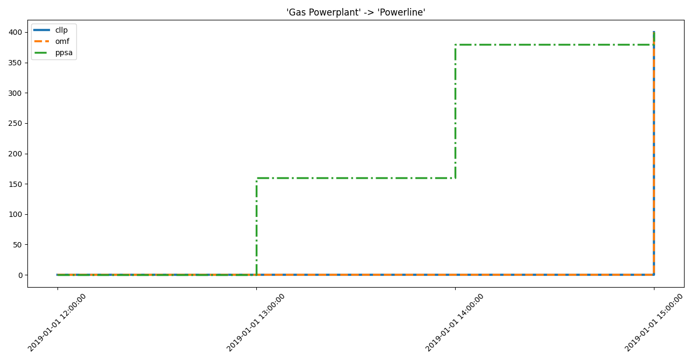

>>> from tessif.visualize import component_loads
>>> for dtf in idf.high_interest_timeframes[('Powerline', 'Excess')]:
...     axes = component_loads.step(dtf)
...     # axes.figure.show()  # commented out for doctesting

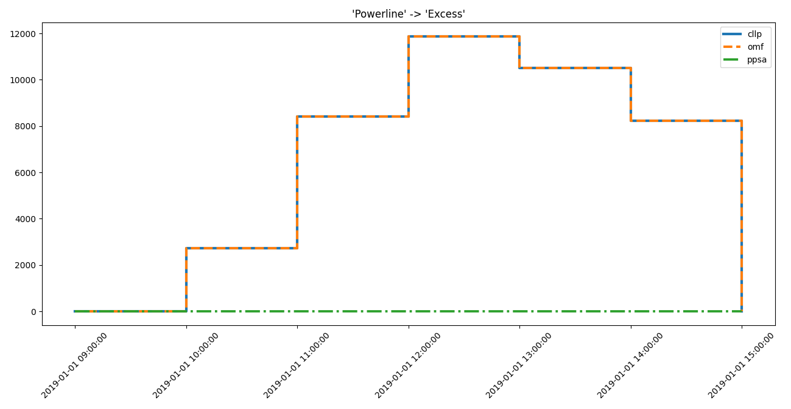

>>> from tessif.visualize import component_loads
>>> for dtf in idf.medium_interest_timeframes[('Solar', 'Powerline')]:
...     axes = component_loads.step(dtf) 
...     # axes.figure.show()  # commented out for doctesting

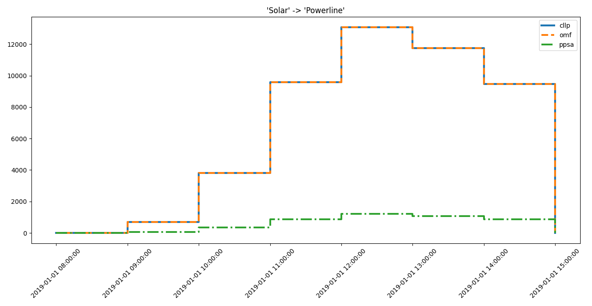

Identifying Root Causes
-----------------------
The identificaiton of root causes is not subject of this tutorial. For further
guidance, the respective phd thesis is recommended.

Used Utilities
==============

.. automodule:: tessif.examples.application.timeseries_comparison
   :members:
