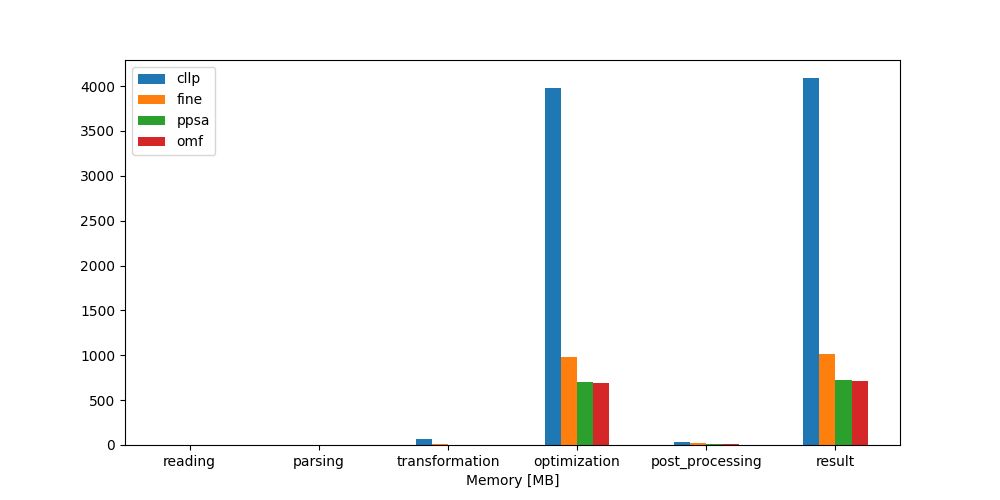

.. _CompCnE_computational_results:

Computational Ressources Results
********************************

Timing Results
==============

Commitment
----------

.. csv-table::
   :file: ./commitment_results/timings_results.csv

Expansion
---------

.. csv-table::
   :file: ./expansion_results/timings_results.csv

Modified Expansion
------------------

.. csv-table::
   :file: ./modified_expansion_results/timings_results.csv

Memory Results
==============

Commitment
----------

.. csv-table::
   :file: ./commitment_results/memory_results.csv

Expansion
---------

.. csv-table::
   :file: ./expansion_results/memory_results.csv

Modified Expansion
------------------

.. csv-table::
   :file: ./modified_expansion_results/memory_results.csv

