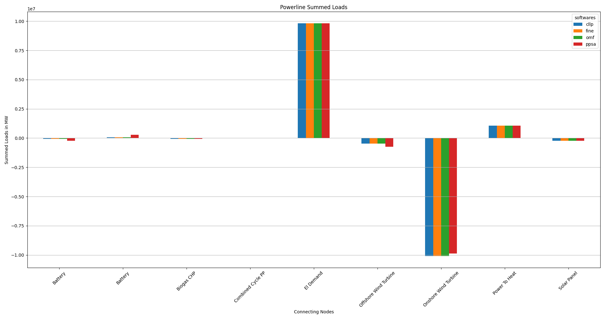
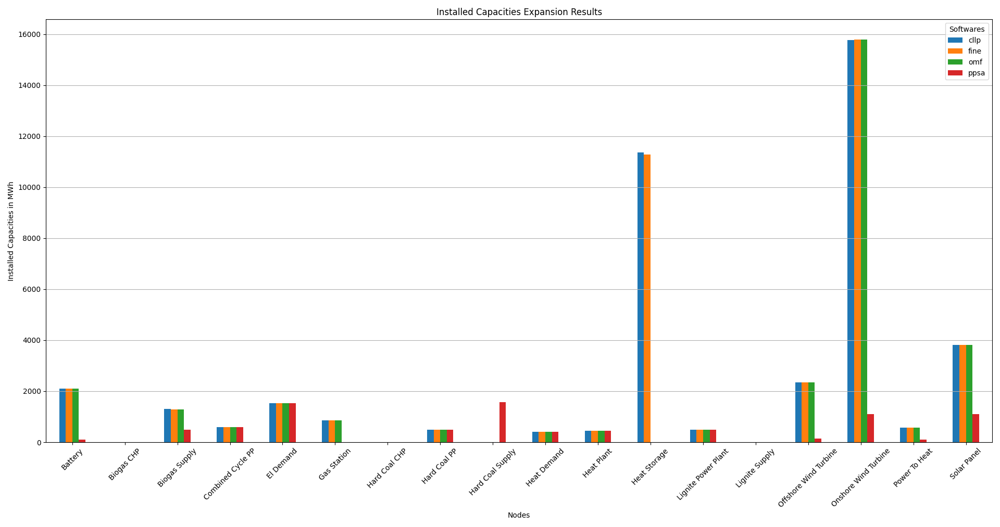
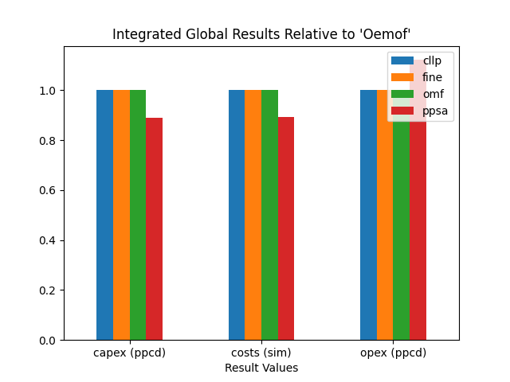
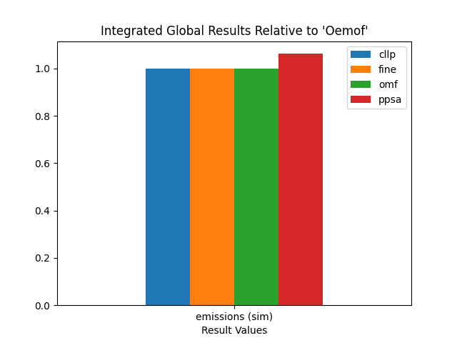
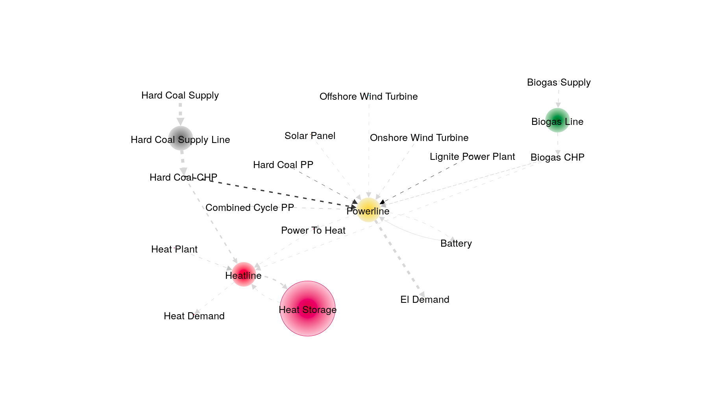
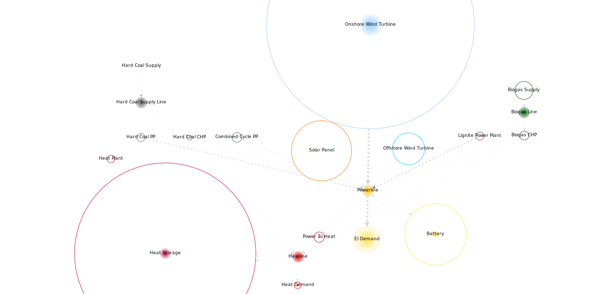

.. _CompCnE_Evaluation:

Discussion/Overview
*******************

.. contents:: Contents
   :local:
   :backlinks: top
	       

.. _CompCnE_gengraph:

Generic Graph
=============
The system model used for the TransC/E Combinatinos can be seen below:

.. image:: ./generic_graph.png
   :align: center
   :alt: Image showing the TransC generic graph

.. _CompCnE_relevant_results:

Optimization Results
====================
The most relevant CompCnE results are listed below. By convention, tessif uses
dynamic dimensioning to allow for different scales of amount of energy
transferred. The current conventions can be seen/adjusted via
:mod:`tessif.frused.configurations` and are as follows for the results below:

     - ``MW`` -- for energy flows and installed power capacities
     - ``MWh`` -- for amounts of energy and installed storage capacities
     - ``EUR`` -- for costs
     - ``t_CO2`` -- for emissions (tonns CO2 equivalent)

       
.. _CompCnE_relevant_results_commitment:

Commitment
----------
The CompC results generated using the
:ref:`using the respective script <CompCnE_code_resgen>`, are as follows:

Integrated Global Results
^^^^^^^^^^^^^^^^^^^^^^^^^
.. csv-table::
   :file: ./commitment_results/IGR.csv

.. image:: ./commitment_results/costs_IGR.png
   :align: center
   :alt: Image showing the CompC costs IGR as bar chart

.. image:: ./commitment_results/non_costs_IGR.png
   :align: center
   :alt: Image showing the CompC non_costs IGR as bar chart       

Installed Capacities
^^^^^^^^^^^^^^^^^^^^

.. csv-table::
   :file: ./commitment_results/Capacity.csv

.. image:: ./commitment_results/installed_capacities.png
   :align: center
   :alt: Image showing the installed capacities bar plot
	 
      
Powerline Results
^^^^^^^^^^^^^^^^^
TODO intro text here

Summed Loads
<<<<<<<<<<<<

.. csv-table::
   :file: ./modified_expansion_results/Load-Powerline.csv

Inflows are negative, outflows positive. Connected zero-flow nodes are not shown:

	 

..
   Load Profile Plot "Oemof"
   <<<<<<<<<<<<<<<<<<<<<<<<<

   .. csv-table::
      :file: ./modified_expansion_results/omf_timeseries_powerline.csv

   Inflows are represented as stacked bars, outflows as stacked step plots.
   Connected zero-flow nodes are not shown:

   .. image:: ./modified_expansion_results/omf_timeseries_powerline.png
      :align: center
      :alt: Image showing the CompC load profile results for "Oemof"

   Load Profile Plot "Pypsa"
   <<<<<<<<<<<<<<<<<<<<<<<<<

   .. csv-table::
      :file: ./modified_expansion_results/ppsa_timeseries_powerline.csv

   Inflows are represented as stacked bars, outflows as stacked step plots.
   Connected zero-flow nodes are not shown:

   .. image:: ./modified_expansion_results/ppsa_timeseries_powerline.png
      :align: center
      :alt: Image showing the CompC load profile results for "Pypsa"

Heatline Results
^^^^^^^^^^^^^^^^^
TODO intro text here

Summed Heat Loads
<<<<<<<<<<<<<<<<<

.. csv-table::
   :file: ./modified_expansion_results/Load-Heatline.csv

Inflows are negative, outflows positive. Connected zero-flow nodes are not shown:

.. image:: ./modified_expansion_results/summed_loads_heatline.png
   :align: center
   :alt: Image showing the modified TransE summed load results
	 

..
   Heat Load Profile Plot "Oemof"
   <<<<<<<<<<<<<<<<<<<<<<<<<<<<<<

   .. csv-table::
      :file: ./modified_expansion_results/omf_timeseries_heatline.csv

   Inflows are represented as stacked bars, outflows as stacked step plots.
   Connected zero-flow nodes are not shown:

   .. image:: ./modified_expansion_results/omf_timeseries_heatline.png
      :align: center
      :alt: Image showing the CompC load profile results for "Oemof"

   Heat Load Profile Plot "Pypsa"
   <<<<<<<<<<<<<<<<<<<<<<<<<<<<<<

   .. csv-table::
      :file: ./modified_expansion_results/ppsa_timeseries_heatline.csv

   Inflows are represented as stacked bars, outflows as stacked step plots.
   Connected zero-flow nodes are not shown:

   .. image:: ./modified_expansion_results/ppsa_timeseries_heatline.png
      :align: center
      :alt: Image showing the CompC load profile results for "Pypsa"

.. _CompCnE_relevant_results_expansion:	 

Expansion
---------

The CompC.congestions results generated using the
:ref:`using the respective script <CompCnE_code_resgen>`, are as follows:

.. _CompCnE_Evaluation_Expansion_IGR:

Integrated Global Results
^^^^^^^^^^^^^^^^^^^^^^^^^
.. csv-table::
   :file: ./expansion_results/IGR.csv

.. image:: ./expansion_results/costs_IGR.png
   :align: center
   :alt: Image showing the CompE costs IGR as bar chart

.. image:: ./expansion_results/non_costs_IGR.png
   :align: center
   :alt: Image showing the CompE non_costs IGR as bar chart       

Installed Capacities
^^^^^^^^^^^^^^^^^^^^

.. csv-table::
   :file: ./expansion_results/Capacity.csv

      
Powerline Results
^^^^^^^^^^^^^^^^^
TODO intro text here

Summed Loads
<<<<<<<<<<<<

.. csv-table::
   :file: ./expansion_results/Load-Powerline.csv

Inflows are negative, outflows positive. Connected zero-flow nodes are not shown:

.. image:: ./expansion_results/summed_loads_powerline.png
   :align: center
   :alt: Image showing the modified TransE summed load results
	 

..
   Load Profile Plot "Oemof"
   <<<<<<<<<<<<<<<<<<<<<<<<<

   .. csv-table::
      :file: ./expansion_results/omf_timeseries_powerline.csv

   Inflows are represented as stacked bars, outflows as stacked step plots.
   Connected zero-flow nodes are not shown:

   .. image:: ./expansion_results/omf_timeseries_powerline.png
      :align: center
      :alt: Image showing the CompC load profile results for "Oemof"

   Load Profile Plot "Pypsa"
   <<<<<<<<<<<<<<<<<<<<<<<<<

   .. csv-table::
      :file: ./expansion_results/ppsa_timeseries_powerline.csv

   Inflows are represented as stacked bars, outflows as stacked step plots.
   Connected zero-flow nodes are not shown:

   .. image:: ./expansion_results/ppsa_timeseries_powerline.png
      :align: center
      :alt: Image showing the CompC load profile results for "Pypsa"

Heatline Results
^^^^^^^^^^^^^^^^^
TODO intro text here

Summed Heat Loads
<<<<<<<<<<<<<<<<<

.. csv-table::
   :file: ./expansion_results/Load-Heatline.csv

Inflows are negative, outflows positive. Connected zero-flow nodes are not shown:

.. image:: ./expansion_results/summed_loads_heatline.png
   :align: center
   :alt: Image showing the modified TransE summed load results
	 

..
   Heat Load Profile Plot "Oemof"
   <<<<<<<<<<<<<<<<<<<<<<<<<<<<<<

   .. csv-table::
      :file: ./expansion_results/omf_timeseries_heatline.csv

   Inflows are represented as stacked bars, outflows as stacked step plots.
   Connected zero-flow nodes are not shown:

   .. image:: ./expansion_results/omf_timeseries_heatline.png
      :align: center
      :alt: Image showing the CompC load profile results for "Oemof"

   Heat Load Profile Plot "Pypsa"
   <<<<<<<<<<<<<<<<<<<<<<<<<<<<<<

   .. csv-table::
      :file: ./expansion_results/ppsa_timeseries_heatline.csv

   Inflows are represented as stacked bars, outflows as stacked step plots.
   Connected zero-flow nodes are not shown:

   .. image:: ./expansion_results/ppsa_timeseries_heatline.png
      :align: center
      :alt: Image showing the CompC load profile results for "Pypsa"	 

.. _CompCnE_relevant_results_modified_expansion:

Modified_Expansion
------------------
The CompE results generated using the
:ref:`using the respective script <CompCnE_code_resgen>`, are as follows:

Integrated Global Results
^^^^^^^^^^^^^^^^^^^^^^^^^
.. csv-table::
   :file: ./modified_expansion_results/IGR.csv

Installed Capacities
^^^^^^^^^^^^^^^^^^^^

.. csv-table::
   :file: ./expansion_results/Capacity.csv

	 
Powerline Results
^^^^^^^^^^^^^^^^^
TODO intro text here

Summed Loads
<<<<<<<<<<<<

.. csv-table::
   :file: ./modified_expansion_results/Load-Powerline.csv

Inflows are negative, outflows positive. Connected zero-flow nodes are not shown:

	 

..
   Load Profile Plot "Pypsa"
   <<<<<<<<<<<<<<<<<<<<<<<<<

   .. csv-table::
      :file: ./modified_expansion_results/ppsa_timeseries_powerline.csv

   Inflows are represented as stacked bars, outflows as stacked step plots.
   Connected zero-flow nodes are not shown:

   .. image:: ./modified_expansion_results/ppsa_timeseries_powerline.png
      :align: center
      :alt: Image showing the CompC load profile results for "Pypsa"
	 

Heatline Results
^^^^^^^^^^^^^^^^^
TODO intro text here

Summed Heat Loads
<<<<<<<<<<<<<<<<<

.. csv-table::
   :file: ./modified_expansion_results/Load-Heatline.csv

Inflows are negative, outflows positive. Connected zero-flow nodes are not shown:

.. image:: ./modified_expansion_results/summed_loads_heatline.png
   :align: center
   :alt: Image showing the modified TransE summed load results
	 

..
   Heat Load Profile Plot "Pypsa"
   <<<<<<<<<<<<<<<<<<<<<<<<<<<<<<

   .. csv-table::
      :file: ./modified_expansion_results/ppsa_timeseries_heatline.csv

   Inflows are represented as stacked bars, outflows as stacked step plots.
   Connected zero-flow nodes are not shown:

   .. image:: ./modified_expansion_results/ppsa_timeseries_heatline.png
      :align: center
      :alt: Image showing the CompC load profile results for "Pypsa" 
	 

.. _CompCnE_relevant_results_computational:

Computationel Ressources Used
=============================

Among the ``Comp`` combinations the ``CompE`` scenario is the most time
consuming. Due to the relatively long timeframe optimized,
Tessif added ressource consumption is negligable:

.. _CompCnE_relevant_results_computational_timing:

Timing Results
--------------

.. csv-table::
   :file: ./expansion_results/timings_results.csv

.. image:: ./expansion_results/timings_results.png
   :align: center
   :alt: Image showing the TransC congestion timing results	  

	 
.. _CompCnE_relevant_results_computational_memory:

Memory Results
--------------

.. csv-table::
   :file: ./expansion_results/memory_results.csv

.. image:: ./expansion_results/memory_results.png
   :align: center
   :alt: Image showing the TransC congestion memory results	  

.. _CompCnE_Evaluation_AdvancedGraph:

Advanced Graphs
===============
Following sections show the advanced graph representations of the three
model-scenario-combinations showing the greatest differences, i.e
the ``Expansion`` and the ``Modified-Expansion`` combinations. Since result
variation in between softwares others then ``Pypsa`` is low, only the
``Oemof`` graph is shown for the ``Expansion`` combinations.

To facilitate inter software comparison, the advanced graphs below, are drawn
relative to the installed capacity and net energy flow of the demand component
``"El Demand"``.

Expansion
---------

Oemof
^^^^^
.. image:: ./avs_results/omf_advanced_graph_normalized.svg
   :align: center
   :alt: Image showing the TransC congestion advanced graph

PyPSA
^^^^^
The :ref:`Integrated Global Results <CompCnE_Evaluation_Expansion_IGR>`
indicate, that the ``PyPSA`` results differ significantly. An initial attempt
to relate node size to the installed capacity and net energy flow of the demand
component ``"El Demand"`` fails, since the resulting size of the
``Heat Storage`` component is too large. Thus the advanced system
visualization below is plotted relating node size to the installed capacity  of
the ``Heat Storage`` component.

Modified_Expansion
------------------
Modifying the ``PyPSA`` system model scenario combination, leads to
optimization results closer to that of the other softwares. The advanced
graph below is therfor again drawn relative to the installed capacity and net
energy flow of the demand component ``"El Demand"``.

PyPSA
^^^^^

.. _CompCnE_Evaluation_AdvancedGraph_KeyObservations:

Key Observations
----------------
Comparing the above advanced graph visulaizations, three main differences are
easily observed between the three scenarios:

    1. The non-modified expansion combination of ``PyPSA`` differs largely.
       The ``"Heat Storage"`` component is used extensively indicating that
       the ``"Hard Coal CHP"`` component is used to provide power and
       electricity, while the component is used to store uneeded heat.

    2. The advanced graph visualization of the modified ``PyPSA`` expansion
       combination resembles that of ``Oemof`` much closer in comparison to
       the non-modified variation.

    3. For the optimal solution Onshore, Solar, Offshore and Heat Storage are
       used the most having relatively large installed capacities compared to
       the compartively low characteristic value / capacity factor.

   
.. _CompCnE_KeyConclusions:
	   
Key Conclusions
===============

1. The :ref:`key_goal` could be served in the sense of developing a reference
   supply system model in conjunction with two relevant and contemporary scenario
   formulations to test out the modelling softwares
   ``Calliope``, ``Fine``, ``Oemof`` and ``Pypsa``.

2. All of the :ref:`5 aims <component-focused-models>` (Thesis-> Method ->
   Modelling -> MSC Selection ) formulated, with regards to component focused
   model behaviour, were successfully addressed:

   1. Integration of volatile renewable energy sources into an existing
      system:

      - The components ``Solar Panel``, ``Onshore Wind Turbine`` and
	``Offshore Wiind Turbine`` represent succesfully integrated,
	volatile renewable energy sources, of which the maximum power produced
	is constraint via hourly resolved load profiles as discussed in
	`Reimer, Ammon
	<https://tore.tuhh.de/handle/11420/11707>`_
	in `Subsection - 3.2.4
	<https://tore.tuhh.de/bitstream/11420/11707/2/PA_Max_Reimer.pdf#subsection.3.2.4>`_
	and `Subsection - 3.2.5
	<https://tore.tuhh.de/bitstream/11420/11707/2/PA_Max_Reimer.pdf#subsection.3.2.5>`_
       
   2. Integration of energy storage technologies into an existing system:

      - The components ``Battery`` and ``Heat Storage`` represent
	successfully integrated electrical and thermal energy storage components
	respectively. They are parameterized in accordance to contemporary tecnical
	specifications as discussed in
	`Reimer, Ammon Subsection - 3.2.10
	<https://tore.tuhh.de/bitstream/11420/11707/2/PA_Max_Reimer.pdf#subsection.3.2.10>`_
       
   3. Year-round, hourly-resolved energy demands based on ambient
      climatic conditions:

      - The components ``El Demand`` and ``Heat Demand`` represent
	succesfully modeled, hourly-resolved energy demands based on
	real world considerations as laid out in
	`Reimer, Ammon Subsection 3.2.1
	<https://tore.tuhh.de/bitstream/11420/11707/2/PA_Max_Reimer.pdf#subsection.3.2.1>`_
     
   4. Cost optimally dispatching energy sources to meet the system's demand:

      - The use case is succesfully modelled via the ``CompC`` combination of
	which the :ref:`generic graph representation <CompCnE_gengraph>` can be
	seen above.
      - The results are evaluated using the codes shown in the
	:ref:`respective code section <CompCnE_code_resgen>` and shown
	:ref:`above <CompCnE_relevant_results_commitment>`.
       
   5. Reaching emission-goals cost optimally on given constraints, potentially
      expanding or adding certain low-emission components.

      - The use case is succesfully modelled via the ``CompE`` combination of
	which the :ref:`generic graph representation <CompCnE_gengraph>` can be
	seen above.
      - The results are evaluated using the codes shown in the
	:ref:`respective code section <CompCnE_code_resgen>` and shown
	:ref:`above <CompCnE_relevant_results_expansion>`.      

3. In addition to that following insights were gained with regards to the
   softwares used:

   1. Given the same input it is possible, but not necessarily directly
      implied, to produce the exact same results on relatively large and
      complex energy supply system models for all softwares investigated.
      
   2. Emission constraint expansion problems reveal software specific
      differences more clearly in comparison to pure commitment problems.
      
   3. Emission allocation differs between softwares. Leading to potentially
      large differences as demonstrated by the :ref:`unmodified expansion results
      <CompCnE_relevant_results_expansion>`.

      The possibility to assign emissions to storage and sector coupling
      components, in particular, varies significantly between softwares.

      See also `Reimer, Ammon - Subsections 4.3.2 and 4.3.3
      <https://tore.tuhh.de/bitstream/11420/11707/2/PA_Max_Reimer.pdf#subsection.4.3.2>`_
      for an in detail discussed comparison between ``oemof`` and ``PyPsa`` in
      this regard.

   4. Storage parameterization varies significantly between softwares. These
      constitute mainly of:
      
      - Initial State of Charge
      - Emission allocation -- Differences beeing in both, the possibility to
	allocate emissions in the first place, and the option to which energy
	flow allocation is possible (inflow, outflow or both).
      - Cost allocation -- Difference beeing wheter the costs are allocatable
	energy flow specific (inflow, outflow or both)l or only to
	State of Charge differences between first and final time step.

   5. Internal represtation differences in cost and emission allocation can be
      compnensated without actually altering the defacto interpreation of the
      input, if so desired. Further more this alteration is done relatively
      simple using tessif, as is demonstrated in the respective
      :ref:`code snippet <CompCnE_relevant_results_modified_expansion>` below.
      
   6. Tessif facilitates comparison, by allowing straight forward energy supply
      sytem model creation, transformation, optimization, post-processing, result
      comparison and visualization as demonstrated by the code with which the abov
      results were generated.

   7. On comparitevly medium to large timeframes, like the above 8760 hourly
      steps, Tessif introduced need of computational ressources is negligable
      (see figures in section :ref:`CompCnE_relevant_results_computational`).

      Comparing the computational ressourcess needed between softwares on the
      above model-scenario-combinations, it seems as though tessif-pypsa is
      generally more efficient than tessif-fine, which is more efficient than
      tessif-calliope, which in turn is more efficient than tessif-oemof.

   
References
==========

- `Max Reimer, Mathias Ammon, und Kristin Abel-Günther. Entwicklung eines Komponenten basierten Szenarios zum Vergleich von Free and Open Source Energiesystemmodellierungssoftware in Python, 2022 <https://tore.tuhh.de/handle/11420/11707>`_

- :ref:`Max Reimers Tessif Documentation <Examples_Application_Components>`
