.. _CompCnE_results:

Optimization Results
********************
The following sections provide detailed overview on the numerical an graphical
results regarding the CompCnE analysis.

.. contents:: Contents
   :local:
   :backlinks: top

	       
.. _CompCnE_results_commitment:

Commitment
========================
The CompC-no-congestion results generated using the :ref:`respective script
<CompCnE_code_resgen>`, are as follows:

Integrated Global Results
^^^^^^^^^^^^^^^^^^^^^^^^^
.. csv-table::
   :file: ./commitment_results/IGR.csv

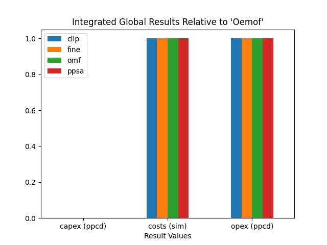

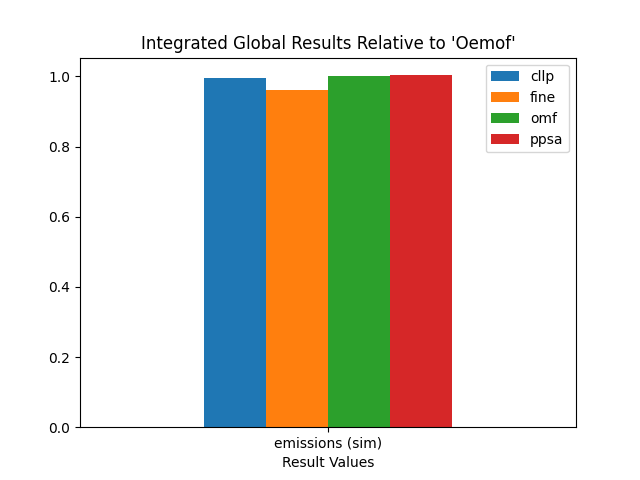

Installed Capacity
^^^^^^^^^^^^^^^^^^

.. csv-table::
   :file: ./commitment_results/Capacity.csv

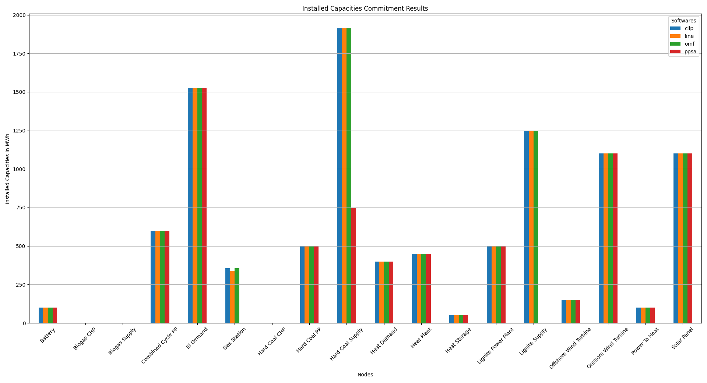

Powerline Summed Loads
^^^^^^^^^^^^^^^^^^^^^^^^^^^^^^

.. csv-table::
   :file: ./commitment_results/Load-Powerline.csv

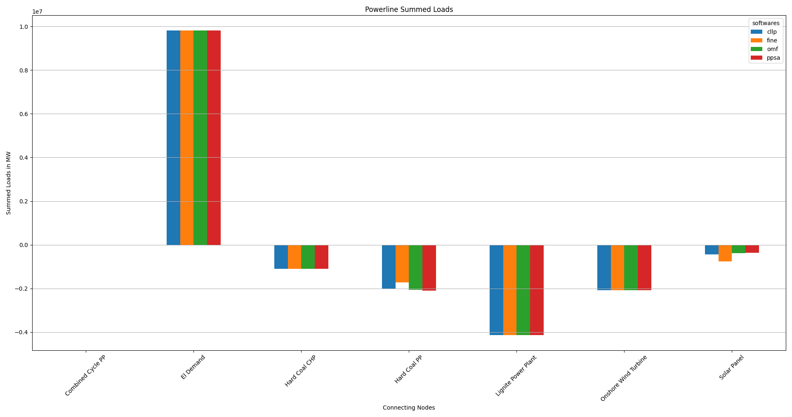

..
   Powerline Timeseries Loads
   ^^^^^^^^^^^^^^^^^^^^^^^^^^^^^^^^^^
   Components not contributing, aka all zero columns are not shown

   .. csv-table::
      :file: ./commitment_results/Timeseries-Powerline.csv
  

Heatline Summed Loads
^^^^^^^^^^^^^^^^^^^^^

.. csv-table::
   :file: ./commitment_results/Load-Heatline.csv

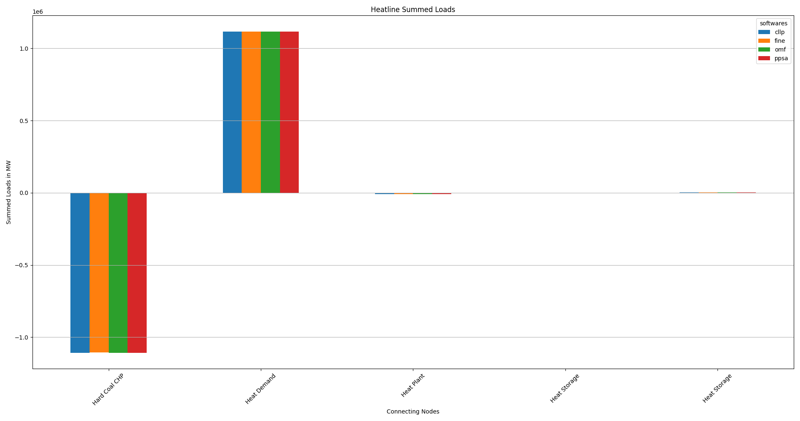
	  
..
   Heatline Timeseries Loads
   ^^^^^^^^^^^^^^^^^^^^^^^^^
   Components not contributing, aka all zero columns are not shown

   .. csv-table::
      :file: ./commitment_results/Timeseries-Heatline.csv
      
      

.. _CompCnE_results_expansion:

Expansion
=========
The CompE results generated using the :ref:`respective script
<CompCnE_code_resgen>`, are as follows:

Integrated Global Results
^^^^^^^^^^^^^^^^^^^^^^^^^
.. csv-table::
   :file: ./expansion_results/IGR.csv

.. image:: ./expansion_results/costs_IGR.png
   :align: center
   :alt: Image showing the CompE costs IGR as bar chart

.. image:: ./expansion_results/non_costs_IGR.png
   :align: center
   :alt: Image showing the CompE non_costs IGR as bar chart

Installed Capacity
^^^^^^^^^^^^^^^^^^

.. csv-table::
   :file: ./expansion_results/Capacity.csv

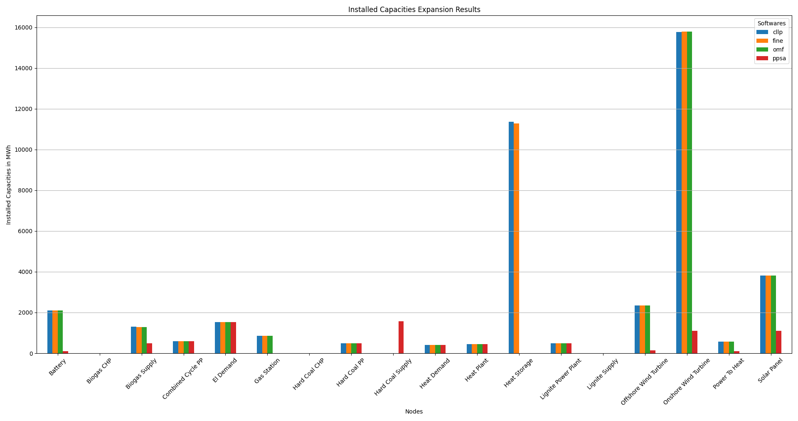

Powerline Summed Loads
^^^^^^^^^^^^^^^^^^^^^^^^^^^^^^

.. csv-table::
   :file: ./expansion_results/Load-Powerline.csv

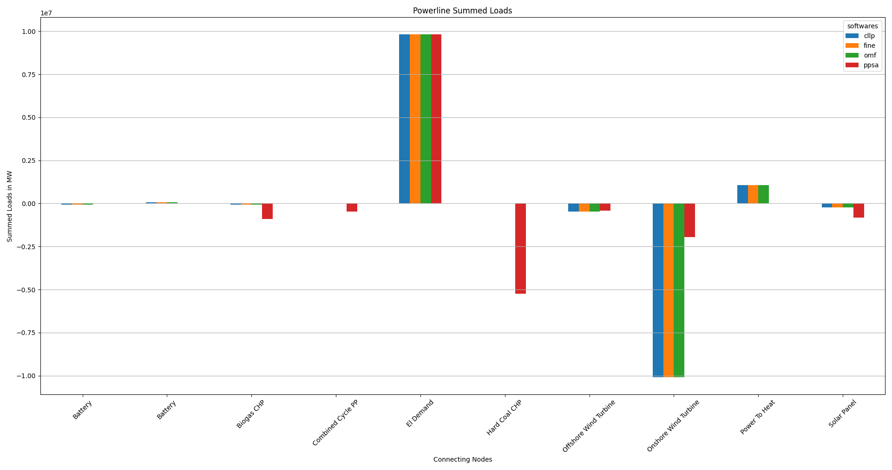

..
   Powerline Timeseries Loads
   ^^^^^^^^^^^^^^^^^^^^^^^^^^^^^^^^^^
   Components not contributing, aka all zero columns are not shown

   .. csv-table::
      :file: ./expansion_results/Timeseries-Powerline.csv

Heatline Summed Loads
^^^^^^^^^^^^^^^^^^^^^

.. csv-table::
   :file: ./expansion_results/Load-Heatline.csv

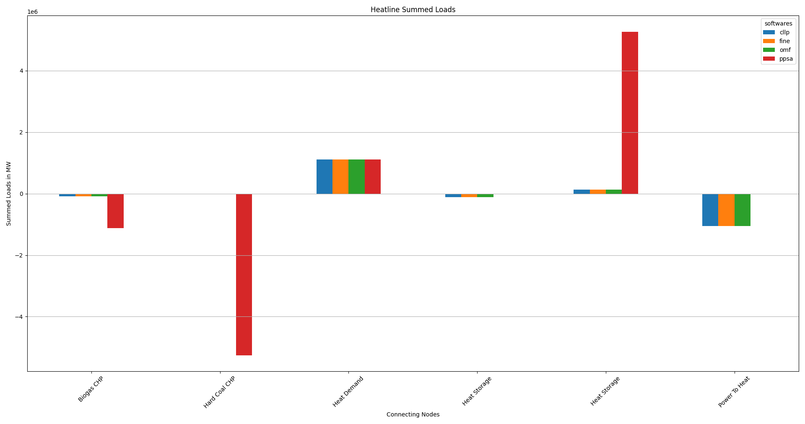

..
   Heatline Timeseries Loads
   ^^^^^^^^^^^^^^^^^^^^^^^^^
   Components not contributing, aka all zero columns are not shown

   .. csv-table::
      :file: ./expansion_results/Timeseries-Heatline.csv

.. _CompCnE_results_modified_expansion:

Modified Expansion
==================
The CompE results generated using the :ref:`respective script
<CompCnE_code_resgen>`, are as follows:

Integrated Global Results
^^^^^^^^^^^^^^^^^^^^^^^^^
.. csv-table::
   :file: ./modified_expansion_results/IGR.csv

.. image:: ./modified_expansion_results/costs_IGR.png
   :align: center
   :alt: Image showing the modified CompE costs IGR as bar chart

.. image:: ./modified_expansion_results/non_costs_IGR.png
   :align: center
   :alt: Image showing the modified CompE non_costs IGR as bar chart

Installed Capacity
^^^^^^^^^^^^^^^^^^

.. csv-table::
   :file: ./modified_expansion_results/Capacity.csv

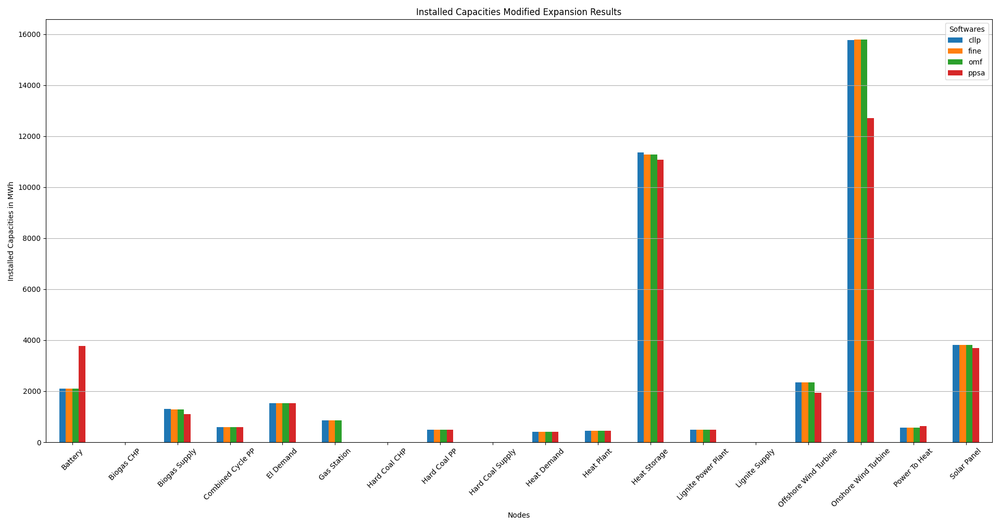

Powerline Summed Loads
^^^^^^^^^^^^^^^^^^^^^^^^^^^^^^

.. csv-table::
   :file: ./modified_expansion_results/Load-Powerline.csv

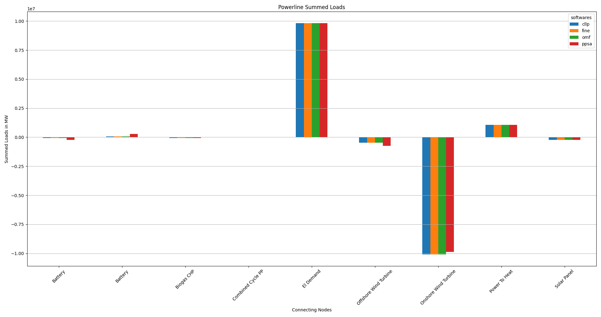

..
   Powerline Timeseries Loads
   ^^^^^^^^^^^^^^^^^^^^^^^^^^^^^^^^^^
   Components not contributing, aka all zero columns are not shown

   .. csv-table::
      :file: ./modified_expansion_results/Timeseries-Powerline.csv

Heatline Summed Loads
^^^^^^^^^^^^^^^^^^^^^

.. csv-table::
   :file: ./modified_expansion_results/Load-Heatline.csv

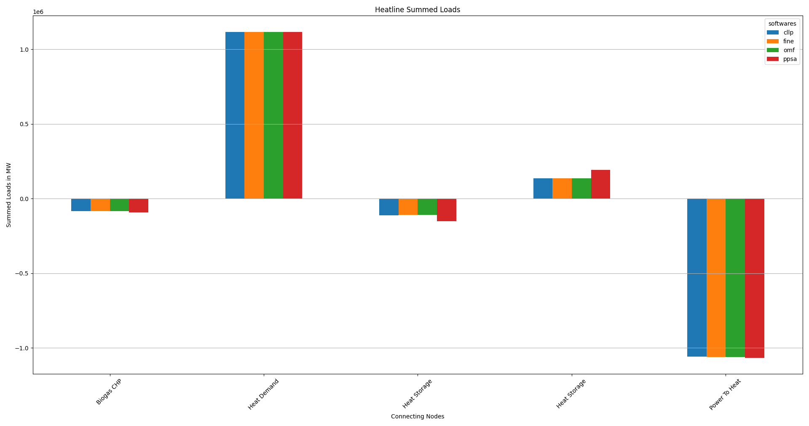

..
   Heatline Timeseries Loads
   ^^^^^^^^^^^^^^^^^^^^^^^^^
   Components not contributing, aka all zero columns are not shown

   .. csv-table::
      :file: ./modified_expansion_results/Timeseries-Heatline.csv

