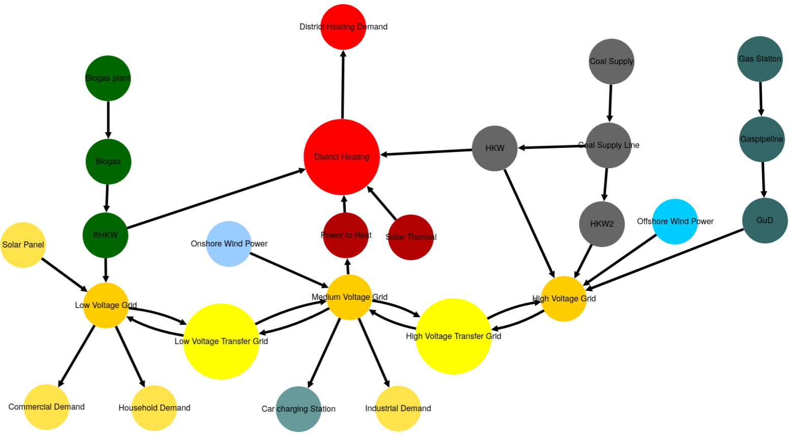
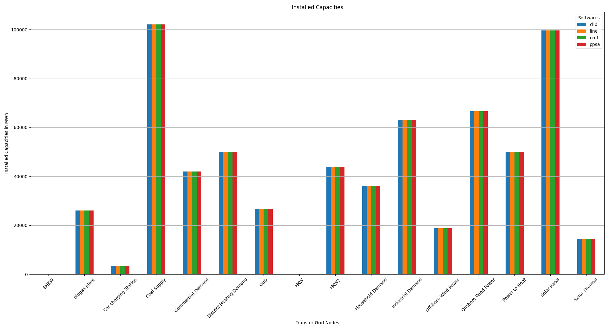
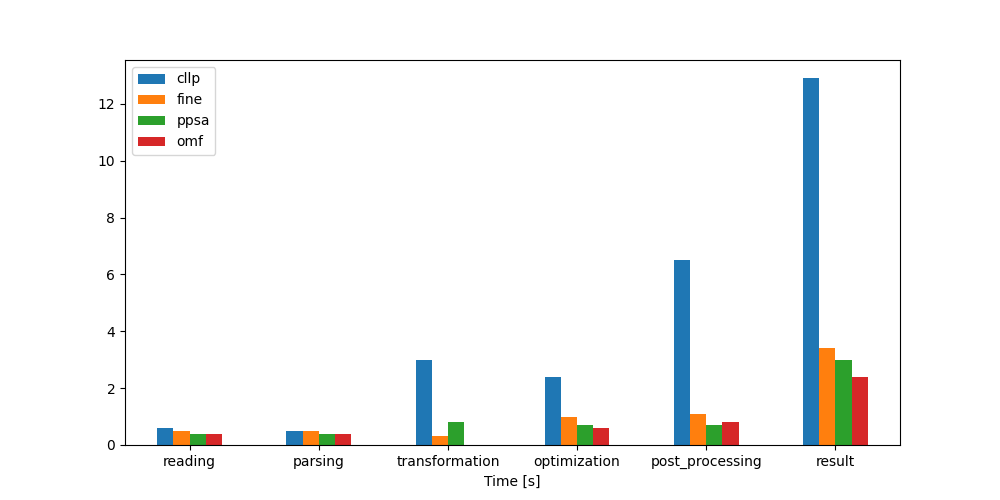
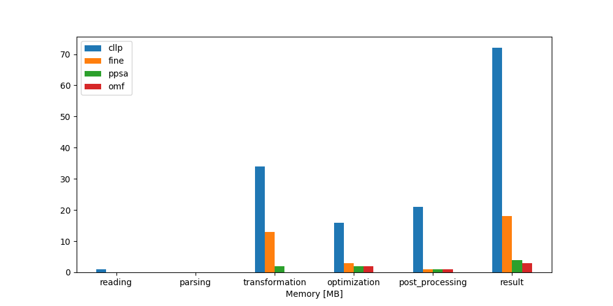

Discussion/Overview
*******************

.. contents:: Contents
   :local:
   :backlinks: top

.. _LossLC_gengraph:

Generic Graph
=============
The system model used for the LossLC combination can be seen below:

			 

.. _LossLC_relevant_results:

Optimization Results
====================
The LossLC results are listed below. By convention, tessif uses
dynamic dimensioning to allow for different scales of amount of energy
transferred. The current conventions can be seen/adjusted via
:mod:`tessif.frused.configurations` and are as follows for the results below:

     - ``MW`` -- for energy flows and installed power capacities
     - ``MWh`` -- for amounts of energy and installed storage capacities
     - ``EUR`` -- for costs
     - ``t_CO2`` -- for emissions (tonns CO2 equivalent)

The LossLC results are generated using the :ref:`skript from below
<LossLC_resgen_optimize>` and are as follows:

Integrated Global Results
-------------------------

.. csv-table::
   :file: ./results/IGR.csv

The Integrated Global Result bar plots are created using the :ref:`code below
<LossLC_igr_plots>`.

.. image:: ./results/costs_IGR.png
   :align: center
   :alt: Image showing the CompC costs IGR as bar chart

.. image:: ./results/non_costs_IGR.png
   :align: center
   :alt: Image showing the CompC non_costs IGR as bar chart

Installed Capacity
------------------

.. csv-table::
   :file: ./results/Capacity.csv

   
Medium Voltage Grid Summed Loads
--------------------------------

.. csv-table::
   :file: ./results/Load-Medium Voltage Grid.csv	  

Computational Ressources Used
=============================
The computational results are generated using the respective
:ref:`estimation scripts <LossLC_ressources_code>` as well as the
subsequent :ref:`plotting scripts <LossLC_ressources_plots>`.

Timings Results
---------------
.. csv-table::
   :file: ./results/timings_results.csv

Memory Results
--------------	 
.. csv-table::
   :file: ./results/memory_results.csv

	    

Key Conclusions
===============

1. The :ref:`key_goal` could be served in the sense of developing a reference
   supply system model in conjunction with one of the two relevant and
   contemporary scenario formulations (``commitment-problem``) to test out the
   modelling softwares ``Calliope``, ``Fine``, ``Oemof`` and ``Pypsa``.

2. None of the  :ref:`4 aims <grid-focused-models>` formulated, with regards
   to gird focused model behaviour, are specifically addressed with this
   ``'Lossless Commitment'`` model scenario combination. It however lays the
   foundation for the :ref:`Transformer Commitment/Expansion <TransCnE>` which
   directly address all of these aims.

3. Even on a relatively complex model-scenario-combination modelling ideal grid
   behaviours it could be shown that the optimal solutions found, using the
   softwares ``Calliope``, ``Fine``, ``Oemof`` and ``Pypsa`` through tessif,
   deviate by less than ``1%`` relative to each other.

      

Reference
=========

   - `Tim Hanke, Mathias Ammon, und Kristin Abel-Günther. Entwickeln eines netzbasierten Energiesystemmodells zum Vergleich von Free und Open Source Energiesystemmodellierungssoftware in Python, 2022 <https://tore.tuhh.de/handle/11420/11759>`_
