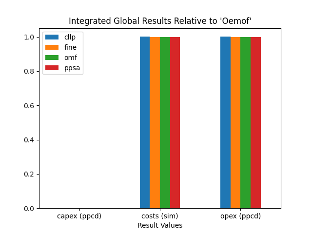
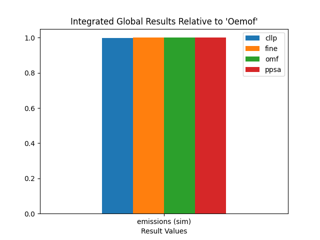

.. _LossLC_results:

Optimization Results
********************
The following sections provide detailed overview on the numerical an graphical
results regarding the LossLC analysis.

.. contents:: Contents
   :local:
   :backlinks: top

Integrated Global Results
-------------------------

.. csv-table::
   :file: ./results/IGR.csv

The Integrated Global Result bar plots are created using the :ref:`code below
<LossLC_igr_plots>`.

Installed Capacity
------------------

.. csv-table::
   :file: ./results/Capacity.csv
	  
High Voltage Grid Summed Loads
------------------------------

.. csv-table::
   :file: ./results/Load-High Voltage Grid.csv
      
Medium Voltage Grid Summed Loads
--------------------------------

.. csv-table::
   :file: ./results/Load-Medium Voltage Grid.csv

Low Voltage Grid Summed Loads
-----------------------------

.. csv-table::
   :file: ./results/Load-Low Voltage Grid.csv

District Heating Summed Loads
-----------------------------

.. csv-table::
   :file: ./results/Load-District Heating.csv
