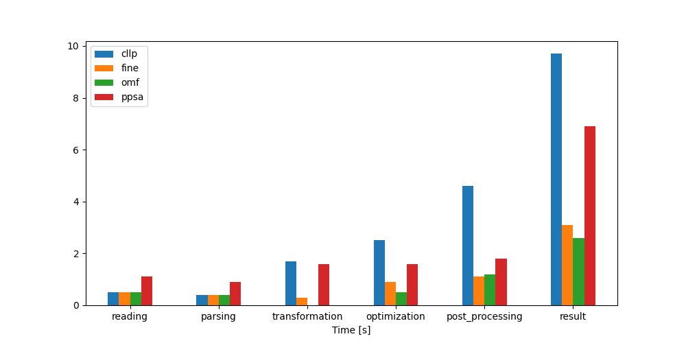

.. _TransCnE_computational_results:

Computational Ressources Results
********************************

Timing Results
==============

No-Congestion Commitment
------------------------

.. csv-table::
   :file: ./commitment_nocongestion_results/timings_results.csv

Congestion Commitment
---------------------

.. csv-table::
   :file: ./commitment_congestion_results/timings_results.csv

Expansion
---------

.. csv-table::
   :file: ./expansion_results/timings_results.csv

Memory Results
==============

No-Congestion Commitment
------------------------

.. csv-table::
   :file: ./commitment_nocongestion_results/memory_results.csv

Congestion Commitment
---------------------

.. csv-table::
   :file: ./commitment_congestion_results/memory_results.csv

.. image:: ./commitment_congestion_results/memory_results.png
   :align: center
   :alt: Image showing the TransC congestion memory results	  

Expansion
---------

.. csv-table::
   :file: ./expansion_results/memory_results.csv

