.. _TransCnE_Evaluation:

Discussion/Overview
*******************

.. contents:: Contents
   :local:
   :backlinks: top
	       

.. _TransCnE_gengraph:

Generic Graph
=============
The system model used for the TransC/E Combinatinos can be seen below:

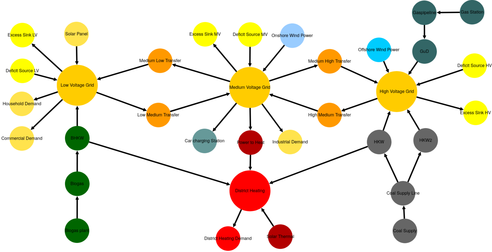

.. _TransCnE_relevant_results:

Optimization Results
====================
The most relevant TransCnE results are listed below. By convention, tessif uses
dynamic dimensioning to allow for different scales of amount of energy
transferred. The current conventions can be seen/adjusted via
:mod:`tessif.frused.configurations` and are as follows for the results below:

     - ``MW`` -- for energy flows and installed power capacities
     - ``MWh`` -- for amounts of energy and installed storage capacities
     - ``EUR`` -- for costs
     - ``t_CO2`` -- for emissions (tonns CO2 equivalent)

No Congestion Commitment
------------------------
The CompC-no-congestions results generated using the
:ref:`using the respective script <TransCnE_code_resgen>`, are as follows:

Integrated Global Results
^^^^^^^^^^^^^^^^^^^^^^^^^
.. csv-table::
   :file: ./commitment_nocongestion_results/IGR.csv

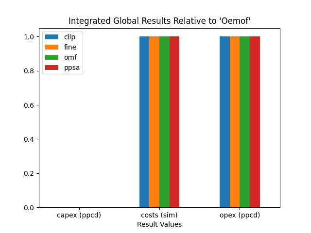

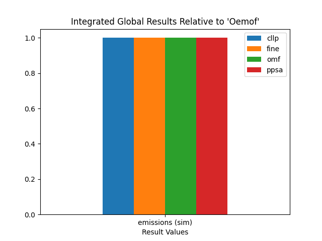

Medium Voltage Grid Loads Results
^^^^^^^^^^^^^^^^^^^^^^^^^^^^^^^^^
Comparing the integrated global results from above as well as the
:ref:`detailed numerical load results
<TransCnE_results_commitment_nocongestion>` of the high, medium and low voltage
grid busses, shows, that the different softwares all solve the TransC
model-scenario-combination quite similarly.

The representative summed loads bar plot as well as the load profile plot for
software "oemof" are shown below.

Summed Loads
<<<<<<<<<<<<

.. csv-table::
   :file: ./commitment_nocongestion_results/Load-Medium Voltage Grid.csv

Inflows are negative, outflows positive. Connected zero-flow nodes are not shown:

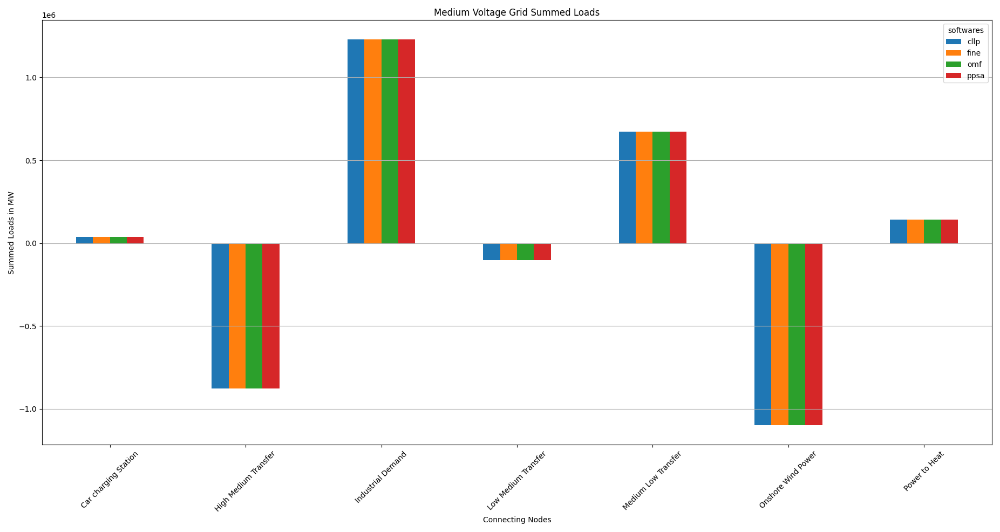
	 

Load Profile Plot "Oemof"
<<<<<<<<<<<<<<<<<<<<<<<<<

.. csv-table::
   :file: ./commitment_nocongestion_results/omf_timeseries_Load_Medium Voltage Grid.csv
	  
Inflows are represented as stacked bars, outflows as stacked step plots.
Connected zero-flow nodes are not shown:

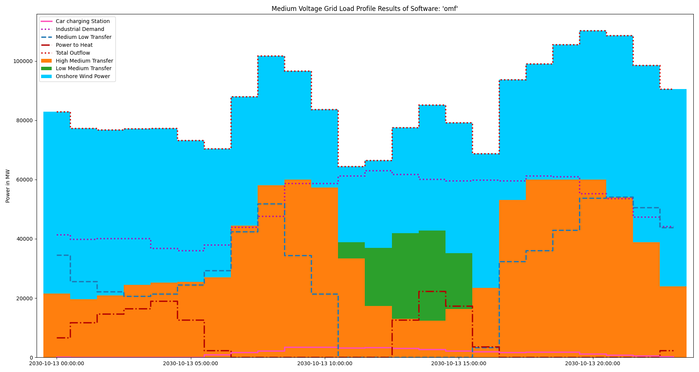

 
Redispatch
^^^^^^^^^^
For the ``No-Congestion TransC`` combination no redispatch is needed.

Circulated Energy Transport
^^^^^^^^^^^^^^^^^^^^^^^^^^^
For the ``No-Congestion TransC`` combination no energy is circulated between
busses to reduce the amount of excess sink fed energy (which is costly).

.. _TransCnE_Evaluation_Congestion:

Congestion Commitment
---------------------

The CompC.congestions results generated using the
:ref:`using the respective script <TransCnE_code_resgen>`, are as follows:

.. _TransCnE_Evaluation_Congestion_IGR:

Integrated Global Results
^^^^^^^^^^^^^^^^^^^^^^^^^
.. csv-table::
   :file: ./commitment_congestion_results/IGR.csv

.. image:: ./commitment_congestion_results/costs_IGR.png
   :align: center
   :alt: Image showing the TransC costs IGR as bar chart

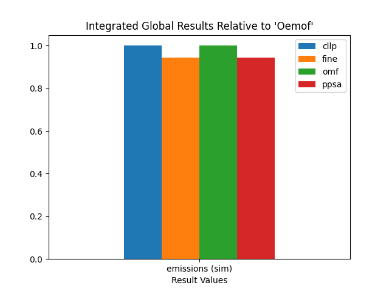

Medium Voltage Grid Loads Results
^^^^^^^^^^^^^^^^^^^^^^^^^^^^^^^^^
Comparing the integrated global results from above as well as the
:ref:`detailed numerical load results
<TransCnE_results_commitment_congestion>` of the high, medium and low voltage
grid busses, shows, that the different softwares all solve the TransC
model-scenario-combination quite similarly.

The representative summed loads bar plot as well as the load profile plot for
software "oemof" are shown below.

Summed Loads
<<<<<<<<<<<<

.. csv-table::
   :file: ./commitment_congestion_results/Load-Medium Voltage Grid.csv

Inflows are negative, outflows positive. Connected zero-flow nodes are not shown:

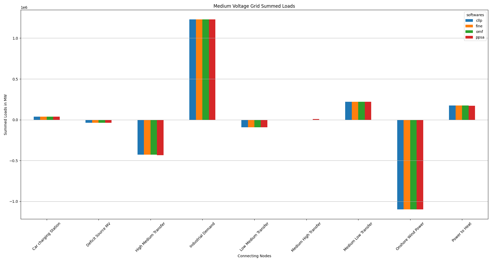
	 

.. _TransCnE_Evaluation_Congestion_LoadProfile:

Load Profile Plot "Oemof"
<<<<<<<<<<<<<<<<<<<<<<<<<

.. csv-table::
   :file: ./commitment_congestion_results/omf_timeseries_Load_Medium Voltage Grid.csv
	  
Inflows are represented as stacked bars, outflows as stacked step plots.
Connected zero-flow nodes are not shown:

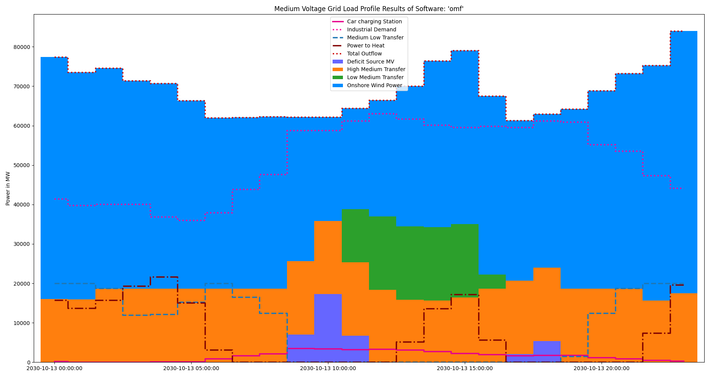

.. _TransCnE_Evaluation_Congestion_Redispatch:

Redispatch
^^^^^^^^^^
For the ``Congestion TransC`` combination a small amount of power is
redispatched during 2 of the 24 timesteps as shown below.

.. csv-table::
   :file: ./commitment_congestion_results/Redispatch_High2Medium.csv

Circulated Energy Transport
^^^^^^^^^^^^^^^^^^^^^^^^^^^
For the ``Congestion TransC`` combination no energy is circulated between
busses to reduce the amount of excess sink fed energy (which is costly).

Medium and High
<<<<<<<<<<<<<<<
.. csv-table::
   :file: ./commitment_congestion_results/Circulation Medium and High.csv

Expansion
---------
The TransE results generated using the
:ref:`using the respective script <TransCnE_code_resgen>`, are as follows:

Integrated Global Results
^^^^^^^^^^^^^^^^^^^^^^^^^
.. csv-table::
   :file: ./expansion_results/IGR.csv

.. image:: ./expansion_results/costs_IGR.png
   :align: center
   :alt: Image showing the TransE costs IGR as bar chart

Transfer Grid Installed Capacity
^^^^^^^^^^^^^^^^^^^^^^^^^^^^^^^^
.. csv-table::
   :file: ./expansion_results/Transfer_Capacities.csv

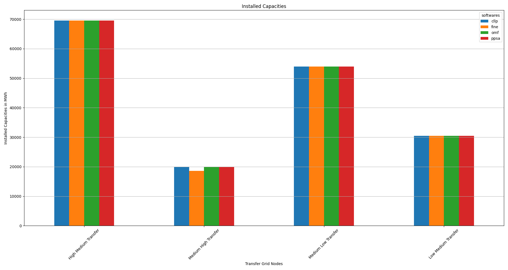

Medium Voltage Grid Loads Results
^^^^^^^^^^^^^^^^^^^^^^^^^^^^^^^^^
Comparing the integrated global results from above as well as the
:ref:`detailed numerical load results
<TransCnE_results_commitment_congestion>` of the high, medium and low voltage
grid busses, shows, that the different softwares all solve the TransC
model-scenario-combination quite similarly.

The representative summed loads bar plot as well as the load profile plot for
software "oemof" are shown below.

Summed Loads
<<<<<<<<<<<<

.. csv-table::
   :file: ./expansion_results/Load-Medium Voltage Grid.csv

Inflows are negative, outflows positive. Connected zero-flow nodes are not shown:

	 

Load Profile Plot "Oemof"
<<<<<<<<<<<<<<<<<<<<<<<<<

.. csv-table::
   :file: ./expansion_results/omf_timeseries_Load_Medium Voltage Grid.csv
	  
Inflows are represented as stacked bars, outflows as stacked step plots.
Connected zero-flow nodes are not shown:

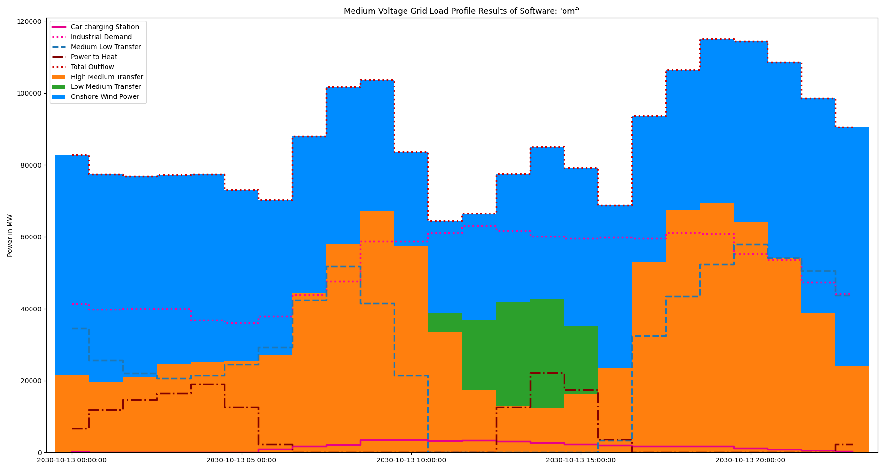

 
Redispatch
^^^^^^^^^^
For the ``TransE`` combination no redispatch is needed.

Circulated Energy Transport
^^^^^^^^^^^^^^^^^^^^^^^^^^^
For the ``TransE`` combination no energy is circulated between
busses to reduce the amount of excess sink fed energy (which is costly).	  

Comparison
----------

Costs
^^^^^

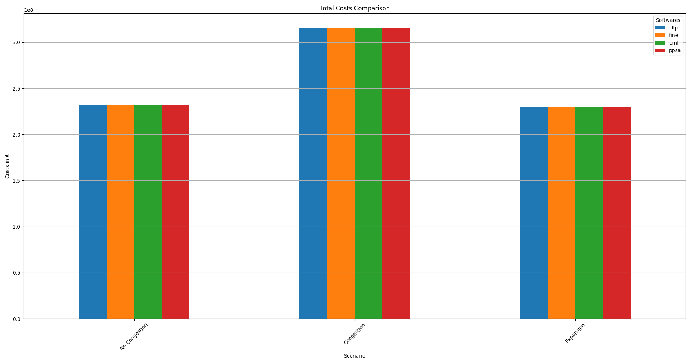

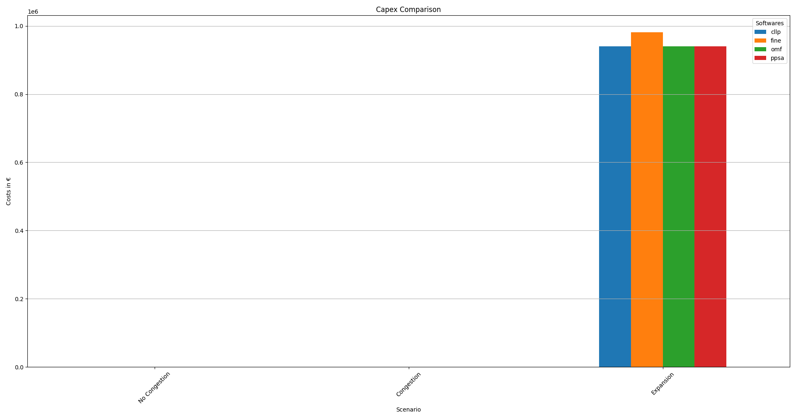

Installed Transfer Grid Capacities
^^^^^^^^^^^^^^^^^^^^^^^^^^^^^^^^^^

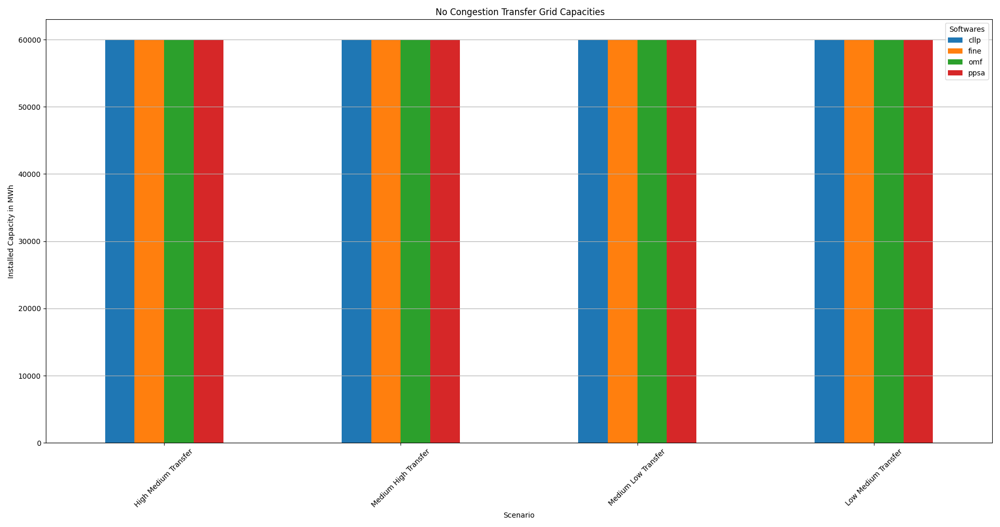

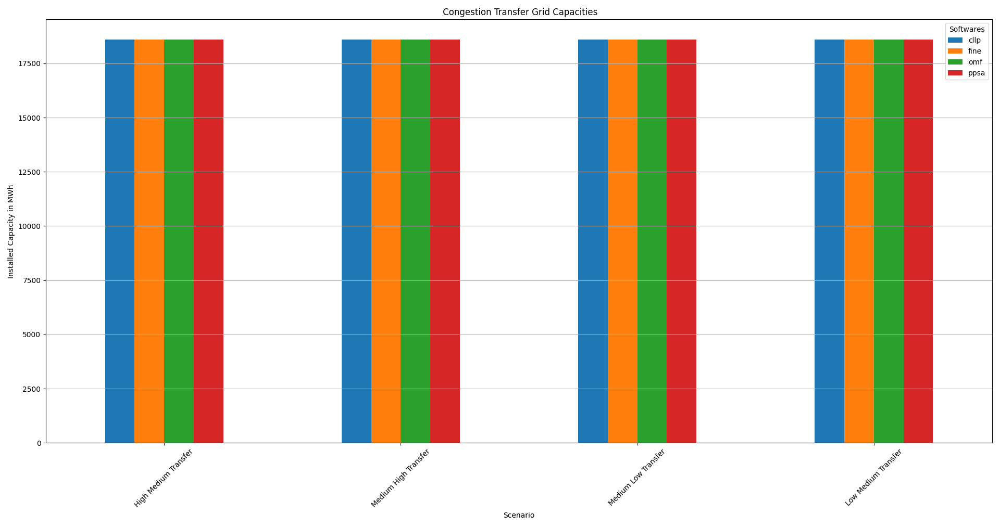

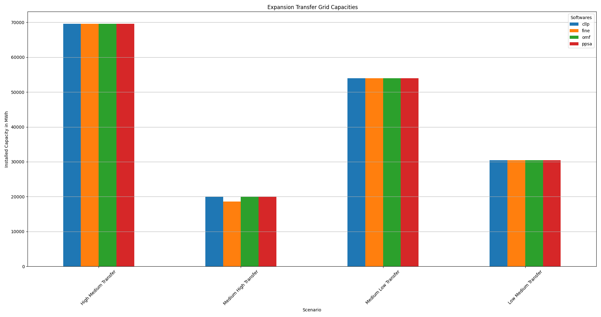

Computationel Ressources Used
=============================

Among the ``Trans`` combinations the ``Congestion`` scenario is the most time
intensive (if only slightly). Due to the relatively short timeframe optimized
transformation and post-processing constribute significantly to overall
ressources used.

Timing Results
--------------

.. csv-table::
   :file: ./commitment_congestion_results/timings_results.csv

.. image:: ./commitment_congestion_results/timings_results.png
   :align: center
   :alt: Image showing the TransC congestion timing results	  

Memory Results
--------------

.. csv-table::
   :file: ./commitment_congestion_results/memory_results.csv

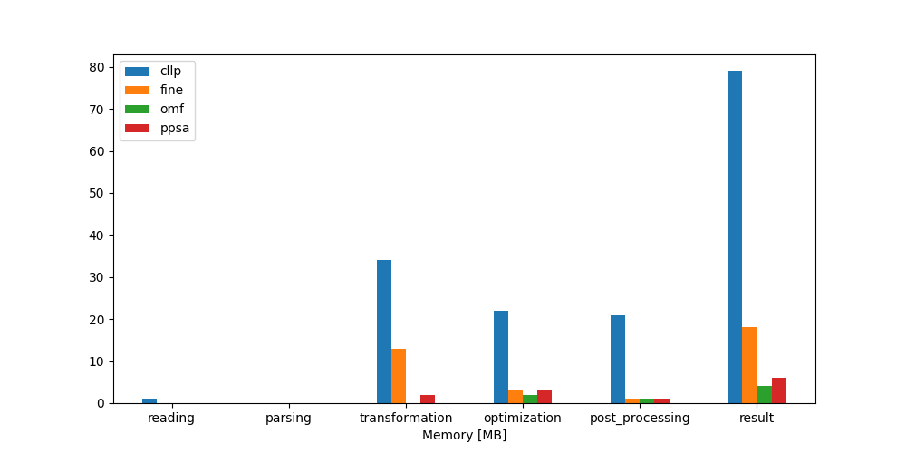

.. _TransCnE_Evaluation_AdvancedGraph:

Advanced Graphs
===============
Following sections show the advanced graph representations of the three
model-scenario-combinations investigated. Since result variation in between
softwares compared is low, only the ``Oemof`` graph is shown.

No Congestion Commitment
------------------------

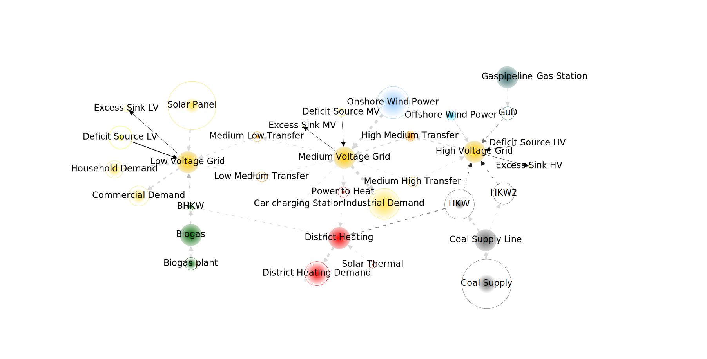

Congestion Commitment
------------------------

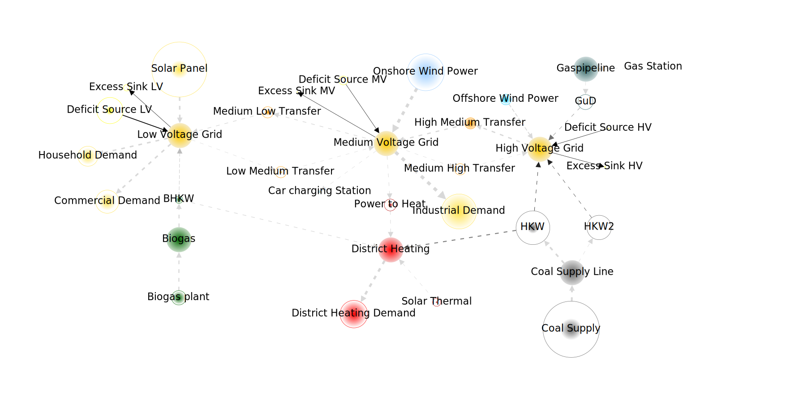

Expansion
---------

.. image:: ./expansion_results/omf_advanced_graph_sorted.svg
   :align: center
   :alt: Image showing the TransE advanced graph	 

.. _TransCnE_Evaluation_AdvancedGraph_KeyObservations:

Key Observations
----------------
Comparing the above advanced graph visulaizations, three main differences are
easily observed between the three scenarios:

1. Inside the ``Commitment - congestion`` scenario the high to medium transfer
   line is used to full capacity

2. In comparison to the other two ``Trans`` scenarios, the low voltage deficit
   source is used in the ``Commitment - congestion`` scenario:

3. In the ``Expansion`` scenario the is overall less expensive to expand high
   to medium and medium to high transfer capacities and utilize the high
   voltage connected coal fired power plant in comparison the bio gas fired low
   voltage connected cogeneration plant (``BHKW``)
   
Key Conclusions
===============

1. The :ref:`key_goal` could be served in the sense of developing a reference
   supply system model in conjunction with two relevant and contemporary scenario
   formulations to test out the modelling softwares
   ``Calliope``, ``Fine``, ``Oemof`` and ``Pypsa``. 

2. All of the :ref:`4 aims <grid-focused-models>` (Thesis-> Method ->
   Modelling -> MSC Selection ) formulated, with regards
   to component focused model behaviour, were successfully addressed:

   1. Modelling energy transportation losses and maximum transferable energy
      in grid-like components:

      - The component-combination ``High Medium Transfer``/
	``Medium High Transfer`` and ``Medium Low Transfer``/
	``Low Medium Transfer`` represent electrical energy transport
	components able to model flow rate dependend losses in form of an
	efficiency value as well as a maximum flow rate via installed capacity
	as discussed in detail in `Hanke, Ammon
	<https://doi.org/10.15480/882.4185>`_ in subsections `3.8.5
	<https://tore.tuhh.de/bitstream/11420/11759/1/Projektarbeit%20Tim%20Hanke.pdf#%5B%7B%22num%22%3A509%2C%22gen%22%3A0%7D%2C%7B%22name%22%3A%22XYZ%22%7D%2C89.292%2C762.11%2Cnull%5D>`_
	to `3.8.8
	<https://tore.tuhh.de/bitstream/11420/11759/1/Projektarbeit%20Tim%20Hanke.pdf#%5B%7B%22num%22%3A529%2C%22gen%22%3A0%7D%2C%7B%22name%22%3A%22XYZ%22%7D%2C89.292%2C395.025%2Cnull%5D>`_

   2. Modelling grid congestion issues:

      - Restricting installed transfer capacity to 20000MW in the
	:ref:`TransCnE_Evaluation_Congestion` Scenario leads to an optimal
	solution more expensive than without restrictions, as can be seen
	in :ref:`TransCnE_Evaluation_Congestion_IGR`.
	Fully utilizing transport capacities while requiring the low voltage
	deficit source to componesate as show by the
	:ref:`TransCnE_Evaluation_AdvancedGraph` (and the subsequent
	:ref:`TransCnE_Evaluation_AdvancedGraph_KeyObservations`).

   3. Modelling congestion issue related redispatch:

      - By limiting the transfer capacity to 20000MW in the
	:ref:`TransCnE_Evaluation_Congestion` Scenario a redispatch in power 
	generation from high voltage to the medium voltage grid becomes
	necessary as observable in figure
	:ref:`TransCnE_Evaluation_Congestion_LoadProfile` and lsited in table
	:ref:`TransCnE_Evaluation_Congestion_Redispatch`.

   4. Potential expansion of transportation capacities to avoid two and
      three.
      
3. In addition to that following insights were gained with regards to the
   softwares used:

   1. Given the same input it is possible, but not necessarily directly
      implied, to produce the exact same results on relatively large and
      complex energy supply system models for all softwares investigated.
      Also and in particular when modelling grid like structures with the help
      of two tessif transformer components, as desmonstrated.
      
   2. Using two tessif transformer components in conjunction with an excess
      sink and deficit source allows modelling required redispatch efficiently.
      It also ensures the solver can find an optimal solution by providing
      unlimited albeit expensive energy in- and output.
      
   3. As seen in the :ref:`TransCnE_Evaluation_Congestion_IGR`, emission
      allocation differs between softwares. If however neither storage nore
      connector components are used in conjunction with allocated emissions,
      deviation is relatively small. In addtion, if the investigated scenario
      does not impose an emission limit, as in the above scenarios, no
      subsequent result variation are observed.
      
   4. The benefits of Tessif facilitating energy supply system model creation,
      transformation, optimization, post-processing, result comparison and
      visualization again become observable when inspecting the programming
      :ref:`code <TransCnE_code>` with which the above results were generated.

   5. On comparitevly small optimization timeframes like the above 24 hourly
      steps Tessif introduced need of computational ressources is significant
      It therfor has to be taken into account in cases where a lot of these small
      optimizations are to be performed in parallel.

      Comparing the computational ressourcess needed between softwares on the
      above model-scenario-combinations, it seems as though tessif-oemof is
      generally more efficient than tessif-fine, which is more efficient than
      tessif-pypsa, which in turn is more efficient than tessif-calliope.

