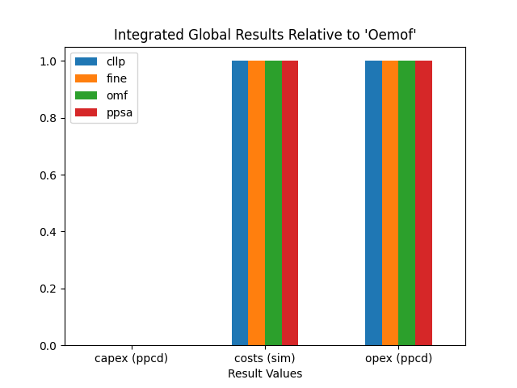
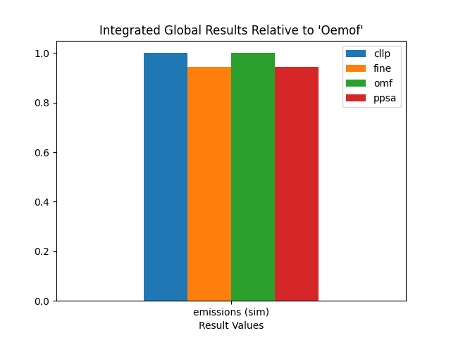
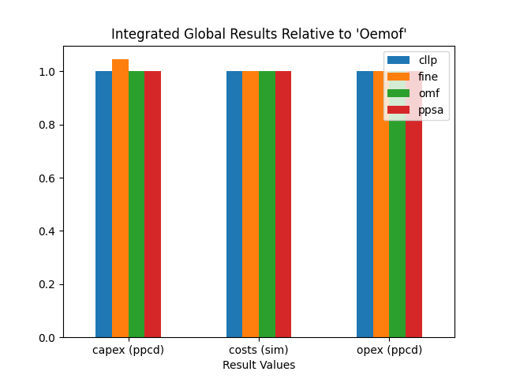

.. _TransCnE_results:

Optimization Results
********************
The following sections provide detailed overview on the numerical an graphical
results regarding the TransCnE analysis.

.. contents:: Contents
   :local:
   :backlinks: top

.. _TransCnE_results_commitment_nocongestion:

No Congestion Commitment
========================
The TransC-no-congestion results generated using the :ref:`respective script
<TransCnE_code_resgen>`, are as follows:

Integrated Global Results
^^^^^^^^^^^^^^^^^^^^^^^^^
.. csv-table::
   :file: ./commitment_nocongestion_results/IGR.csv

.. image:: ./commitment_nocongestion_results/non_costs_IGR.png
   :align: center
   :alt: Image showing the TransC non_costs IGR as bar chart

Installed Capacity
^^^^^^^^^^^^^^^^^^

.. csv-table::
   :file: ./commitment_nocongestion_results/Capacity.csv

High Voltage Grid Summed Loads
^^^^^^^^^^^^^^^^^^^^^^^^^^^^^^

.. csv-table::
   :file: ./commitment_nocongestion_results/Load-High Voltage Grid.csv

High Voltage Grid Timeseries Loads
^^^^^^^^^^^^^^^^^^^^^^^^^^^^^^^^^^
Components not contributing, aka all zero columns are not shown

.. csv-table::
   :file: ./commitment_nocongestion_results/Timeseries-High Voltage Grid.csv
      
Medium Voltage Grid Summed Loads
^^^^^^^^^^^^^^^^^^^^^^^^^^^^^^^^

.. csv-table::
   :file: ./commitment_nocongestion_results/Load-Medium Voltage Grid.csv

Medium Voltage Grid Timeseries Loads
^^^^^^^^^^^^^^^^^^^^^^^^^^^^^^^^^^^^
Components not contributing, aka all zero columns are not shown

.. csv-table::
   :file: ./commitment_nocongestion_results/Timeseries-Medium Voltage Grid.csv
      
Low Voltage Grid Summed Loads
^^^^^^^^^^^^^^^^^^^^^^^^^^^^^

.. csv-table::
   :file: ./commitment_nocongestion_results/Load-Low Voltage Grid.csv

Low Voltage Grid Timeseries Loads
^^^^^^^^^^^^^^^^^^^^^^^^^^^^^^^^^
Components not contributing, aka all zero columns are not shown

.. csv-table::
   :file: ./commitment_nocongestion_results/Timeseries-Low Voltage Grid.csv	  

District Heating Summed Loads
^^^^^^^^^^^^^^^^^^^^^^^^^^^^^

.. csv-table::
   :file: ./commitment_nocongestion_results/Load-District Heating.csv	

Redispatch
^^^^^^^^^^
For the ``No-Congestion TransC`` combination no redispatch is needed:

High -> Medium:
<<<<<<<<<<<<<<<

.. csv-table::
   :file: ./commitment_nocongestion_results/Redispatch_High2Medium.csv

Medium -> High
<<<<<<<<<<<<<<<
.. csv-table::
   :file: ./commitment_nocongestion_results/Redispatch_Medium2High.csv	  

Low -> Medium
<<<<<<<<<<<<<
.. csv-table::
   :file: ./commitment_nocongestion_results/Redispatch_Low2Medium.csv

Medium -> Low
<<<<<<<<<<<<<
.. csv-table::
   :file: ./commitment_nocongestion_results/Redispatch_Medium2Low.csv

Circulation
^^^^^^^^^^^
For the ``No-Congestion TransC`` combination no energy is circulated between
busses to reduce the amount of excess sink fed energy (which is costly).

Medium and High
<<<<<<<<<<<<<<<
.. csv-table::
   :file: ./commitment_nocongestion_results/Circulation Medium and High.csv

Medium and Low
<<<<<<<<<<<<<<
.. csv-table::
   :file: ./commitment_nocongestion_results/Circulation Medium and Low.csv

.. _TransCnE_results_commitment_congestion:

Congestion Commitment
========================
The TransC-congestion results generated using the :ref:`respective script
<TransCnE_code_resgen>`, are as follows:

Integrated Global Results
^^^^^^^^^^^^^^^^^^^^^^^^^
.. csv-table::
   :file: ./commitment_congestion_results/IGR.csv

.. image:: ./commitment_congestion_results/costs_IGR.png
   :align: center
   :alt: Image showing the TransC costs IGR as bar chart

Installed Capacity
^^^^^^^^^^^^^^^^^^

.. csv-table::
   :file: ./commitment_congestion_results/Capacity.csv

High Voltage Grid Summed Loads
^^^^^^^^^^^^^^^^^^^^^^^^^^^^^^

.. csv-table::
   :file: ./commitment_congestion_results/Load-High Voltage Grid.csv

High Voltage Grid Timeseries Loads
^^^^^^^^^^^^^^^^^^^^^^^^^^^^^^^^^^
Components not contributing, aka all zero columns are not shown

.. csv-table::
   :file: ./commitment_congestion_results/Timeseries-High Voltage Grid.csv
      
Medium Voltage Grid Summed Loads
^^^^^^^^^^^^^^^^^^^^^^^^^^^^^^^^

.. csv-table::
   :file: ./commitment_congestion_results/Load-Medium Voltage Grid.csv

Medium Voltage Grid Timeseries Loads
^^^^^^^^^^^^^^^^^^^^^^^^^^^^^^^^^^^^
Components not contributing, aka all zero columns are not shown

.. csv-table::
   :file: ./commitment_congestion_results/Timeseries-Medium Voltage Grid.csv
      
Low Voltage Grid Summed Loads
^^^^^^^^^^^^^^^^^^^^^^^^^^^^^

.. csv-table::
   :file: ./commitment_congestion_results/Load-Low Voltage Grid.csv

Low Voltage Grid Timeseries Loads
^^^^^^^^^^^^^^^^^^^^^^^^^^^^^^^^^
Components not contributing, aka all zero columns are not shown

.. csv-table::
   :file: ./commitment_congestion_results/Timeseries-Low Voltage Grid.csv	  

District Heating Summed Loads
^^^^^^^^^^^^^^^^^^^^^^^^^^^^^

.. csv-table::
   :file: ./commitment_congestion_results/Load-District Heating.csv	

Redispatch
^^^^^^^^^^
For the ``Congestion TransC`` combination some redispatch is needed:

High -> Medium:
<<<<<<<<<<<<<<<

.. csv-table::
   :file: ./commitment_congestion_results/Redispatch_High2Medium.csv

Medium -> High
<<<<<<<<<<<<<<<
.. csv-table::
   :file: ./commitment_congestion_results/Redispatch_Medium2High.csv	  

Low -> Medium
<<<<<<<<<<<<<
.. csv-table::
   :file: ./commitment_congestion_results/Redispatch_Low2Medium.csv

Medium -> Low
<<<<<<<<<<<<<
.. csv-table::
   :file: ./commitment_congestion_results/Redispatch_Medium2Low.csv

Circulation
^^^^^^^^^^^
For the ``Congestion TransC`` combination no energy is circulated between
busses to reduce the amount of excess sink fed energy (which is costly).

Medium and High
<<<<<<<<<<<<<<<
.. csv-table::
   :file: ./commitment_congestion_results/Circulation Medium and High.csv

Medium and Low
<<<<<<<<<<<<<<
.. csv-table::
   :file: ./commitment_congestion_results/Circulation Medium and Low.csv	  

.. _TransCnE_results_expansion:

Expansion
=========
The TransE results generated using the :ref:`respective script
<TransCnE_code_resgen>`, are as follows:

Integrated Global Results
^^^^^^^^^^^^^^^^^^^^^^^^^
.. csv-table::
   :file: ./expansion_results/IGR.csv

.. image:: ./expansion_results/non_costs_IGR.png
   :align: center
   :alt: Image showing the TransC non_costs IGR as bar chart

Installed Capacity
^^^^^^^^^^^^^^^^^^

.. csv-table::
   :file: ./expansion_results/Capacity.csv

Transfer Grid Installed Capacity
^^^^^^^^^^^^^^^^^^^^^^^^^^^^^^^^
.. csv-table::
   :file: ./expansion_results/Transfer_Capacities.csv

.. image:: ./expansion_results/installed_capacities.png
   :align: center
   :alt: Image showing the TransE installed transfer grid capacities	  

High Voltage Grid Summed Loads
^^^^^^^^^^^^^^^^^^^^^^^^^^^^^^

.. csv-table::
   :file: ./expansion_results/Load-High Voltage Grid.csv

High Voltage Grid Timeseries Loads
^^^^^^^^^^^^^^^^^^^^^^^^^^^^^^^^^^
Components not contributing, aka all zero columns are not shown

.. csv-table::
   :file: ./expansion_results/Timeseries-High Voltage Grid.csv
      
Medium Voltage Grid Summed Loads
^^^^^^^^^^^^^^^^^^^^^^^^^^^^^^^^

.. csv-table::
   :file: ./expansion_results/Load-Medium Voltage Grid.csv

Medium Voltage Grid Timeseries Loads
^^^^^^^^^^^^^^^^^^^^^^^^^^^^^^^^^^^^
Components not contributing, aka all zero columns are not shown

.. csv-table::
   :file: ./expansion_results/Timeseries-Medium Voltage Grid.csv
      
Low Voltage Grid Summed Loads
^^^^^^^^^^^^^^^^^^^^^^^^^^^^^

.. csv-table::
   :file: ./expansion_results/Load-Low Voltage Grid.csv

Low Voltage Grid Timeseries Loads
^^^^^^^^^^^^^^^^^^^^^^^^^^^^^^^^^
Components not contributing, aka all zero columns are not shown

.. csv-table::
   :file: ./expansion_results/Timeseries-Low Voltage Grid.csv	  

District Heating Summed Loads
^^^^^^^^^^^^^^^^^^^^^^^^^^^^^

.. csv-table::
   :file: ./expansion_results/Load-District Heating.csv	

Redispatch
^^^^^^^^^^
For the ``TransE`` combination no redispatch is needed:

High -> Medium:
<<<<<<<<<<<<<<<

.. csv-table::
   :file: ./expansion_results/Redispatch_High2Medium.csv

Medium -> High
<<<<<<<<<<<<<<<
.. csv-table::
   :file: ./expansion_results/Redispatch_Medium2High.csv	  

Low -> Medium
<<<<<<<<<<<<<
.. csv-table::
   :file: ./expansion_results/Redispatch_Low2Medium.csv

Medium -> Low
<<<<<<<<<<<<<
.. csv-table::
   :file: ./expansion_results/Redispatch_Medium2Low.csv

Circulation
^^^^^^^^^^^
For the ``TransE`` combination no energy is circulated between
busses to reduce the amount of excess sink fed energy (which is costly).

Medium and High
<<<<<<<<<<<<<<<
.. csv-table::
   :file: ./expansion_results/Circulation Medium and High.csv

Medium and Low
<<<<<<<<<<<<<<
.. csv-table::
   :file: ./expansion_results/Circulation Medium and Low.csv	        
