.. _PHD_CRA:

Comparative Result Analysis
***************************
As identified in the :ref:`PHD_PRA`, the Component Expansion and the modified
Component Expansion model scenario combinations, are deemed to be subject to
a detailed comparative result analysis. Following subsections aim to identify
key differences between the softwares investigated, as well as to locate root
causes from which these differences originate.

.. contents:: Contents
   :local:
   :backlinks: top

.. _PHD_CRA_IGR:

High Priority Results / Integrated Global Results
=================================================

CompE
-----
.. csv-table::
   :file: ./CompCnE/expansion_results/IGR.csv
   :stub-columns: 1
   :header-rows: 1
   :align: left

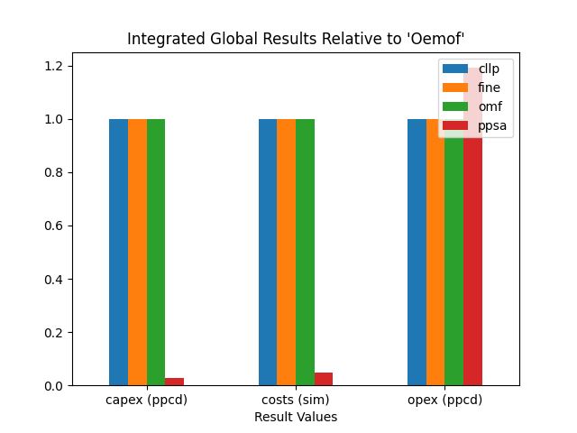

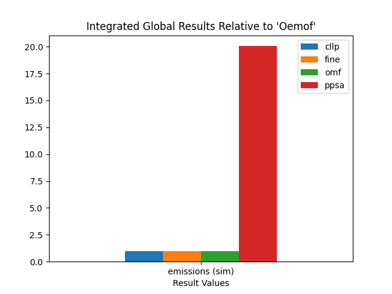
	 
Modified CompE
--------------
.. csv-table::
   :file: ./CompCnE/modified_expansion_results/IGR.csv
   :stub-columns: 1
   :header-rows: 1
   :align: left
	   
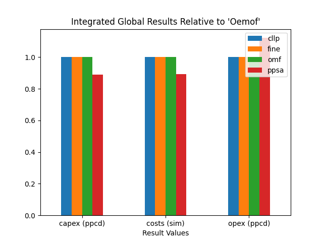

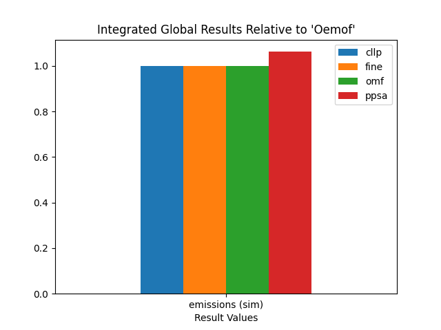

	 
.. _PHD_CRA_AGV:

Advanced Graph / Advanced System Visualization
==============================================
The advanced graph / advanced system visualizations (AGV / ASV respectively)
of the preselected model-scenario combinations (MSCs) are shown below. A list
of relevant observations is made further below in the respective ISD sections
when perfroming the visual comparison.

The AGS subsection closes with some additional remarks on what
observations are considered to be helpful in an investigation focused on the
actual results rather than their comparison. It also serves demonstration
purposes on how to use the AVS and the benefits it brings.

Component Expansion (CompE)
---------------------------

Oemof
^^^^^
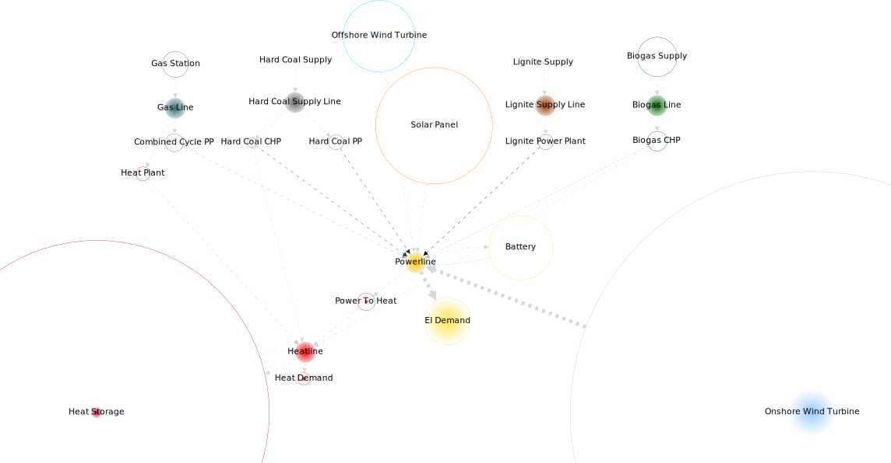

PyPSA
^^^^^
The :ref:`PHD_PRA` indicates, that the ``PyPSA`` results differ significantly.
An initial attempt to relate node size to the installed capacity and net energy
flow of the demand component ``'El Demand'`` fails, since the resulting size of
the ``Heat Storage`` component is too large. Thus the advanced system
visualization below is plotted, relating node size to the installed capacity  of
the ``Heat Storage`` component.

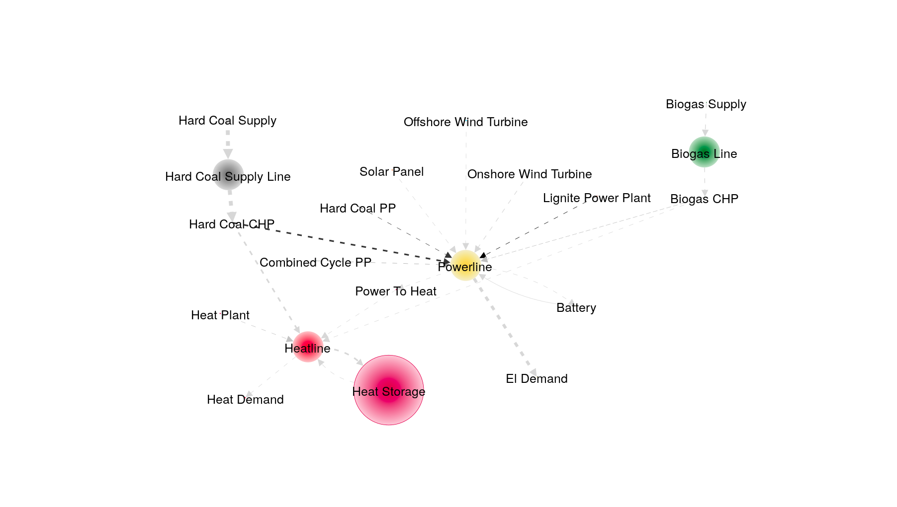
   

Modified Component Expansion (Modified CompE)
---------------------------------------------
Modifying the ``PyPSA`` system model scenario combination, leads to
optimization results closer to that of the other softwares. The advanced
graph below is therfor again drawn relative to the installed capacity and net
energy flow of the demand component ``'El Demand'``.

PyPSA
^^^^^

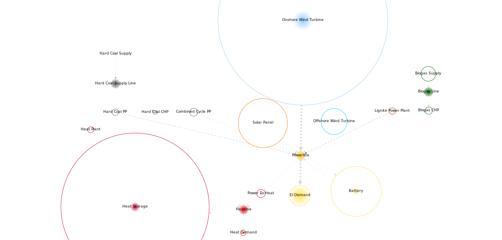

    
Actual Result Analysis
----------------------
When using the advanced graph / advanced system visualization for analysing the
results as would be the case in actual research / investigations, following
information can be exctracted:

    1. For the optimal solution the components ``Onshore``, ``Solar``,
       ``Offshore`` and ``'Battery'`` and ``Heat Storage`` are  used the most,
       having relatively large installed capacities compared to  the relatively
       low characteristic value / capacity factor.

    2. The ``Onshore`` component supplies most of the power, as indicated by
       the arrow width.

    3. Most of the heat is supplied by the ``power2heat`` component, as again,
       indicated by the arrow width.

    4. All technologies used have relatively low specific emissions, as indicated
       by the light grey of the arrows of significant width.

    5. All of the controllable power plant components (``'Lignite PP'``,
       ``'Hard Coal PP'``, ``'Hard Coal CHP'``, ``'Hard Coal CHP'`` and
       ``'Combined Cycle PP'``) have an installed capacity greater than zero
       but only very litte to no use, as indicated by the combination of node
       size and node fill size.

.. _CRA_ISD:

Identifying Significant Differences
===================================

Findings of the identifying significant differences (ISD) step, part of the
comparative results analysis are laid out and discussed in the following. As
argued in the :ref:`PHD_PRA`, only the CompE and Modified CompE results are
subject to the ISD method. The following explanation thereby serve the purpose
of detecting the differences as well as to showcase the method itself and its
features.

Components of Interest
----------------------
Identification of the components of interest (COI), is the first step. In case
a preliminary result analysis was performed like in this field study,
components causing the differences might be already identified or at least
hinted at. If not, which is usually the case for large system models, they are
identified using the technologies below.

Visual Comparison
^^^^^^^^^^^^^^^^^
Using the advanced graph / advanced system visualization (AGV / ASV
respectively), in conjunction with the integrated global results (IGR)
visualization for quickly spotting few major differences and formulating
hypotheses on their relations, even in large system models, is possible. For
cases however, where there are many large differences (e.g. the CompE model
scenario combination (MSC)), or barely any difference at all (e.g. The CompC
MSC), visually comparing the ASVs and IGRs of different software tools
can be of no benefit. For the two MSCs selected by the :ref:`PHD_PRA` however,
the observations are listed below.

Component Expansion (CompE)
<<<<<<<<<<<<<<<<<<<<<<<<<<<
Comparing the above ``'Oemof`` advanced graph visulaizations to the ``PyPSA``
one from below, following observations can be made:

    1. The ``"Onshore Wind Turbine`` component is used for most of the
       energy supplied as indicated by the arrow width.

    2. Specific emissions of the ``'Heat Storage'`` is seemingly in the
       same order of magnitude for both software tools, as indicated by
       the arrow greyscale.
	  
Following observations of the ``PyPSA`` advanced graph and integrated global
results visulaizations were made:

    1. The non-modified expansion combination of ``PyPSA`` differs largely in
       comparison to ``Oemof``.

    2. The ``'Biogas'`` and ``'Hard Coal'`` commodities are used for most of the
       energy supplied as indicated by the respective arrow widths.

    3. The ``'Hard Coal CHP'`` and the ``'Biogas CHP'`` comonent are used for
       providing most of the power and heat as indicated by the arrow width.

    4. The ``'Hard Coal CHP'`` component causes significant amounts of
       emissions indicated by arrow width and blackness.

    5. The total amount of integrated global emissions is comparaively very
       high, as seen by the bar size.

    6. The ``'Heat Storage'`` component is used extensively as indicated by
       node size and node fill size.

    7. Comparaively, the ``Onshore Wind Turbine``, ``Solar``,
       ``Offshore Wind Turbine`` and ``'Power To Heat'`` components are used
       far less.

Modified Component Expansion (Modified CompE)
<<<<<<<<<<<<<<<<<<<<<<<<<<<<<<<<<<<<<<<<<<<<<       
Comparing the advanced graph visualization of the modified ``PyPSA`` component
expansion model scenario combination, following aspects can be identified:

    1. The modified ``PyPSA`` visualization resembles that of ``Oemof`` much
       closer in comparison to the non-modified variation.

    2. The installed capacity of the ``'Battery'`` component is larger, as
       indicated by the node size       

Statistical Identifciation
^^^^^^^^^^^^^^^^^^^^^^^^^^
In addition to the visaully enhanced manual inspection, the developed method
propses a statistical identifciation technique, which is made accessible via
the :mod:`tessif.identify` submodule. Findings and additional insights are
presented below, categoriezed by investigated model scenario combination.

For both combinations the entirety of the statistical identifciation results
is shown for purposes of demonstration. If, in an application context, the
desired output are only certain levels of interest, those can be accessed
easily via the respective interest keys word (i.e 'high' for 'of-high-interest'
etc.). Examples of this can be found in the digital addendum and the respective
online documentation.

Component Expansion (CompE)
<<<<<<<<<<<<<<<<<<<<<<<<<<<
The tables below list the identified levels of interest for both the
timevarying load results and the static installed capacity results.
In addition, the auxilliary results of calculated correlation coefficients
and error value results as well as the relative deviation results are given
to showcase internal usage of the method implementation. All of the tables
shown are directly accessible via their respective interfaces of the
:mod:`tessif.identify` submodule.

Identifciation of significantly deviating load results:

.. csv-table::
   :file: ./CompCnE/avs_results/load_interest.csv
   :stub-columns: 1
   :header-rows: 1
   :align: left

Calculated correlations:

.. csv-table::
   :file: ./CompCnE/avs_results/load_correlation.csv
   :stub-columns: 1
   :header-rows: 1
   :align: left

Calculated error values:

.. csv-table::
   :file: ./CompCnE/avs_results/load_errors.csv
   :stub-columns: 1
   :header-rows: 1
   :align: left

Identifciation of significantly deviating capacity results:

.. csv-table::
   :file: ./CompCnE/avs_results/capacities_interest.csv
   :stub-columns: 1
   :header-rows: 1
   :align: left
	   
Calculated deviations:

.. csv-table::
   :file: ./CompCnE/avs_results/capacities_deviations.csv
   :stub-columns: 1
   :header-rows: 1
   :align: left
	   
As indicated in (paragraph of method description chapter), standard
parameterization of the statistical identification tools is not suited well,
for isolating singular occurences in a comparison where many large differences
exist. Hence this analysis does not provide any further key insights other than
confirming already observed aspects:

    1.  ``PyPSA`` uses the ``'Biogas'`` and ``'Hard Coal'`` commodities and
	their subsequent transformer technologies, very
	differently, as indicated by level of interest, correlation
	coefficients and relative deviations of the installed capacities.

    2. ``PyPSA`` usage differences of  the ``'Heat Storage'`` component are
       very very large as indicated by relative deviation of the installed
       capacities (9.06) and the correlation coefficient of the respective
       load results (0.1).

    3. ``PyPSA`` utilizes the ``Onshore Wind Turbine``, ``Solar``,
       ``Offshore Wind Turbine`` and ``'Power To Heat'`` components very
       differently.

One additional aspect however, gets highlighted by the statistical
identifciation, that is difficult to detect, using the bar charts
of the :ref:`PHD_PRA_CompE` alone, since the actual bar length is quite small:

    3. ``PyPSA`` also uses the ``'Battery'`` component very differently as
       indicated by relative deviation of the installed capacity (0.95) and
       the correlation coefficient of the respective load results (0.03).

       

Modified Component Expansion (Modified CompE)
<<<<<<<<<<<<<<<<<<<<<<<<<<<<<<<<<<<<<<<<<<<<<
Listed below, are the tables showing the identification results of the modified
Component-Expansion model-scenario-combination. As before, all results
including calculated correlations, error-values and relative deviations are
shown to demonstrate their usage.

Identifciation of significantly deviating load results:

.. csv-table::
   :file: ./CompCnE/modified_expansion_results/load_interest.csv
   :stub-columns: 1
   :header-rows: 1
   :align: left
	   
Calculated correlations:

.. csv-table::
   :file: ./CompCnE/modified_expansion_results/load_correlation.csv
   :stub-columns: 1
   :header-rows: 1
   :align: left
	   
Calculated error values:

.. csv-table::
   :file: ./CompCnE/modified_expansion_results/load_errors.csv
   :stub-columns: 1
   :header-rows: 1
   :align: left
	   
Identifciation of significantly deviating capacity results:

.. csv-table::
   :file: ./CompCnE/modified_expansion_results/capacities_interest.csv
   :stub-columns: 1
   :header-rows: 1
   :align: left
	   
Calculated deviations:

.. csv-table::
   :file: ./CompCnE/modified_expansion_results/capacities_deviations.csv
   :stub-columns: 1
   :header-rows: 1
   :align: left
	   
As indicated by the :ref:`preliminary result analysis <PHD_PRA_FAS_ModCompE>`,
the ``'Battery'`` component of ``PyPSA`` might be responsible for the observed
deviations in global integrated emissions. Using the proposed statistical
identifciation technique, following points are to be observed:

    1. The ``'Battery'`` component of ``PyPSA`` is expanded much more than
       in the other softwares. Indicated during preliminary result analysis
       (figure XYZ) and confirmed here by level of interest (table XYZ) and
       relative deviation (0.79 table XYZ) of the installed capacities.
       
    2. ``PyPSA`` uses its ``'Battery'`` component  similar to the other
       softwares when discharging,  as indicated by the still relatively high
       correlation coefficient (0.59 table XYZ).

    2. ``PyPSA`` uses its ``'Battery'`` component  quite differently to the
       other softwares when storing power, as indicated by the still
       relatively low correlation coefficient (0.17 table).

    4. The amount of energy transferred from and to the ``'Battery'`` component
       of ``PyPSA`` differs substantially compared to the remaining software
       tools as indicated by the calculated, relative deviation values of 3.17
       and 4.40 for discharging and charging, respectively.

    5. Same tendencies, but not as obvious, are noteable with the
       ``'Heat Storage'`` component of ``PyPSA``. With the discharging results
       even only beeing of 'medium' interest according to the identifciation.

    6. Deviations of 'medium' interest, as identified, includes the low
       emitting components ``Onshore Wind Turbine``, ``Offshore Wind Turbine``
       and ``Solar`` as well as the higher emitting but less expensive
       components ``'Biogas CHP'`` and  ``'Combined Cycle PP'``, as indicated
       by the level of intrerest results for both the timevarying load results
       (table XYZ) as well as the static installed capacity results
       (table XYZ).

       
Differing Timeframes
--------------------
Identifying differing timeframes, as proposed by the respective method
description, is most useful in cases where the actual results are subject of
primary interest. In a comparative analysis for the sake of comparison, as done
in this thesis however, they are most ofen of subordinate significance. Since
major differences, leading to educated assumptions of root casues, can be made
without comparing the actual timevarying results. Which is shown by the
component identifciation above and the hypotheses formulation below.

For purposes of demonstration, the first start and end points of the identified
timeframes as well as examplary visualization of above-threshold timevarying
result differences, for the flow from the ``'Powerline'`` component to the
``'Battery'``, are shown in the table and figures below. The SOC visualization
at the bottom plots each SOC as a dot to highlight the identified deviations.

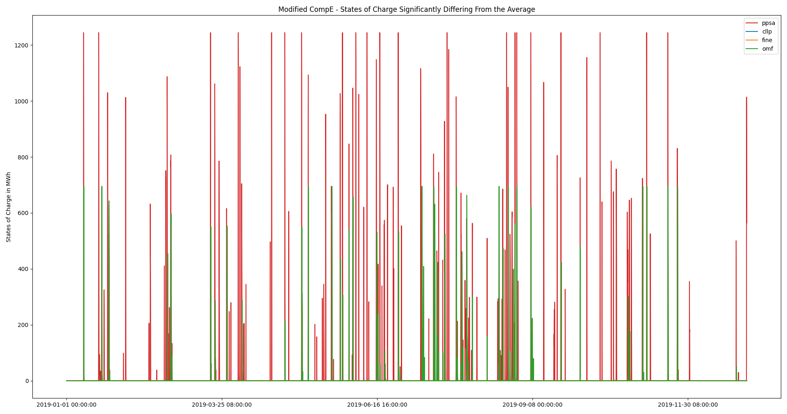

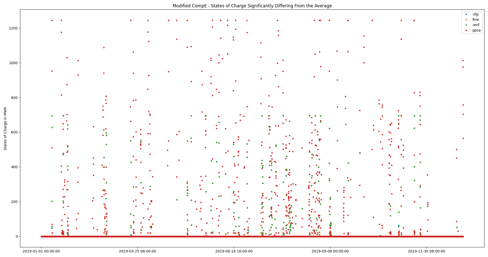

.. csv-table::
   :file: ./CompCnE/modified_expansion_results/first_three_indices.csv
   :stub-columns: 1
   :header-rows: 1
   :align: left	 

Further Analysis Selection
--------------------------
After identifying differing components and timeframes, both visually as well as
statistically, conclusions are drawn which potential root causes should be
investigated further.

Component Expansion (CompE)
^^^^^^^^^^^^^^^^^^^^^^^^^^^
Hypotheses formulated based on the visual and statistical identification
analysis performed above:

    1. The emissions caused by the ``'Hard Coal CHP'`` component of ``PyPSA``
       are probably higher than intendend. Most likely beeing part of the
       reason, for why integrated global emissions differ as much.
       
    2. The ``'Hard Coal CHP'`` and ``'Biogas CHP'`` components of ``PyPSA`` are
       used to provide most of the power and heat. This, in conjunction with the
       comparaively very high installed capacity of the ``'Heat Storage'``
       component, further indicate chp related emissions allocation issues,
       probably leading to large amounts of unneded thermal energy, that is
       stored inside the heat storage. Potentially indicating that no cyclic
       state of charge constraint is used, as intended by tessif's
       parameterization.

    3. The identified differences of the ``Onshore Wind Turbine``, ``Solar``,
       ``Offshore Wind Turbine`` and ``'Power To Heat'`` component are probably
       only a result of the above, since they are parameterized as overall less
       cost efficient. Leading the solver to not use them, if possible despite
       the emission constraint.

Hence following questions are suggested to beeing answered by identifying
potential root causes:

    1. Do the ``PyPSA`` CHP components respect the allocated emissions as
       intended by ``Tessif``?
    2. Is there substantial amount of unused thermal energy inside the heat
       storage?
    3. Does ``PyPSA`` use a non-cyclic state of charge constraint and is it the
       same for all of the software tools?

Modified Component Expansion (Modified CompE)
^^^^^^^^^^^^^^^^^^^^^^^^^^^^^^^^^^^^^^^^^^^^^
Hypotheses formulated based on the visual and statistical identification
analysis performed above:

     1. Energy flow specific emissions for the ``'Battery'`` component are
	likely to be within the same order of magnitude between ``'oemof'`` and
	``'PyPSA'``, yet the 	``PyPSA``  time integrated global emission
	results are higher. Since ``PyPSA`` installed capacity of the
	``'Battery'`` comonent is comparatively larger, this indicates remaining
	differences in storage component emissions allocations.

     2. Similar conclusions can be drawn on the ``'Heat Storage'`` component
	further indicating a systematic difference of storage components
	between ``'PyPSA'`` and the other software tools.

     3. The observed shift in power generation from less emitting to less
	expensive but more emitting technologies by ``PyPSA`` compared to the
	other softwares are most likely a result of the interpreted, lower
	storage component emissions.

Based on the formulated hypotheses, following question is suggested to beeing
answered during the identifciation of root causes:

      - Do the ``PyPSA`` storage components interpret allocated emissions the
        same way as the other software tools?

.. _CRA_IRC:

Identifying Root Causes
=======================
During the :ref:`ISD Analysis <CRA_ISD>` several questions were worked out to
be answered during the identifying root causes (IRC) analysis. In the following
they are listed again and rephased slightly (if necessary) to match the more
general nature of the IRC analysis:

    1. Do the ``PyPSA`` CHP components respect the allocated emissions as
       intended by ``Tessif``? And how does that compare to the other software
       tools?
    2. Is there substantial amount of unused thermal energy inside the heat
       storage for the CompE MSC? Implying that ``PyPSA`` uses the non-cyclic
       state-of-charge  constraint as implied by ``Tessif``. How does it
       compare to the other software tools?
    3. Do the ``PyPSA`` storage components interpret allocated emissions the
       same way as the other software tools?

Suggesting following investigations:

    1. CHP components and emissions:

       a) Perform a tabular-parameter-comparison of the CompE MSC
	  ``'Hard Coal CHP'`` to check an emission parameter exists and
	  is allocated correctly.
	  
       b) Perform a plausiblity check using a small system model focused around
	  a singular chp component, imposing an emission constraint forcing the
          solver to use more expansive, but less emitting alternatives.

    2. Storage components and cyclic state-of-charge constriants:

       a) Perform a tabular-parameter-comparison of the CompE MSC
          ``'Heat Storage'`` component to check a cycle state-of-charge
	  parameter exits and is allocated correctly.

       b) Perform a plausbility check, using a small system model focused around a
	  singular storage component, not imposing a cyclic state-of-charge
	  constraint, while making it less expensive to produce surplus amounts of
	  energy that just get stored inside the storage and not used.

       c) Plot the timevarying state of charge results of all storage
	  components of the CompE MSC to check for large amounts of unused
	  thermal energy as part of 'checking leftover ISD hypotheses' like
	  described in the respective IRC subsection.

    3. Storage components and emissions:
       
       a) Perform a tabular-parameter-comparison of the CompE MSC
          ``'Heat Storage'`` component to check an emission parameter exists
	  and is allocated correctly.

       b) Perform a plausbility check, using a small system model focused around a
	  singular storage component having outflow allocated emissions, a
	  cyclic state-of-charge constraint while also having a more expensive,
	  but less emitting alternative.

CHP Components and Emissions
----------------------------

.. _CRA_IRC_CHP_PA:

Parameter Analysis
^^^^^^^^^^^^^^^^^^
.. csv-table::
   :file: ./CompCnE/root_causes/tabular_comparison_chp_emissions.csv
   :stub-columns: 1
   :header-rows: 1
   :align: left		 

-  Tabular Parameter Comparison shows that PyPSA CHP component does not have an
   inherent emission allocation parameter.

- `PyPSa Doku
  <https://pypsa.readthedocs.io/en/latest/components.html#global-constraints>`_ states: "Global constraints are added to OPF problems and apply to many components at once. Currently only constraints related to primary energy (i.e. before conversion with losses by generators) are supported, the canonical example being CO2 emissions for an optimisation period. Other primary-energy-related gas emissions also fall into this framework."

- Tessif circumvents that by adding an individual carrier to its PyPSA networks
  for each component having co2 emissions allocated, as for examples stated by the
  :attr:`Tessif Doku
  <tessif.transform.es2es.ppsa.create_pypsa_links_from_transformers>`:
  "Note how an extra Carrier object gets parsed to accomodate for the Link
  allocated emission constraints."

- Tessifs intended parameters show emission allocation:

  .. csv-table::
     :file: ./CompCnE/root_causes/chp_tessif_params.csv
     :stub-columns: 1
     :header-rows: 1		    
     :align: left		 	    
  
- Carriers get added as Tessif intends:

  .. csv-table::
     :file: ./CompCnE/root_causes/chp_carriers_added.csv
     :stub-columns: 1
     :header-rows: 1
     :align: left		 

- Emissions get allocated as Tessif intends:
  
  .. csv-table::
     :file: ./CompCnE/root_causes/chp_allcarrier_emisisons.csv
     :stub-columns: 1
     :header-rows: 1
     :align: left		 
	    
Plausiblity Check
^^^^^^^^^^^^^^^^^

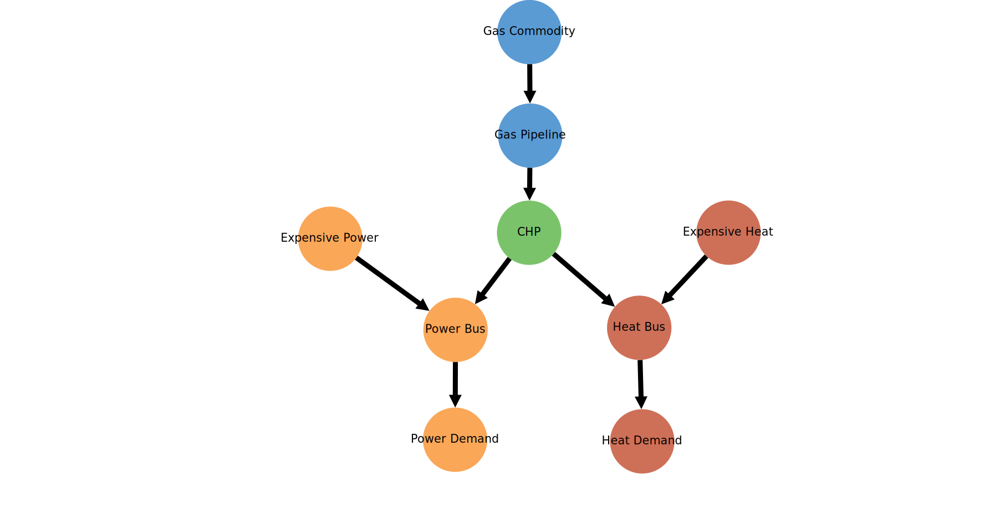
	 
System-Model MSC:

    - ``'Power Demand'`` and ``'Heat Demand'`` require 10 electrical energy
      units and 8 thermal energy per timestep over a total of four
      timesteps, respectively,
    - ``'Expensive Power'``  and ``'Expensive Heat'`` generate between 0 and
      10 electrical energy units and 0 and 8 thermal energy units respectively
      at each time step at the cost of 2 currency units per energy unit and
      guarantee that power an heat demand can be met at all times.
    - ``'CHP'`` generates between 0 and 10 electrical energy units as well
      between 0 and 8 thermal energy units (with a power to heat ratio of 10 to
      8) at the cost of 1 currency unit per energy unit. Emitting 1 emission unit
      per energy unit.
    - Global emission constraint is set to 54 emission units

Expected outcome:      

    - ``'CHP'`` provides power and heat for three of the four timesteps, since
      it is overall least expensive option
    - At the one of the four time steps, the global emission limit is reached
      due to the emissions allocated to ``'CHP'``. To meet the power and heat
      demand, ``'Expensive Power'`` and ``'Expensive Heat'`` are used to meet
      the demand, since they have no emissions allocated.

Observed outcome:

    - The expected outcome can be observed by each of the software tools
      checked, with the exception of ``PyPSA``, as shown by the ``'CHP'``
      outflow results in the table below.
      
    .. csv-table::
       :file: ./CompCnE/root_causes/plausify_chp_emissions_chp_flows.csv
       :stub-columns: 1
       :header-rows: 1
       :align: left
	   
    - ``PyPSA`` however, does use ``'CHP'`` for all of the four timesteps
      appearantly not taking any emissions of the underlying ``'Link'``
      comonent into account, as can be seen by the ``PyPSA`` integrated
      global results, shown in the table below

    .. csv-table::
       :file: ./CompCnE/root_causes/plausify_chp_emissions_igr.csv
       :stub-columns: 1
       :header-rows: 1
       :align: left

    
Conclusion
^^^^^^^^^^
Based on the fact, emissions get seemingly allocated correctly, a reasoned
assumption can be made in that  there might a potential error in the pypsa
``Link`` component with regards to the the ``Carrier`` component emission
allocation. Potentially only occuring on Link compoents, that get manually
expanded to CHP like components.

Consulting the `PyPSA online documentation
<https://pypsa.readthedocs.io/en/latest/optimal_power_flow.html#global-constraints>`_
about the indepth mathematical formulation, reveals that only components taken
into account for emission calculation, are their ``'Generator'`` and storage
like components. This is somewhat counterintuitive, since the developers also
`recommend
<https://pypsa.readthedocs.io/en/latest/components.html#link-with-multiple-outputs-or-inputs>`_
expanding the ``'Link'`` component to model CHP like components.

To counteract the problamatic emission bahaviour,
a reallocation of the emissions to the CHP component feeding commodities is
advised. Since this is not possibe for the ``'Power to Heat'`` component, it
is recommended to not allocated emissions to this component in a modified
version of the CompE MSC.

Storage Components and Cyclic State-of-Charge Constraints
---------------------------------------------------------

Parameter Analysis
^^^^^^^^^^^^^^^^^^
Table below visualizes a cut out of the storage component's tabular parameter
comparison for all of the software tools used.

.. csv-table::
   :file: ./CompCnE/root_causes/tabular_comparison_storage_cyclic.csv
   :stub-columns: 1
   :header-rows: 1
   :align: left  

The table indicates, that each of the softwares used offers the possibility to
provide a cyclic state-of-charge constraints to their storages.

Plausibility Check
^^^^^^^^^^^^^^^^^^

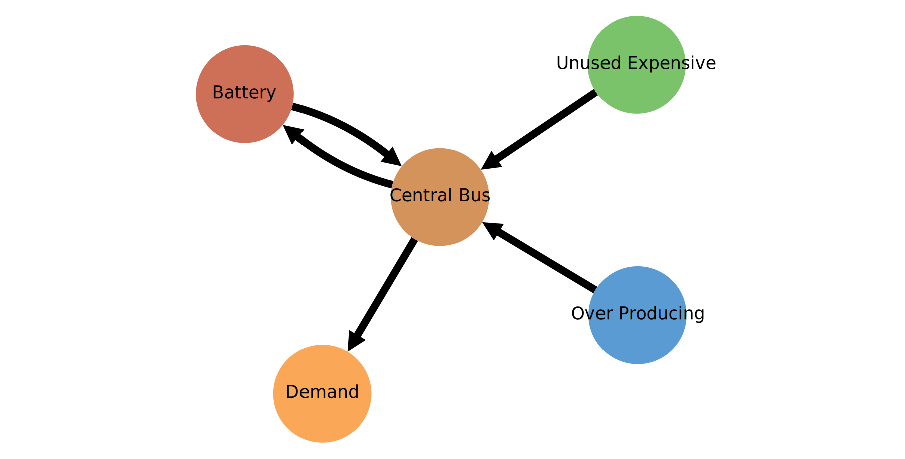
	 
System-Model MSC:

    - ``'Demand'`` requires 10 energy units per time step over a total of four
      timesteps	 
    - ``'Over Producing'`` generates 11 energy units at each time step at the
      cost of 1 currency unit per energy unit.
    - ``'Unused Expensive'`` generates between 0 and 10  energy units at each
      time step at the cost of 2 currency unit per energy unit and guarantees
      solvebility.
    - ``'Battery'`` has an installed capacity of 100 energy units, no outflow
      costs, no allocated emissions and no idle changes in its SOC.

Expected outcome:

    - The Demand is met at all timesteps by ``'Over Producing'``.
    - The surplus amount of energy is stored inside ``'Battery'``.
    - At the ende of the optimisation time span, the SOC of ``'Battery'``
      is higher than at the first, since no cyclic SOC constraint was given,
      no energy was discharged and each time step one energy unit was stored.
      

Observed outcome:

    - Each of the software tools checked, show the expected outcome as can be
      seen by the SOC results in the table below. With the  minor exception of
      ``FINE`` which seems to interpret the SOC as it is in
      the beginning of the time step as opposed to the end of the timestep like
      the other softwares.

.. csv-table::
   :file: ./CompCnE/root_causes/plausify_cyclic_soc.csv
   :stub-columns: 1
   :header-rows: 1
   :align: left      
      
Comparing State-of-Charges (Checking Leftover ISD Hypotheses)
^^^^^^^^^^^^^^^^^^^^^^^^^^^^^^^^^^^^^^^^^^^^^^^^^^^^^^^^^^^^^

Visualizing the CompE MSC Storage SOCs for checking the hypotheses of
large amounts of unused thermal energy.

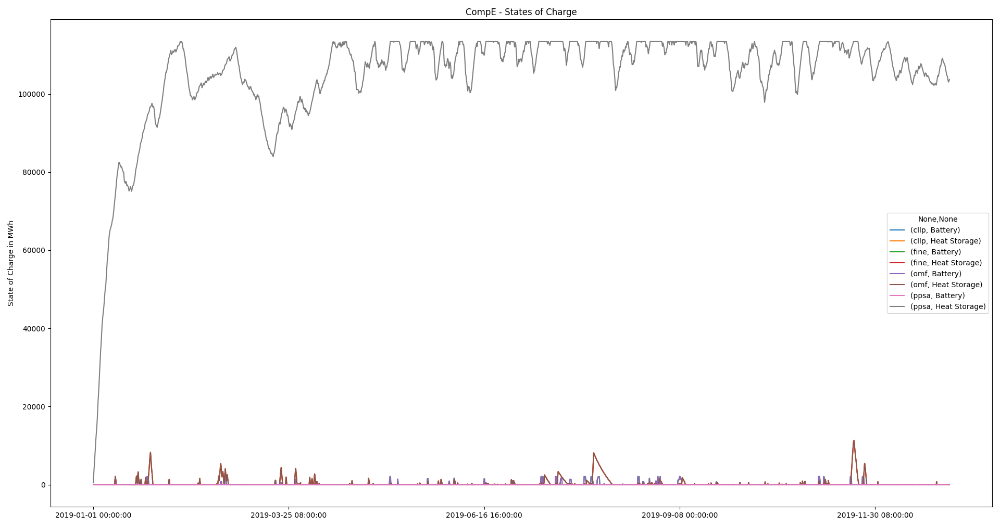

Conclusion
^^^^^^^^^^	 
Evaluating the findings from above, following conlusive can be drawn:

The tabular parameter comparison above shows, that all supported software
tools, including ``PyPSA``, are indeed able to model non-cyclic state-of-charge
constraints for their storages, as is intended by ``Tessif`` in its CompE MSC.

Inspecting the state-of-charge results shows, that only ``PyPSA`` uses its
``'Heat Storage'`` component to store large amounts of unneeded thermal energy.

Since all software tools successfully utilize a cyclic state-of-charge
constraint, as shown by the plausibility check above, it seems reasonable, to
assume that the observed use of the ``PyPSA 'Heat Storage Component'``, does
not originate from the component itself, but is rather a side-effect of other
factors. Based on the CHP component comparison above, it is seen as very likely,
that the observed differences stem from the emission allocation issue resulting
in an overall lower amount of detected emissions by ``PyPSA``. Thus, resulting
in the usage of the more cost efficient CHP components. Hence the same
recommandation as above is made, with regards to reallocation and reoptimization
of the Component Expansion MSC.
  

Storage Components and Emissions
--------------------------------

.. _CRA_IRC_StE_PA:

Parameter Analysis
^^^^^^^^^^^^^^^^^^
The table below lists the relavant part of the storage component's tabular parameter
comparison for ``Tessif`` and ``PyPSA``

.. csv-table::
   :file: ./CompCnE/root_causes/tabular_comparison_storage_emissions.csv
   :stub-columns: 1
   :header-rows: 1
   :align: left  

The Tabular comparison shows, that the ``PyPSA`` storage component does not
have an inherent emission allocation parameter. As indicated in the
:ref:`CHP IRC Analysis <CRA_IRC_CHP_PA>`, ``PyPSA`` uses seperate
``'Carrier'`` objects to allocate emissions to (primary) energy carriers.
Tessif utilizes them in creating an individual component specific ``'Carrier'``
object, whith the respective emmisions allocated.

For the modified CompE MSC, ``Tessif`` allocates emissions to the
``'Battery'`` as shown by the respective parameter analysis shown
in the table below:

  .. csv-table::
     :file: ./CompCnE/root_causes/storage_tessif_params.csv
     :stub-columns: 1
     :header-rows: 1		    
     :align: left		 	    
  
This ``'Battery'`` component specific carrier gets added, as shown by the
respective ``PyPSA`` parameter analysis results, seen in the table below:

  .. csv-table::
     :file: ./CompCnE/root_causes/storage_carriers_added.csv
     :stub-columns: 1
     :header-rows: 1
     :align: left		 

Further analysing the ``PyPSA`` allocated emissions shows, that the
``'Battery'`` component gets the emission parameter succesfully allocated as
listed in the table below:
  
  .. csv-table::
     :file: ./CompCnE/root_causes/storage_allcarrier_emisisons.csv
     :stub-columns: 1
     :header-rows: 1
     :align: left		 

Inspecting ``PyPSA's`` `formulation on calculating the emissions
<https://pypsa.readthedocs.io/en/latest/optimal_power_flow.html#global-constraints>`_
as done by `Reimer and Ammon
<https://tore.tuhh.de/bitstream/11420/11707/2/PA_Max_Reimer.pdf#subsection.4.3.2>`_
shows that only the difference between final and initial state of charge are
taken into account when calculating sotrage component related emisssions.
``Tessif`` however, intends the emissions to be allocated to the storage
component outflow.

.. _CRA_IRC_StE_PlC:

Plausibility Check
^^^^^^^^^^^^^^^^^^

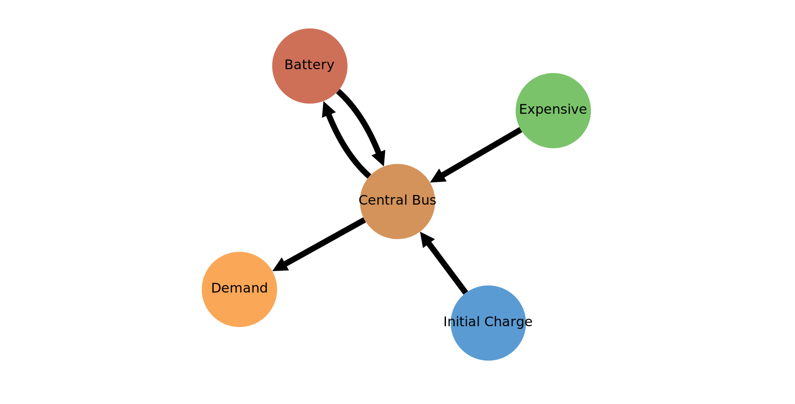

System-Model MSC:

    - ``'Demand'`` requires 10 energy units per time step over a total of four
      timesteps	 
    - ``'Initial Charge'`` provides 110 energy units at the first time step for
      zero cost units at zero emission, but none at the remaining time steps
    - ``'Battery'`` gets charged at the first time step with 100 energy units,
      has no outflow costs and no idle changes in its SOC.
    - ``'Battery'`` emitts 1 emission unit per energy unit flowing out of it
    - Global emission constraint is set to 20 emission units

Expected outcome:

    - Demand is met at the first timestep by the ``'Initial Charge'`` component
    - Demand is met at second and third time step by dischraging the
      ``'Battery'`` component.
    - At the last time step, global emission limit is reached due to the
      ``'Battery'`` component discharging. Hence the ``'Expensive'`` component
      meets the demand at the final timestep.

Observed outcome:

    - Each of the software tools checked, with the exception of ``PyPSA``,
      produce the expected outcome
    - ``PyPSA`` however does not, and discharges the ``'Battery'`` component
      at the third timestep to meet the demand, as shown in the upper table
      below. Leading to an overall emission of 30 emission units as interpreted
      by ``Tessif`` as seen in the lower table below.
    - The results indicate, that ``PyPSA 'Storage Unit'``  components indeed
      calculate emissions based on SOC differences, in contrast to ``Tessif's``
      outflow based calculation.
    
	 
.. csv-table::
   :file: ./CompCnE/root_causes/plausify_storage_emissions_battery_flows.csv
   :stub-columns: 1
   :header-rows: 1
   :align: left

.. csv-table::
   :file: ./CompCnE/root_causes/plausify_storage_emissions_igr.csv
   :stub-columns: 1
   :header-rows: 1
   :align: left	   

Conclusion
^^^^^^^^^^
Summerizing the above investigations, following conlusive points can be made.

The ``PyPSA 'Battery'`` component emissions get succesfully allocated, as shown by
the above :ref:`CRA_IRC_StE_PA` and as obeservable in the emissions caused plot
created during the preliminary result analysis.

Furthermore it could be shown, that ``PyPSA 'Storage'`` components do respect the
emission allocation parameter. Emissions caused however, are calculated based
on the difference between the final and initial state of charge, as indicated
by the analysis of `Reimer and Ammon
<https://tore.tuhh.de/bitstream/11420/11707/2/PA_Max_Reimer.pdf#subsection.4.3.2>`_
and demonstrated by the :ref:`CRA_IRC_StE_PlC`.

Since this discrepency can not easily be circumvented, by ``Tessif's`` current
implementation, `Reimer and Ammon
<https://tore.tuhh.de/bitstream/11420/11707/2/PA_Max_Reimer.pdf#subsection.4.3.3>`__
investigated an additional modified CompE MSC in which no emissions were
allocated to the storage components. Resulting in integrated global
results, very close to each other (relative deviation less than one percent),
including the emission results. Plausifying the findings of this root cause
analysis.
  

