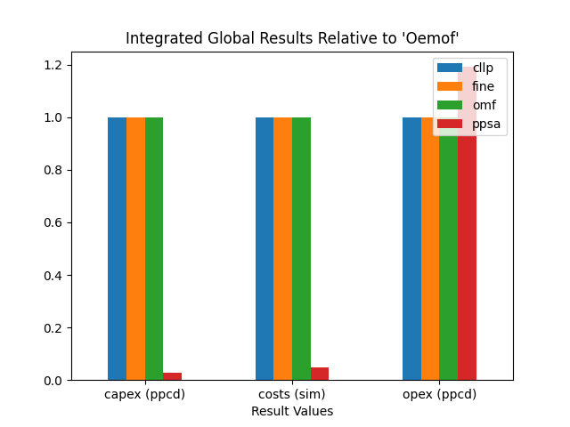
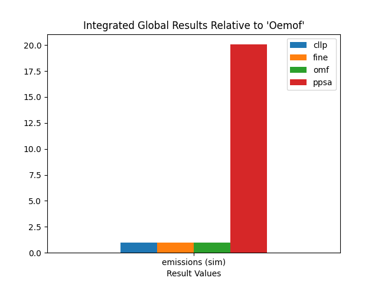
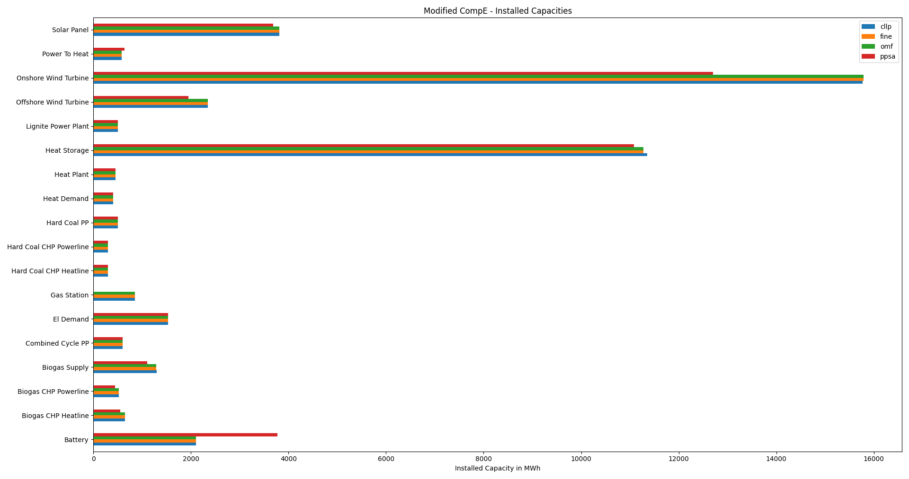
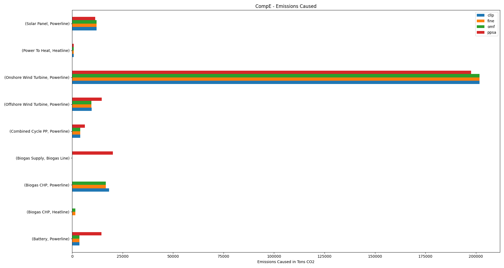

.. _PHD_PRA:

Preliminary Result Analysis
***************************
The preliminary result analysis is best suited for small to medium size supply
system models (up to about 30 to 40 components). Since it serves both purposes
at once, doing the actual result analysis and allowing some straight forwared
comparisons. Following subsections give an overview of the conducted preliminary
result analysis. Amining at demonstrating the method itself as well as
selecting specific aspects for further :ref:`PHD_CRA`.

The horizontal bar charts shown below, plot the installed capacities, summed
loads and total emissions caused clustered by component for each of the
softwares used. Components are not shown where the respective result is zero
among the results for all of the investigated softwares.

.. contents:: Contents
   :local:
   :backlinks: top

CompC
=====

Integrated Global Results
-------------------------
.. csv-table::
   :file: ./CompCnE/commitment_results/IGR.csv

.. image:: ./CompCnE/commitment_results/costs_IGR.png
   :align: center
   :alt: Image showing the TransC costs IGR as bar chart

.. image:: ./CompCnE/commitment_results/non_costs_IGR.png
   :align: center
   :alt: Image showing the TransC non_costs IGR as bar chart

Summed Loads
------------

.. csv-table::
   :file: ./CompCnE/commitment_results/plotted_net_energy_flows.csv

      
Installed Capacities
--------------------

.. csv-table::
   :file: ./CompCnE/commitment_results/plotted_installed_capacities.csv

Emissions Caused
----------------

.. csv-table::
   :file: ./CompCnE/commitment_results/plotted_emissions_caused.csv

.. _PHD_PRA_CompE:

CompE
=====

Integrated Global Results
-------------------------

.. csv-table::
   :file: ./CompCnE/expansion_results/IGR.csv

Summed Loads
------------
Following bar charts show the net energy flow results of all softwares grouped
by component. Components are not shown, where summed loads are zero
among the results of all of the investigated softwares.

.. csv-table::
   :file: ./CompCnE/expansion_results/plotted_net_energy_flows.csv

Installed Capacities
--------------------

.. csv-table::
   :file: ./CompCnE/expansion_results/plotted_installed_capacities.csv

Emissions Caused
----------------

.. csv-table::
   :file: ./CompCnE/expansion_results/plotted_emissions_caused.csv

	 
Modified CompE
==============

Integrated Global Results
-------------------------

.. csv-table::
   :file: ./CompCnE/modified_expansion_results/IGR.csv

.. image:: ./CompCnE/modified_expansion_results/costs_IGR.png
   :align: center
   :alt: Image showing the CompE costs IGR as bar chart

.. image:: ./CompCnE/modified_expansion_results/non_costs_IGR.png
   :align: center
   :alt: Image showing the CompE non_costs IGR as bar chart

Summed Loads
------------	 
.. csv-table::
   :file: ./CompCnE/modified_expansion_results/plotted_net_energy_flows.csv

Installed Capacities
--------------------      

.. csv-table::
   :file: ./CompCnE/modified_expansion_results/plotted_installed_capacities.csv

Emissions Caused
----------------	 

.. csv-table::
   :file: ./CompCnE/modified_expansion_results/plotted_emissions_caused.csv

LossLC
======

Integrated Global Results
-------------------------

.. csv-table::
   :file: ./LossLC/losslc_results/IGR.csv

.. image:: ./LossLC/losslc_results/costs_IGR.png
   :align: center
   :alt: Image showing the LossLC costs IGR as bar chart

Summed Loads
------------

.. csv-table::
   :file: ./LossLC/losslc_results/plotted_net_energy_flows.csv

Installed Capacities
--------------------

.. csv-table::
   :file: ./LossLC/losslc_results/plotted_installed_capacities.csv

Emissions Caused
----------------

.. csv-table::
   :file: ./LossLC/losslc_results/plotted_emissions_caused.csv

	 

No Congestion TransC
====================

Integrated Global Results
-------------------------

.. csv-table::
   :file: ./TransCnE/commitment_nocongestion_results/IGR.csv

.. image:: ./TransCnE/commitment_nocongestion_results/costs_IGR.png
   :align: center
   :alt: Image showing the no congestion TransC costs IGR as bar chart

.. image:: ./TransCnE/commitment_nocongestion_results/non_costs_IGR.png
   :align: center
   :alt: Image showing the no congestion TransC non_costs IGR as bar chart
   
Summed Loads
------------

.. csv-table::
   :file: ./TransCnE/commitment_nocongestion_results/plotted_net_energy_flows.csv

Installed Capacities
--------------------

.. csv-table::
   :file: ./TransCnE/commitment_nocongestion_results/plotted_installed_capacities.csv

Emissions Caused
----------------	 

.. csv-table::
   :file: ./TransCnE/commitment_nocongestion_results/plotted_emissions_caused.csv

Congestion TransC
=================

Integrated Global Results
-------------------------

.. csv-table::
   :file: ./TransCnE/commitment_congestion_results/IGR.csv

.. image:: ./TransCnE/commitment_congestion_results/costs_IGR.png
   :align: center
   :alt: Image showing the congestion TransC costs IGR as bar chart

.. image:: ./TransCnE/commitment_congestion_results/non_costs_IGR.png
   :align: center
   :alt: Image showing the congestion TransC non_costs IGR as bar chart

Summed Loads
------------

.. csv-table::
   :file: ./TransCnE/commitment_congestion_results/plotted_net_energy_flows.csv

Installed Capacities
--------------------

.. csv-table::
   :file: ./TransCnE/commitment_congestion_results/plotted_installed_capacities.csv

Emissions Caused
----------------

.. csv-table::
   :file: ./TransCnE/commitment_congestion_results/plotted_emissions_caused.csv

.. image:: ./TransCnE/commitment_congestion_results/plotted_emissions_caused.png
   :align: center
   :alt: Image showing the congestion TransC emissions caused != 0
	 

TransE
======

Integrated Global Results
-------------------------

.. csv-table::
   :file: ./TransCnE/expansion_results/IGR.csv

.. image:: ./TransCnE/expansion_results/costs_IGR.png
   :align: center
   :alt: Image showing the TransE costs IGR as bar chart

.. image:: ./TransCnE/expansion_results/non_costs_IGR.png
   :align: center
   :alt: Image showing the  TransE non_costs IGR as bar chart	 
      

Summed Loads
------------

.. csv-table::
   :file: ./TransCnE/expansion_results/plotted_net_energy_flows.csv

Installed Capacities
--------------------      

.. csv-table::
   :file: ./TransCnE/expansion_results/plotted_installed_capacities.csv

	 
Emissions Caused
----------------
.. csv-table::
   :file: ./TransCnE/expansion_results/plotted_emissions_caused.csv

	 

Further Analysis Selection
==========================

Following remarks can be made after preliminary results analysis for each of
the investigated model scenario combinations.

CompCnE
-------

The Component Comittment results of all softwares are well within a range of
deviation less than 10%. This includes integrated global results, capacities
installed and summed up load results but excludes total emissions caused. Since
the latter has no senodary impact on other system behaviour due to no emission
limit imposed, overall comparison relevant results resemble closely.

The Component Expansion results on the other hand differ substantially between
``PyPSA`` and the remaining softwares. Whereas the results for ``Calliope``,
``FINE`` and ``oemof`` are again well within a range of deviation less than 10%.
This includes all the investigated preliminary results (IGR, installed
capacities, summemd up loads, eissions caused). Indicating that a closer
comparison between one of the other tools and ``PyPSA`` seems sensible. The
amount of deviation however, suggests significant discrepancies, most likely
beeing identifiable without utilizing the finer grained comparative analysis
strategy proposed in this thesis.

Comparing the summed loads and installed capacities of the ``Hard Coal CHP``
and the ``Biogas CHP``  component in conjunction with the installed capacity
of the ``Heat Storage`` component indicate, that ``PyPSA`` does not interpet
emission allocation  to CHP coompents as designed by ``Tessif``. Likely making
the use of the overall more energy efficient combined heat and power
generation, in conjunction with non cyclic state of charge constraints,
preferable.

The plausiblity check as well as the tabular parameter comparison of the
``Hard Coal CHP``, the ``Biogas CHP``  and the ``Heat Storage`` done in the
:ref:`Comparative Result Analysis <CRA_IRC>` were able to verify or
at least plausify this theory. So that for further analysis an additional
optimization is performed labeled as ``modified CompE`` where emissions
are allocated to hard coal and biogas supply lines so that ``PyPSA`` can
correctly interpret ``Tessif's`` intend.

.. _PHD_PRA_FAS_ModCompE:

Modified CompE
----------------
As described above the modified CompE model-scenario-combination reallocates
CHP component relevant emissions to their respective commidity supply line so
that ``PyPSA`` is able to correctly interpret *Tessif's* intend in this
regard.

As indicated by the integrated global results, still some deviations remain.
``PyPSA's`` total emission results are still 1.06 times that of ``oemof``
while overall costs are only still about 89% of that of ``oemof``. Hence
further investigations are recommended most likely revolving around the
``Battery`` component judging from the total component emissions diagram.

If the recommended comparative result analysis was not to be conducted (e.g.
for technical reasons or reasons of brevity), the method propses the
investigation of relative differences. In this case however, they would probably
not result in any further valuable insight. Since the root cause seems to be a
minor deviation within the ``PyPSA`` storage component behaviour, a
plausiblity-check as propsed in the respective method section would be advised.

LossLC
------
The Lossless Comittment results of all softwares are well within a range of
deviation less than 1% for the IGR, the summed up loads (except
for those show below) as well as overall emissions caused.

Analysing the net energy flows where deviation is greater than 10% yields the
results shown below. Revealing that ``Calliope`` uses the ``Biogas`` commodity,
instead of the ``Gas`` commodity. If the LossLC model scenario combination was
a standalone investigation focused on the actual optimization results rather
than on their comparison, further investigations would be recommended. Since
this not the case however, and overall integrated global results resemble very
closely, no further effort is undertaken at this point.

.. csv-table::
   :file: ./LossLC/losslc_results/plotted_rel_energy_flows.csv

TransCnE
--------
The observed devation of the No Congestion Transformer results are less
than 5% among all results compared in the preliminary result analysis, with
the exception of the total component emissions caused, where ``Calliope``
allocates emissions slightly differently without impacting overal emissions.
Thus, further comparative result analysis is deemed unnecessary.

For the Congestion Transformer Commitment results total emissions vary slightly
between ``PyPSA`` and ``Fine`` as well as ``Oemof`` and ``Calliope`` due to
only the latter beeing able to allocate eissions to Sink inflows. This impacts
overall global emissions, where as the other integrated global results as well
as summed up loads do not deviate more than 1%. No 

The Transformer Expansion results of all softwares are well within a range of
deviation less than 5%. This includes integrated global results, capacities
installed and summed up load results but excludes total component emissions
caused, where ``Calliope`` allocates emissions differently, however without
effecting overall emissions. Hence the results are interpreted as similar
enough to not warrent further investigations

Additional Remarks
==================

The Congestion Transfer Commitment model scenario combination is designed to
model grid congestion effects. To counter act these, a subsequent redispatch
is necessary, which can be calculated by comparing the inflows of an
``Excess Sink`` component and the outflows of the respective ``Deficit Source``
component on the other side of the grid component having congestion issues.

Within the optimized timespan, two occurences of redispatch happen. Both at
the ``High Medum Transfer`` component and thus in the power flow direction
from high voltage grid to medium voltage grid. The table below lists these
congestion occurences and the subsequent redispatch necessary.

.. csv-table::
   :file: ./TransCnE/commitment_congestion_results/Redispatch_High2Medium.csv
