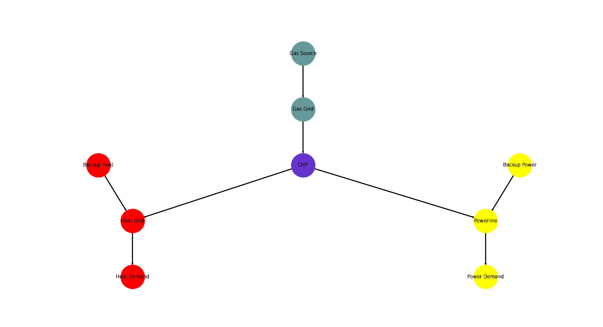

.. _AutoCompare_CHP:

Combined Heat and Power Example (Brief)
***************************************

This example briefly illustrates the auto comparative features of the
:mod:`~tessif.analyze` module. For a more detailed example please refer to
the :ref:`examples_auto_comparison_fpwe`.

.. contents:: Contents
   :local:
   :backlinks: top

Initial code to do the comparison
=================================

>>> # change spellings_logging_level to debug to declutter output
>>> import tessif.frused.configurations as configurations
>>> configurations.spellings_logging_level = 'debug'

>>> # Import hardcoded tessif energy system using the example hub:
>>> import tessif.examples.data.tsf.py_hard as tsf_examples

>>> # Choose the underlying energy system
>>> tsf_es = tsf_examples.create_chp()

>>> # write it to disk, so the comparatier can read it out
>>> import os
>>> from tessif.frused.paths import write_dir
>>> #
>>> output_msg = tsf_es.to_hdf5(
...     directory=os.path.join(write_dir, 'tsf'),
...     filename='chp_comparison.hdf5',
... )

>>> # let the comparatier do the auto comparison:
>>> import tessif.analyze, tessif.parse
>>> #
>>> comparatier = tessif.analyze.Comparatier(
...     path=os.path.join(write_dir, 'tsf', 'chp_comparison.hdf5'),
...     parser=tessif.parse.hdf5,
...     models=('oemof', 'pypsa', 'fine', 'calliope'),
... )

Code accessing the results
==========================
Following section provides examples on how to use the
:class:`Comparatier interface <tessif.analyze.Comparatier>` to access the
auto generated comparison results.

Models
------

>>> # show the models compared:
>>> for model in sorted(comparatier.models):
...     print(model)
cllp
fine
omf
ppsa

Energy System Objects
---------------------

>>> # access the model based energy system objects
>>> # (type(es) printed here for doctesting)
>>> # 
>>> for model, es in comparatier.energy_systems.items():
...     print(f'{model}: {type(es)}')
cllp: <class 'calliope.core.model.Model'>
fine: <class 'FINE.energySystemModel.EnergySystemModel'>
omf: <class 'oemof.solph.network.energy_system.EnergySystem'>
ppsa: <class 'pypsa.components.Network'>

Energy System Graph
-------------------
>>> import matplotlib.pyplot as plt
>>> import tessif.visualize.nxgrph as nxv

>>> grph = comparatier.graph

>>> drawing_data = nxv.draw_graph(
...     grph,
...     node_color={
...         'Gas Source': '#669999',
...         'Gas Grid': '#669999',
...         'CHP': '#6633cc',
...         'Backup Heat': 'red',
...         'Heat Grid': 'red',
...         'Heat Demand': 'red',
...         'Backup Power': 'yellow',
...         'Powerline': 'yellow',
...         'Power Demand': 'yellow',
...     },
... )
>>> # plt.show()  # commented out for simpler doctesting

Comparative Model Results
-------------------------
Following sections show how to utilize to built-in
:class:`~tessif.analyze.ComparativeResultier` to access results conveniently
among models.

Installed Capacity Results
^^^^^^^^^^^^^^^^^^^^^^^^^^
>>> print(comparatier.comparative_results.capacities['CHP'])
CHP             cllp    fine        omf       ppsa
Heat Grid   6.666667   6.667   6.666667   6.666667
Powerline  10.000000  10.000  10.000000  10.000000

Original Capacity Values
^^^^^^^^^^^^^^^^^^^^^^^^
>>> print(comparatier.comparative_results.original_capacities['CHP'])
CHP        cllp  fine  omf  ppsa
Heat Grid   0.0   0.0    0   0.0
Powerline   0.0   0.0    0   0.0

Expansion Cost Results
^^^^^^^^^^^^^^^^^^^^^^
>>> print(comparatier.comparative_results.expansion_costs['CHP'])
CHP        cllp  fine  omf  ppsa
Heat Grid     0   0.0  0.0   0.0
Powerline     0   0.0  0.0   0.0

Flow Cost Results
^^^^^^^^^^^^^^^^^
>>> print(comparatier.comparative_results.costs[('CHP', 'Powerline')])
cllp    4.333333
fine    3.000000
omf     3.000000
ppsa    3.000000
Name: (CHP, Powerline), dtype: float64

>>> print(comparatier.comparative_results.costs[('CHP', 'Heat Grid')])
cllp    0.0
fine    2.0
omf     2.0
ppsa    2.0
Name: (CHP, Heat Grid), dtype: float64

Characteristic Value Results
^^^^^^^^^^^^^^^^^^^^^^^^^^^^
>>> print(comparatier.comparative_results.cvs['CHP'])
CHP        cllp  fine  omf  ppsa
Heat Grid   1.0   1.0  1.0   1.0
Powerline   1.0   1.0  1.0   1.0

Flow Emission Results
^^^^^^^^^^^^^^^^^^^^^
>>> print(comparatier.comparative_results.emissions[('CHP', 'Powerline')])
cllp    4.0
fine    2.0
omf     2.0
ppsa    2.0
Name: (CHP, Powerline), dtype: float64

>>> print(comparatier.comparative_results.emissions[('CHP', 'Heat Grid')])
cllp    0.0
fine    3.0
omf     3.0
ppsa    3.0
Name: (CHP, Heat Grid), dtype: float64

.. _AutoCompare_CHP_Unconstrained_Loads:

Load Results
^^^^^^^^^^^^
>>> print(comparatier.comparative_results.loads['CHP'])
                          cllp                           fine                            omf                           ppsa                    
CHP                   Gas Grid Heat Grid Powerline   Gas Grid Heat Grid Powerline   Gas Grid Heat Grid Powerline   Gas Grid Heat Grid Powerline
1990-07-13 00:00:00 -33.333333  6.666667      10.0 -33.333333  6.666667      10.0 -33.333333  6.666667      10.0 -33.333333  6.666667      10.0
1990-07-13 01:00:00 -33.333333  6.666667      10.0 -33.333333  6.666667      10.0 -33.333333  6.666667      10.0 -33.333333  6.666667      10.0
1990-07-13 02:00:00 -33.333333  6.666667      10.0 -33.333333  6.666667      10.0 -33.333333  6.666667      10.0 -33.333333  6.666667      10.0
1990-07-13 03:00:00 -33.333333  6.666667      10.0 -33.333333  6.666667      10.0 -33.333333  6.666667      10.0 -33.333333  6.666667      10.0

.. _AutoCompare_CHP_Unconstrained_Results:

Integrated Global Results (IGR)
-------------------------------
Following section demonstrate how to access the
:attr:`integrated global results
<tessif.analyze.Comparatier.integrated_global_results>` of the models compared.

>>> # show the integrated global results of the chp example:
>>> comparatier.integrated_global_results.drop(
...     ['time (s)', 'memory (MB)'], axis='index')
                  cllp   fine    omf   ppsa
emissions (sim)  160.0  160.0  160.0  160.0
costs (sim)      307.0  307.0  307.0  307.0
opex (ppcd)      307.0  307.0  307.0  307.0
capex (ppcd)       0.0    0.0    0.0    0.0

Memory and timing results are dropped because they vary slightly between runs.
The original results look something like::

  comparatier.integrated_global_results
                    cllp   fine    omf   ppsa
  emissions (sim)  160.0  160.0  160.0  160.0
  costs (sim)      307.0  307.0  307.0  307.0
  opex (ppcd)      307.0  307.0  307.0  307.0
  capex (ppcd)       0.0    0.0    0.0    0.0
  time (s)           0.9    1.1    0.9    1.5
  memory (MB)        1.1    1.1    0.7    1.6

.. _AutoCompare_CHP_Constrained:

Adding CO-2 Emission Constraints
================================

>>> tsf_es = tsf_examples.create_chp()
>>> # use the existing constraints ...
>>> new_constraints = tsf_es.global_constraints.copy()
>>> # ... to modify them
>>> new_constraints['emissions'] = 100

Build the new energy system:

>>> from tessif.model.energy_system import AbstractEnergySystem  # nopep8
>>> new_tsf_es = AbstractEnergySystem.from_components(
...     uid='constrained_chp_example',
...     components=tsf_es.nodes,
...     timeframe=tsf_es.timeframe,
...     global_constraints=new_constraints,
... )

Redo the comparison:

>>> # write it to disk, so the comparatier can read it out
>>> output_msg = new_tsf_es.to_hdf5(
...     directory=os.path.join(write_dir, 'tsf'),
...     filename='constrained_chp_example.hdf5',
... )

>>> # let the comparatier to the auto comparison:
>>> import functools  # nopep8
>>> from tessif.frused.hooks.tsf import reparameterize_components  # nopep8
>>> #
>>> comparatier = tessif.analyze.Comparatier(
...     path=os.path.join(write_dir, 'tsf', 'constrained_chp_example.hdf5'),
...     parser=tessif.parse.hdf5,
...     models=('oemof', 'pypsa','fine', 'calliope'),
...     hooks={
...         'pypsa': functools.partial(
...             reparameterize_components,
...             components={
...                 'CHP': {
...                     'flow_emissions': {'electricity': 0, 'heat': 0, 'gas': 0},
...                 },
...                 'Gas Source': {
...                     # reallocating emission from chp outflows to gas source:
...                     'flow_emissions': {'gas': 2*0.3+3*0.2},
...                 },
...             }
...         )
...     },
... )

Constrained Results
-------------------

.. _AutoCompare_CHP_Constrained_Loads:

CHP Loads
^^^^^^^^^

>>> print(comparatier.comparative_results.loads['CHP'])
                          cllp                           fine                            omf                           ppsa                    
CHP                   Gas Grid Heat Grid Powerline   Gas Grid Heat Grid Powerline   Gas Grid Heat Grid Powerline   Gas Grid Heat Grid Powerline
1990-07-13 00:00:00 -16.666667  3.333333       5.0 -33.333333  6.666667      10.0 -33.333333  6.666667      10.0  -0.000000  0.000000       0.0
1990-07-13 01:00:00  -0.000000  0.000000       0.0 -33.333333  6.666667      10.0 -16.666667  3.333333       5.0 -33.333333  6.666667      10.0
1990-07-13 02:00:00 -33.333333  6.666667      10.0 -16.666667  3.333333       5.0 -33.333333  6.666667      10.0 -33.333333  6.666667      10.0
1990-07-13 03:00:00 -33.333333  6.666667      10.0  -0.000000  0.000000       0.0  -0.000000  0.000000       0.0 -16.666667  3.333333       5.0

.. _AutoCompare_CHP_Constrained_Results:

Integrated Global Results
^^^^^^^^^^^^^^^^^^^^^^^^^

>>> comparatier.integrated_global_results.drop(
...     ['time (s)', 'memory (MB)'], axis='index')
                  cllp   fine    omf   ppsa
emissions (sim)  100.0  100.0  100.0  100.0
costs (sim)      492.0  492.0  492.0  492.0
opex (ppcd)      492.0  492.0  492.0  492.0
capex (ppcd)       0.0    0.0    0.0    0.0

Memory and timing results are dropped because they vary slightly between runs.
The original results look something like::

  comparatier.integrated_global_results
                    cllp   fine    omf   ppsa
  emissions (sim)  100.0  100.0  100.0  100.0
  costs (sim)      492.0  492.0  492.0  492.0
  opex (ppcd)      492.0  492.0  492.0  492.0
  capex (ppcd)       0.0    0.0    0.0    0.0
  time (s)           1.3    1.1    0.9    1.5
  memory (MB)        2.0    1.1    0.6    1.3  
