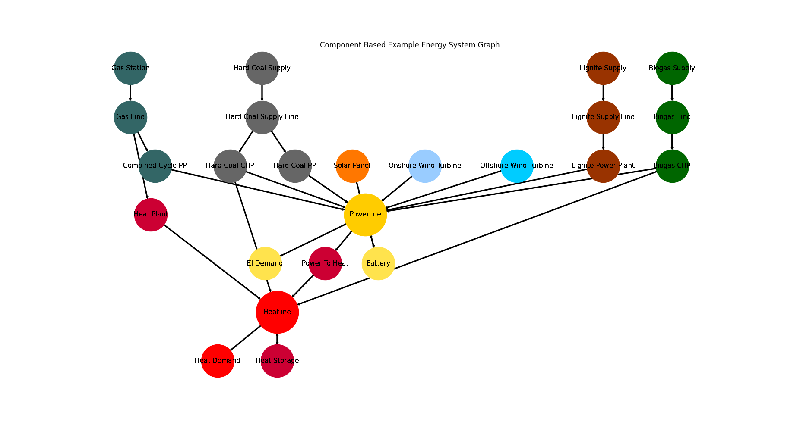

.. _AutoCompare_component_es:

Component Focused Energy System (Brief)
***************************************

This example briefly illustrates the auto comparative features of the
:mod:`~tessif.analyze` module. For a more detailed example please refer to
the :ref:`examples_auto_comparison_fpwe`.

.. contents:: Contents
   :local:
   :backlinks: top

Initial code to do the comparison
=================================

>>> # change spellings_logging_level to debug to declutter output
>>> import tessif.frused.configurations as configurations
>>> configurations.spellings_logging_level = 'debug'

>>> # Import hardcoded tessif energy system using the example hub:
>>> import tessif.examples.data.tsf.py_hard as tsf_examples

>>> # Choose the underlying energy system
>>> PERIODS = 10
>>> tsf_es = tsf_examples.create_component_es(
...     expansion_problem=True, periods=PERIODS)

>>> # write it to disk, so the comparatier can read it out
>>> import os
>>> from tessif.frused.paths import write_dir
>>> #
>>> output_msg = tsf_es.to_hdf5(
...     directory=os.path.join(write_dir, 'tsf'),
...     filename='component_es_comparison.hdf5',
... )

>>> # let the comparatier do the auto comparison:
>>> import tessif.analyze, tessif.parse
>>> #
>>> comparatier = tessif.analyze.Comparatier(
...     path=os.path.join(write_dir, 'tsf', 'component_es_comparison.hdf5'),
...     parser=tessif.parse.hdf5,
...     models=('calliope', 'oemof', 'pypsa', 'fine',),
... )

Code accessing the results
==========================
Following section provides examples on how to use the
:class:`Comparatier interface <tessif.analyze.Comparatier>` to access the
auto generated comparison results.

Models
------

>>> # show the models compared:
>>> for model in sorted(comparatier.models):
...     print(model)
cllp
fine
omf
ppsa

Energy System Objects
---------------------

>>> # access the model based energy system objects
>>> # (type(es) printed here for doctesting)
>>> # 
>>> for model, es in comparatier.energy_systems.items():
...     print(f'{model}: {type(es)}')
cllp: <class 'calliope.core.model.Model'>
fine: <class 'FINE.energySystemModel.EnergySystemModel'>
omf: <class 'oemof.solph.network.energy_system.EnergySystem'>
ppsa: <class 'pypsa.components.Network'>

Energy System Graph
-------------------
>>> import matplotlib.pyplot as plt
>>> import tessif.visualize.nxgrph as nxv

>>> grph = comparatier.graph

>>> drawing_data = nxv.draw_graph(
...     grph,
...     node_color={
...         'Hard Coal Supply': '#666666',
...         'Hard Coal Supply Line': '#666666',
...         'Hard Coal PP': '#666666',
...         'Hard Coal CHP': '#666666',
...         'Solar Panel': '#FF7700',
...         'Heat Storage': '#cc0033',
...         'Heat Demand': 'Red',
...         'Heat Plant': '#cc0033',
...         'Heatline': 'Red',
...         'Power To Heat': '#cc0033',
...         'Biogas CHP': '#006600',
...         'Biogas Line': '#006600',
...         'Biogas Supply': '#006600',
...         'Onshore Wind Turbine': '#99ccff',
...         'Offshore Wind Turbine': '#00ccff',
...         'Gas Station': '#336666',
...         'Gas Line': '#336666',
...         'Combined Cycle PP': '#336666',
...         'El Demand': '#ffe34d',
...         'Battery': '#ffe34d',
...         'Powerline': '#ffcc00',
...         'Lignite Supply': '#993300',
...         'Lignite Supply Line': '#993300',
...         'Lignite Power Plant': '#993300',
...     },
... )
>>> # plt.show()  # commented out for simpler doctesting

Integrated Global Results (IGR)
-------------------------------
Following section demonstrate how to access the
:attr:`integrated global results
<tessif.analyze.Comparatier.integrated_global_results>` of the models compared.

>>> # show the integrated global results of the chp example:
>>> comparatier.integrated_global_results.drop(
...     ['time (s)', 'memory (MB)'], axis='index')
                     cllp      fine       omf      ppsa
emissions (sim)    2549.0    2549.0    2549.0    2549.0
costs (sim)      526410.0  526396.0  526394.0  526394.0
opex (ppcd)      526394.0  526394.0  526394.0  526394.0
capex (ppcd)          0.0      10.0       0.0      -0.0

Memory and timing results are dropped because they vary slightly between runs.
The original results look something like::

  comparatier.integrated_global_results
                       cllp      fine       omf      ppsa
  emissions (sim)    2549.0    2549.0    2549.0    2549.0
  costs (sim)      526410.0  526396.0  526394.0  526394.0
  opex (ppcd)      526394.0  526394.0  526394.0  526394.0
  capex (ppcd)          0.0      10.0       0.0      -0.0
  time (s)              9.9       2.7       1.9       2.4
  memory (MB)          11.6       3.1       2.0       2.5
