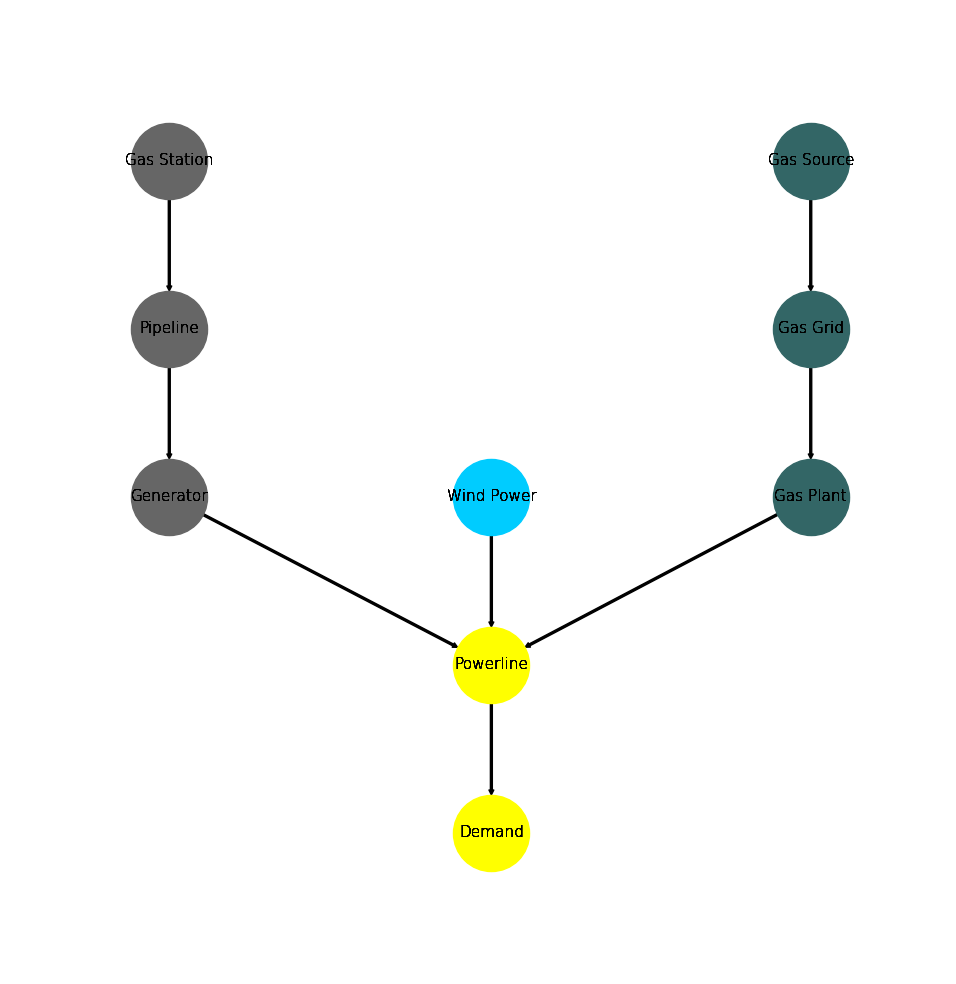

.. _examples_auto_comparison_emissions:

Emission Objective (Brief)
**************************
This example briefly illustrates the auto comparative features of the
:mod:`~tessif.analyze` module on a small :attr:`emission objective example
<tessif.examples.data.tsf.py_hard.emission_objective>`.
For a more detailed example please refer to the
:ref:`examples_auto_comparison_fpwe`.

It also demonstrates how tessif handles emission and cost reallocating when
simulating energy systems using :ref`Models_Pypsa` where pypsa
:attr:`replaces <tessif.transform.es2es.ppsa.compute_unneeded_supply_chains>`
a: ``Source -> Bus -> Transformer`` supply chain by a singular `Generator
<https://pypsa.readthedocs.io/en/stable/components.html#generator>`_.

.. contents:: Contents
   :local:
   :backlinks: top

Initial code to do the comparison
=================================

>>> # change spellings_logging_level to debug to declutter output
>>> import tessif.frused.configurations as configurations
>>> configurations.spellings_logging_level = 'debug'

>>> # Import hardcoded tessif energy system using the example hub:
>>> import tessif.examples.data.tsf.py_hard as tsf_examples

>>> # Choose the underlying energy system
>>> tsf_es = tsf_examples.emission_objective()

>>> # write it to disk, so the comparatier can read it out
>>> import os
>>> from tessif.frused.paths import write_dir
>>> #
>>> output_msg = tsf_es.to_hdf5(
...     directory=os.path.join(write_dir, 'tsf'),
...     filename='emissions_comparison.hdf5',
... )

>>> # let the comparatier to the auto comparison:
>>> import tessif.analyze, tessif.parse
>>> #
>>> comparatier = tessif.analyze.Comparatier(
...     path=os.path.join(write_dir, 'tsf', 'emissions_comparison.hdf5'),
...     parser=tessif.parse.hdf5,
...     models=('oemof', 'pypsa', 'fine', 'calliope'),
... )

Code accessing the results
==========================
Following section provides examples on how to use the
:class:`Comparatier interface <tessif.analyze.Comparatier>` to access the
auto generated comparison results.

Models
------

>>> # show the models compared:
>>> for model in sorted(comparatier.models):
...     print(model)
cllp
fine
omf
ppsa

Energy System Objects
---------------------

>>> # access the model based energy system objects
>>> # (type(es) printed here for doctesting)
>>> # 
>>> for model, es in comparatier.energy_systems.items():
...     print(f'{model}: {type(es)}')
cllp: <class 'calliope.core.model.Model'>
fine: <class 'FINE.energySystemModel.EnergySystemModel'>
omf: <class 'oemof.solph.network.energy_system.EnergySystem'>
ppsa: <class 'pypsa.components.Network'>

Energy System Graph
-------------------
>>> import matplotlib.pyplot as plt
>>> import tessif.visualize.nxgrph as nxv

>>> grph = comparatier.graph

>>> drawing_data = nxv.draw_graph(
...     grph,
...     node_color={
...         'Wind Power': '#00ccff',
...         'Gas Source': '#336666',
...         'Gas Grid': '#336666',
...         'Gas Plant': '#336666',
...         'Gas Station': '#666666',
...         'Pipeline': '#666666',
...         'Generator': '#666666',
...         'Powerline': 'yellow',
...         'Demand': 'yellow',
...     },
... )
>>> # plt.show()  # commented out to improve doctesting

Comparative Model Results
-------------------------
Following sections show how to utilize to built-in
:class:`~tessif.analyze.ComparativeResultier` to access results conveniently
among models.

Flow Cost Results
^^^^^^^^^^^^^^^^^
Wind Power is more expensive.

>>> print(comparatier.comparative_results.costs[('Wind Power', 'Powerline')])
cllp    10.0
fine    10.0
omf     10.0
ppsa    10.0
Name: (Wind Power, Powerline), dtype: float64

>>> print(comparatier.comparative_results.costs[('Generator', 'Powerline')])
cllp    2.000000
fine    2.000000
omf     2.000000
ppsa    6.761905
Name: (Generator, Powerline), dtype: float64

.. note::
   Note how pypsa's 'Generator' flow costs are higher than oemof's. This is
   due to reallocating costs and emissions of prior, cut-off, supply chain
   components.
   
Flow Emission Results
^^^^^^^^^^^^^^^^^^^^^
'Wind Power' has no emissions, while the 'Generator' and the 'Gas Plant' have.

>>> print(comparatier.comparative_results.emissions[('Gas Station', 'Pipeline')])
cllp    1.5
fine    1.5
omf     1.5
ppsa    NaN
Name: (Gas Station, Pipeline), dtype: float64

.. note::
   Note how the 'Gas Station' is not present inside the pypsa energy system...

>>> print(comparatier.comparative_results.emissions[('Generator', 'Powerline')])
cllp    3.000000
fine    3.000000
omf     3.000000
ppsa    6.571429
Name: (Generator, Powerline), dtype: float64

.. note::
   ... and how the emissions are allocated to the Generator

>>> print(comparatier.comparative_results.emissions[('Gas Plant', 'Powerline')])
cllp    2.000000
fine    2.000000
omf     2.000000
ppsa    2.833333
Name: (Gas Plant, Powerline), dtype: float64

.. note::
   ... and the 'Gas Plant' to overall achieve the same global constraints
   (see the :ref:`examples_autocomparison_emissions_igr`)

>>> print(comparatier.comparative_results.emissions[('Wind Power', 'Powerline')])
cllp    0.0
fine    0.0
omf     0.0
ppsa    0.0
Name: (Wind Power, Powerline), dtype: float64

Load Results
^^^^^^^^^^^^
>>> print(comparatier.comparative_results.loads['Powerline'])
                         cllp                                  fine                                   omf                                  ppsa                            
Powerline           Gas Plant Generator Wind Power Demand Gas Plant Generator Wind Power Demand Gas Plant Generator Wind Power Demand Gas Plant Generator Wind Power Demand
1990-07-13 00:00:00      -5.0 -0.000000  -5.000000   10.0      -5.0 -0.000000  -5.000000   10.0      -5.0 -0.000000  -5.000000   10.0      -5.0 -0.507246  -4.492754   10.0
1990-07-13 01:00:00      -5.0 -0.000000  -5.000000   10.0      -5.0 -0.000000  -5.000000   10.0      -5.0 -0.000000  -5.000000   10.0      -5.0 -0.000000  -5.000000   10.0
1990-07-13 02:00:00      -5.0 -0.507246  -4.492754   10.0      -5.0 -0.000000  -5.000000   10.0      -5.0 -0.000000  -5.000000   10.0      -5.0 -0.000000  -5.000000   10.0
1990-07-13 03:00:00      -5.0 -0.000000  -5.000000   10.0      -5.0 -0.507246  -4.492754   10.0      -5.0 -0.507246  -4.492754   10.0      -5.0 -0.000000  -5.000000   10.0

Installed Capacity Results
^^^^^^^^^^^^^^^^^^^^^^^^^^
>>> print(comparatier.comparative_results.capacities['Generator'])
cllp    0.507246
fine    0.507000
omf     0.507246
ppsa    0.507246
Name: Generator, dtype: float64

Original Capacity Values
^^^^^^^^^^^^^^^^^^^^^^^^
>>> print(comparatier.comparative_results.original_capacities['Generator'])
cllp    0.0
fine    0.0
omf     0.0
ppsa    0.0
Name: Generator, dtype: float64

Expansion Cost Results
^^^^^^^^^^^^^^^^^^^^^^
>>> print(comparatier.comparative_results.expansion_costs['Generator'])
cllp    0.0
fine    0.0
omf     0.0
ppsa    0.0
Name: Generator, dtype: float64

.. _examples_autocomparison_emissions_igr:

Integrated Global Results (IGR)
-------------------------------
Following section demonstrate how to access the
:attr:`integrated global results
<tessif.analyze.Comparatier.integrated_global_results>` of the models compared.

>>> # show the integrated global results of the chp example:
>>> comparatier.integrated_global_results.drop(
...     ['time (s)', 'memory (MB)'], axis='index')
                  cllp   fine    omf   ppsa
emissions (sim)   60.0   60.0   60.0   60.0
costs (sim)      252.0  252.0  252.0  252.0
opex (ppcd)      252.0  252.0  252.0  252.0
capex (ppcd)       0.0    0.0    0.0    0.0

Memory and timing results are dropped because they vary slightly between runs.
The original results look something like::

  comparatier.integrated_global_results
                      cllp   fine    omf   ppsa
    emissions (sim)   60.0   60.0   60.0   60.0
    costs (sim)      252.0  252.0  252.0  252.0
    opex (ppcd)      252.0  252.0  252.0  252.0
    capex (ppcd)       0.0    0.0    0.0    0.0
    time (s)           2.3    0.8    0.5    1.0
    memory (MB)        2.0    1.2    0.6    1.2
 
