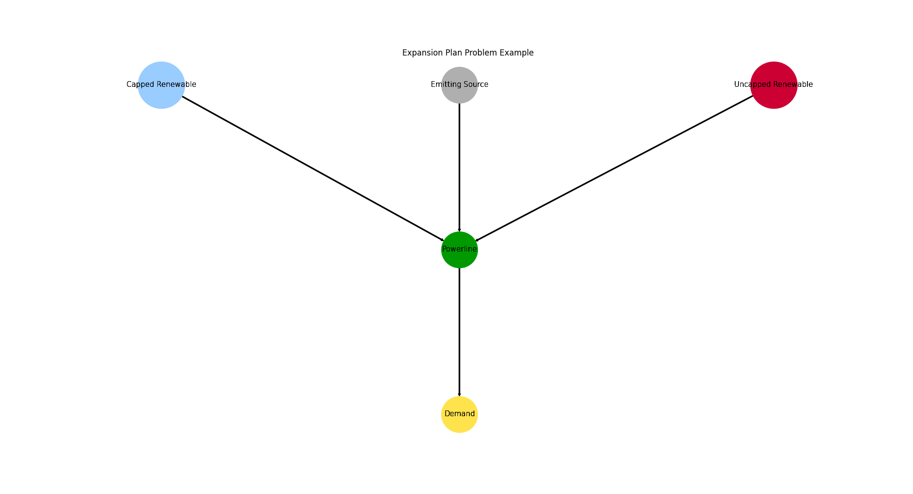

.. _AutoCompare_Expansion:

Expansion Example (Brief)
*************************

This example briefly illustrates the auto comparative features of the
:mod:`~tessif.analyze` module. For a more detailed example please refer to
the :ref:`examples_auto_comparison_fpwe`.

.. contents:: Contents
   :local:
   :backlinks: top

Initial code to do the comparison
=================================

>>> # change spellings_logging_level to debug to declutter output
>>> import tessif.frused.configurations as configurations
>>> configurations.spellings_logging_level = 'debug'

>>> # Import hardcoded tessif energy system using the example hub:
>>> import tessif.examples.data.tsf.py_hard as tsf_examples

>>> # Choose the underlying energy system
>>> tsf_es = tsf_examples.create_expansion_plan_example()

>>> # write it to disk, so the comparatier can read it out
>>> import os
>>> from tessif.frused.paths import write_dir
>>> #
>>> output_msg = tsf_es.to_hdf5(
...     directory=os.path.join(write_dir, 'tsf'),
...     filename='expansion_comparison.hdf5',
... )

>>> # let the comparatier to the auto comparison:
>>> import tessif.analyze, tessif.parse
>>> #
>>> comparatier = tessif.analyze.Comparatier(
...     path=os.path.join(write_dir, 'tsf', 'expansion_comparison.hdf5'),
...     parser=tessif.parse.hdf5,
...     models=('oemof', 'pypsa', 'fine', 'calliope'),
... )

Code accessing the results
==========================
Following section provides examples on how to use the
:class:`Comparatier interface <tessif.analyze.Comparatier>` to access the
auto generated comparison results.

Models
------

>>> # show the models compared:
>>> for model in sorted(comparatier.models):
...     print(model)
cllp
fine
omf
ppsa

Energy System Graph
-------------------
>>> import matplotlib.pyplot as plt
>>> import tessif.visualize.nxgrph as nxv

>>> grph = comparatier.graph

>>> drawing_data = nxv.draw_graph(
...     grph,
...     node_color={'Powerline': '#009900',
...                 'Emitting Source': '#cc0033',
...                 'Demand': '#00ccff',
...                 'Capped Renewable': '#ffD700',
...                 'Uncapped Renewable': '#ffD700',},
...     node_size={'Powerline': 5000},
...     layout='dot')
>>> # plt.show()  # commented out for simpler doctesting

              

Comparative Model Results
-------------------------
Following sections show how to utilize to built-in
:class:`~tessif.analyze.ComparativeResultier` to access results conveniently
among models.

Original Capacitiy Results
^^^^^^^^^^^^^^^^^^^^^^^^^^
>>> print(comparatier.comparative_results.original_capacities['Emitting Source'])
cllp    0.0
fine    0.0
omf     0.0
ppsa    0.0
Name: Emitting Source, dtype: float64

>>> print(comparatier.comparative_results.original_capacities['Capped Renewable'])
cllp    2.0
fine    2.0
omf     2.0
ppsa    2.0
Name: Capped Renewable, dtype: float64

>>> print(comparatier.comparative_results.original_capacities['Uncapped Renewable'])
cllp    3.0
fine    3.0
omf     3.0
ppsa    3.0
Name: Uncapped Renewable, dtype: float64

>>> print(comparatier.comparative_results.original_capacities['Demand'])
cllp    10.0
fine    10.0
omf     10.0
ppsa    10.0
Name: Demand, dtype: float64

Expansion Costs
^^^^^^^^^^^^^^^
>>> print(comparatier.comparative_results.expansion_costs['Emitting Source'])
cllp    0.0
fine    0.0
omf     0.0
ppsa    0.0
Name: Emitting Source, dtype: float64

>>> print(comparatier.comparative_results.expansion_costs['Capped Renewable'])
cllp    1.0
fine    1.0
omf     1.0
ppsa    1.0
Name: Capped Renewable, dtype: float64

    
>>> print(comparatier.comparative_results.expansion_costs['Uncapped Renewable'])
cllp    2.0
fine    2.0
omf     2.0
ppsa    2.0
Name: Uncapped Renewable, dtype: float64

Installed Capacity Results
^^^^^^^^^^^^^^^^^^^^^^^^^^
>>> print(comparatier.comparative_results.capacities['Emitting Source'])
cllp    5.75
fine    5.75
omf     5.75
ppsa    5.75
Name: Emitting Source, dtype: float64
    
>>> print(comparatier.comparative_results.capacities['Capped Renewable'])
cllp    3.25
fine    3.25
omf     3.25
ppsa    3.25
Name: Capped Renewable, dtype: float64

>>> print(comparatier.comparative_results.capacities['Uncapped Renewable'])
cllp    3.0
fine    3.0
omf     3.0
ppsa    3.0
Name: Uncapped Renewable, dtype: float64
    
>>> print(comparatier.comparative_results.capacities['Demand'])
cllp    10.0
fine    10.0
omf     10.0
ppsa    10.0
Name: Demand, dtype: float64

Load Results
^^^^^^^^^^^^
>>> from pandas import option_context
>>> with option_context('display.max_rows', 10, 'display.max_columns', 16, 'display.width', 84):
...     print(comparatier.comparative_results.loads['Powerline'])
                                cllp                                            \
Powerline           Capped Renewable Emitting Source Uncapped Renewable Demand   
1990-07-13 00:00:00            -3.25           -5.75               -1.0   10.0   
1990-07-13 01:00:00            -3.25           -4.75               -2.0   10.0   
1990-07-13 02:00:00            -3.25           -3.75               -3.0   10.0   
1990-07-13 03:00:00            -3.25           -5.75               -1.0   10.0   
<BLANKLINE>
                                fine                                            \
Powerline           Capped Renewable Emitting Source Uncapped Renewable Demand   
1990-07-13 00:00:00            -3.25           -5.75               -1.0   10.0   
1990-07-13 01:00:00            -3.25           -4.75               -2.0   10.0   
1990-07-13 02:00:00            -3.25           -3.75               -3.0   10.0   
1990-07-13 03:00:00            -3.25           -5.75               -1.0   10.0   
<BLANKLINE>
                                 omf                                            \
Powerline           Capped Renewable Emitting Source Uncapped Renewable Demand   
1990-07-13 00:00:00            -3.25           -5.75               -1.0   10.0   
1990-07-13 01:00:00            -3.25           -4.75               -2.0   10.0   
1990-07-13 02:00:00            -3.25           -3.75               -3.0   10.0   
1990-07-13 03:00:00            -3.25           -5.75               -1.0   10.0   
<BLANKLINE>
                                ppsa                                            
Powerline           Capped Renewable Emitting Source Uncapped Renewable Demand  
1990-07-13 00:00:00            -3.25           -5.75               -1.0   10.0  
1990-07-13 01:00:00            -3.25           -4.75               -2.0   10.0  
1990-07-13 02:00:00            -3.25           -3.75               -3.0   10.0  
1990-07-13 03:00:00            -3.25           -5.75               -1.0   10.0  

Integrated Global Results (IGR)
-------------------------------
Following section demonstrate how to access the
:attr:`integrated global results
<tessif.analyze.Comparatier.integrated_global_results>` of the models compared.

>>> # show the integrated global results of the storage example:
>>> comparatier.integrated_global_results.drop(
...     ['time (s)', 'memory (MB)'], axis='index')
                 cllp  fine   omf  ppsa
emissions (sim)  20.0  20.0  20.0  20.0
costs (sim)      41.0  41.0  41.0  41.0
opex (ppcd)      40.0  40.0  40.0  40.0
capex (ppcd)      1.0   1.0   1.0   1.0

Memory and timing results are dropped because they vary slightly between runs.
The original results look something like::

  comparatier.integrated_global_results
                   cllp  fine   omf  ppsa
  emissions (sim)  20.0  20.0  20.0  20.0
  costs (sim)      41.0  41.0  41.0  41.0
  opex (ppcd)      40.0  40.0  40.0  40.0
  capex (ppcd)      1.0   1.0   1.0   1.0
  time (s)          0.8   0.6   0.3   0.9
  memory (MB)       1.6   0.9   0.5   1.1
