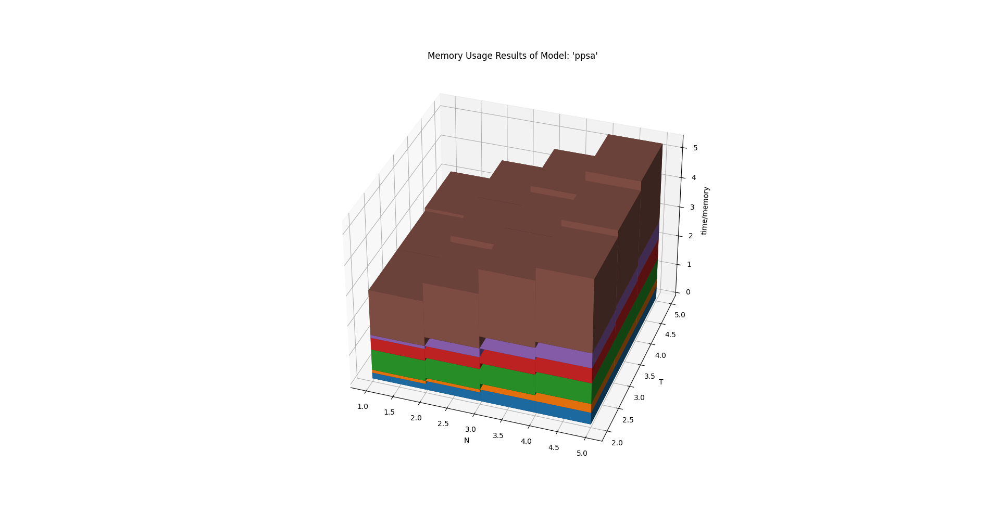
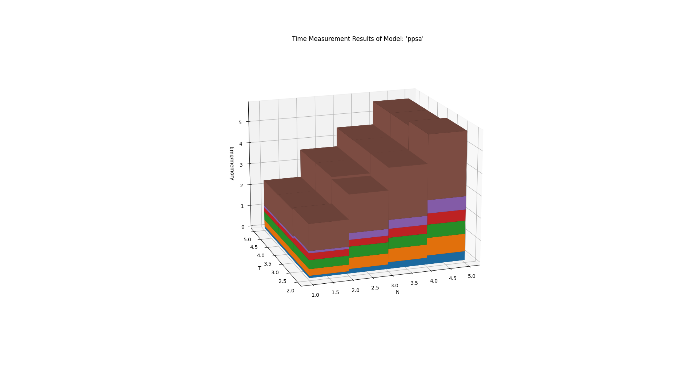
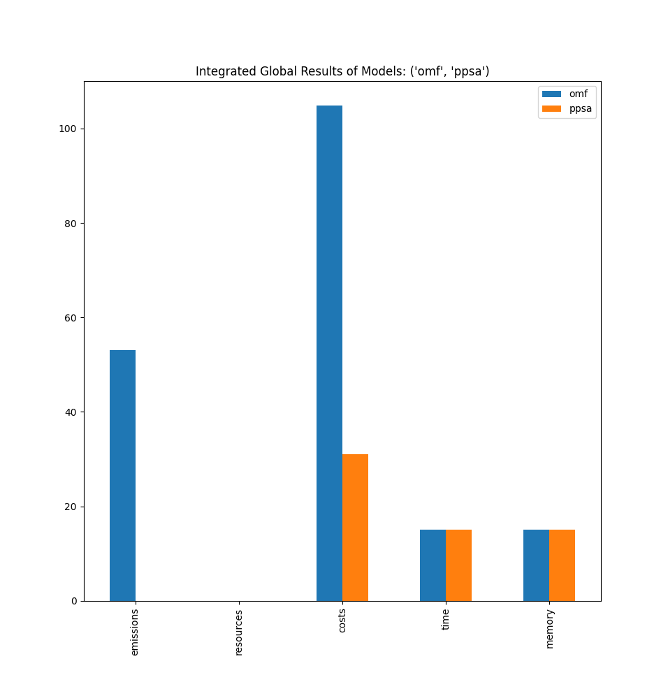
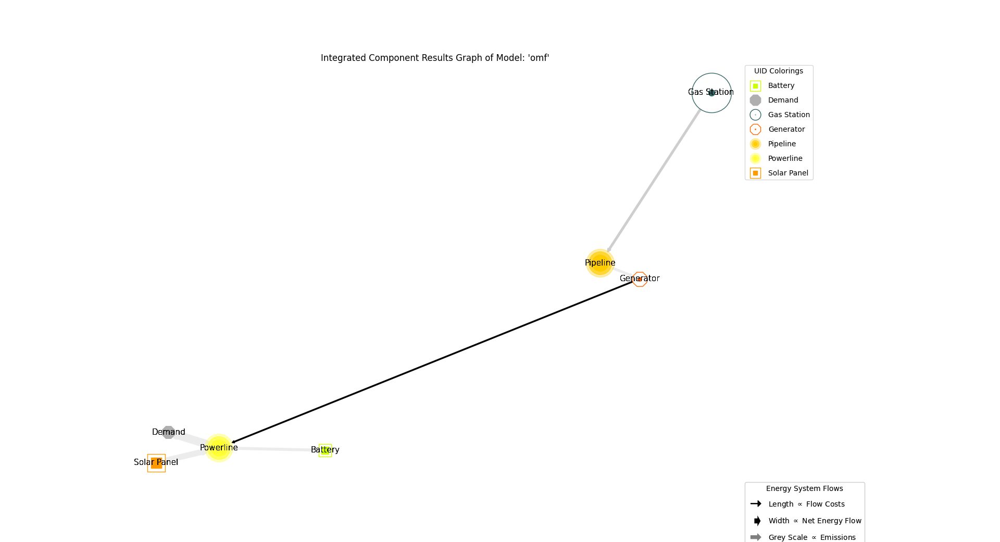
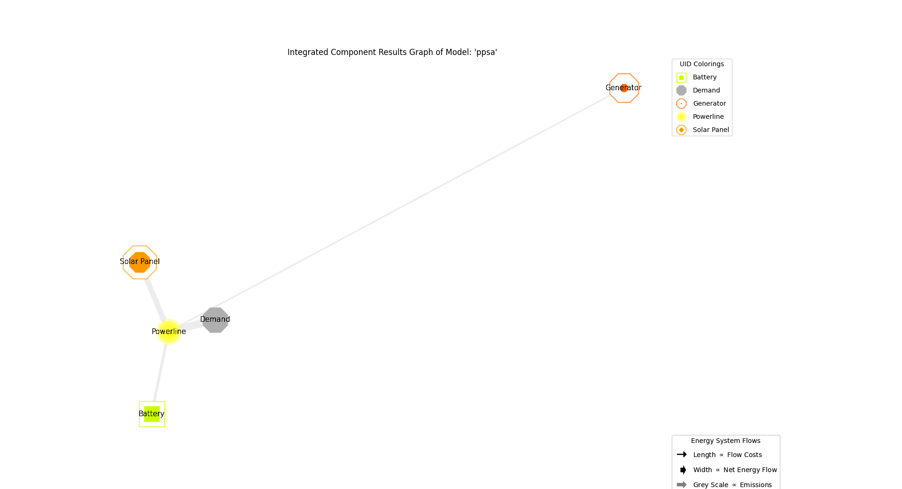
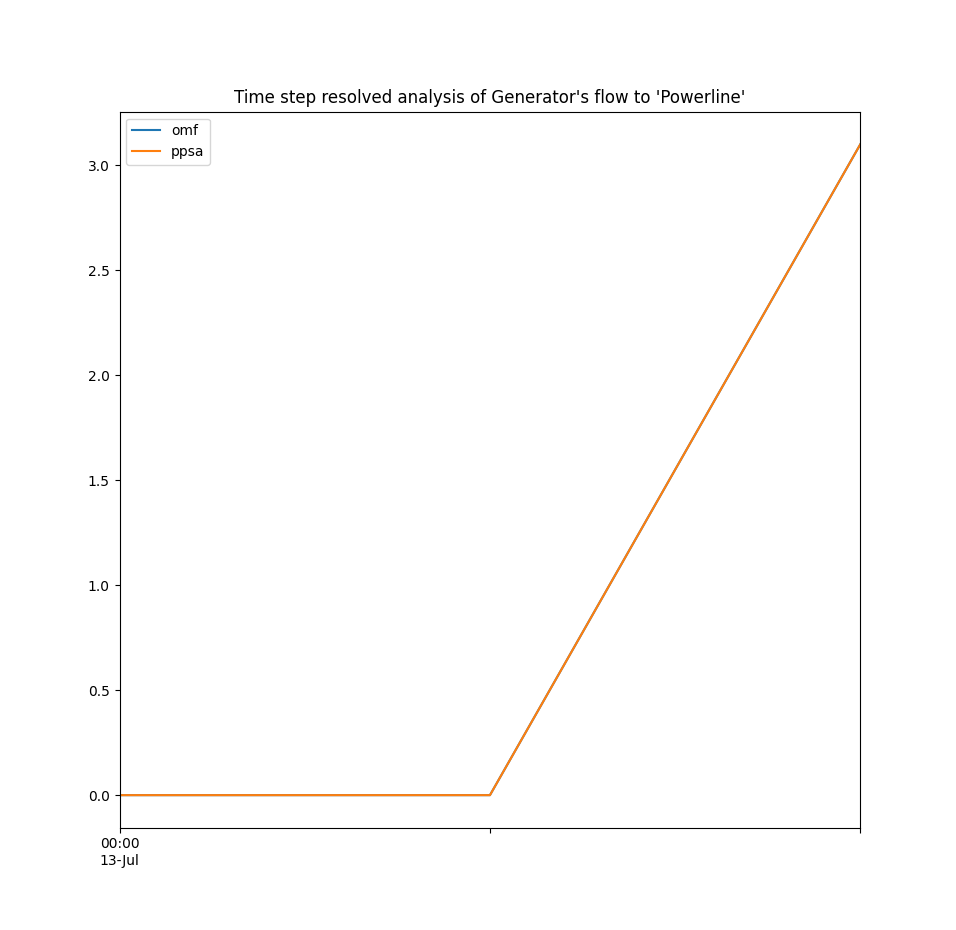
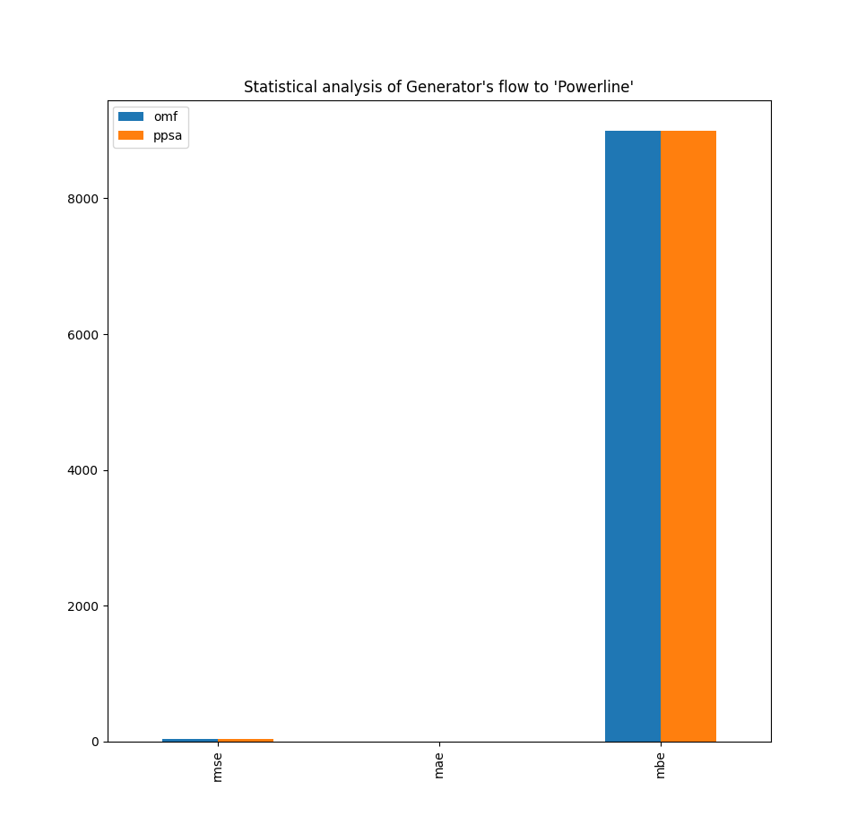

.. _examples_auto_comparison_fpwe:

Fully Parameterized Working Example (Detailed)
**********************************************

In contrast to the mwe, the fpwe differs (among other things) by utilizing a
fixed timeseries to model a solar panel's output.

.. contents:: Contents
   :local:
   :backlinks: top
               
Initial code to do the comparison
=================================

>>> # change spellings_logging_level to debug to declutter output
>>> import tessif.frused.configurations as configurations
>>> configurations.spellings_logging_level = 'debug'

>>> # Import hardcoded tessif energy system using the example hub:
>>> import tessif.examples.data.tsf.py_hard as tsf_examples

>>> # Choose the underlying energy system
>>> tsf_es = tsf_examples.create_fpwe()

>>> # write it to disk, so the comparatier can read it out
>>> import os
>>> from tessif.frused.paths import write_dir
>>> #
>>> output_msg = tsf_es.to_hdf5(
...     directory=os.path.join(write_dir, 'tsf'),
...     filename='es_to_compare.hdf5',
... )

>>> # let the comparatier do the auto comparison:
>>> import tessif.analyze, tessif.parse
>>> import functools  # nopep8
>>> from tessif.frused.hooks.tsf import reparameterize_components  # nopep8
>>> comparatier = tessif.analyze.Comparatier(
...     path=os.path.join(write_dir, 'tsf', 'es_to_compare.hdf5'),
...     parser=tessif.parse.hdf5,
...     models=('oemof', 'pypsa', 'fine', 'calliope'),
...     hooks={
...         'calliope': functools.partial(
...            reparameterize_components,
...            components={
...                'Battery': {
...                     'initial_soc': 9,
...                 },
...             }
...         )
...     },
...     scaling=True,
... )

Code accessing the results
==========================
Following section provides examples on how to use the
:class:`Comparatier interface <tessif.analyze.Comparatier>` to access the
auto generated comparison results

Analyzed Subjects
-----------------
Following sections show how to access the analyzed energy systems and models

Models
^^^^^^

>>> # show the models compared:
>>> for model in sorted(comparatier.models):
...     print(model)
cllp
fine
omf
ppsa

Energy System Objects
^^^^^^^^^^^^^^^^^^^^^

>>> # access the model based energy system objects
>>> # (type(es) printed here for doctesting)
>>> # 
>>> for model, es in comparatier.energy_systems.items():
...     print(f'{model}: {type(es)}')
cllp: <class 'calliope.core.model.Model'>
fine: <class 'FINE.energySystemModel.EnergySystemModel'>
omf: <class 'oemof.solph.network.energy_system.EnergySystem'>
ppsa: <class 'pypsa.components.Network'>

Optimization Results
--------------------
Following demonstrate how to access the numerical simulation results

Singular Model Results
^^^^^^^^^^^^^^^^^^^^^^
>>> # access the model based post processing results
>>> for model, resultier in comparatier.optimization_results.items():
...     print(model)
...     print(79*'-')
...     print(resultier.node_load['Powerline'])
...     print(79*'-')
cllp
-------------------------------------------------------------------------------
Powerline            Battery  Generator  Solar Panel  Battery  Demand
1990-07-13 00:00:00     -0.0       -0.0        -12.0      1.0    11.0
1990-07-13 01:00:00     -8.0       -0.0         -3.0      0.0    11.0
1990-07-13 02:00:00     -0.9       -3.1         -7.0      0.0    11.0
-------------------------------------------------------------------------------
fine
-------------------------------------------------------------------------------
Powerline            Battery  Generator  Solar Panel  Battery  Demand
1990-07-13 00:00:00     -0.0       -0.0        -12.0      1.0    11.0
1990-07-13 01:00:00     -0.9       -7.1         -3.0      0.0    11.0
1990-07-13 02:00:00     -0.0       -4.0         -7.0      0.0    11.0
-------------------------------------------------------------------------------
omf
-------------------------------------------------------------------------------
Powerline            Battery  Generator  Solar Panel  Battery  Demand
1990-07-13 00:00:00     -0.0       -0.0        -12.0      1.0    11.0
1990-07-13 01:00:00     -8.0       -0.0         -3.0      0.0    11.0
1990-07-13 02:00:00     -0.9       -3.1         -7.0      0.0    11.0
-------------------------------------------------------------------------------
ppsa
-------------------------------------------------------------------------------
Powerline            Battery  Generator  Solar Panel  Battery  Demand
1990-07-13 00:00:00     -0.0       -0.0        -12.0      1.0    11.0
1990-07-13 01:00:00     -8.0       -0.0         -3.0      0.0    11.0
1990-07-13 02:00:00     -0.9       -3.1         -7.0      0.0    11.0
-------------------------------------------------------------------------------

.. _examples_auto_comparison_comparative:

Comparative Model Results
^^^^^^^^^^^^^^^^^^^^^^^^^
Following sections show how to utilize to built-in
:class:`~tessif.analyze.ComparativeResultier` to access results conveniently
among models.

.. _examples_auto_comparison_comparative_capacities:

Installed Capacity Results
<<<<<<<<<<<<<<<<<<<<<<<<<<
>>> print(comparatier.comparative_results.capacities['Battery'])
cllp    10.0
fine    10.0
omf     10.0
ppsa    10.0
Name: Battery, dtype: float64

.. _examples_auto_comparison_comparative_original_capacities:

Original Capacity Results
<<<<<<<<<<<<<<<<<<<<<<<<<
>>> print(comparatier.comparative_results.original_capacities['Battery'])
cllp    10.0
fine    10.0
omf     10.0
ppsa    10.0
Name: Battery, dtype: float64

.. _examples_auto_comparison_comparative_expansion_costs:

Capacity Expansion Costs
<<<<<<<<<<<<<<<<<<<<<<<<<
>>> print(comparatier.comparative_results.original_capacities['Solar Panel'])
cllp    20.0
fine    12.0
omf     20.0
ppsa    20.0
Name: Solar Panel, dtype: float64

.. _examples_auto_comparison_comparative_costs:

Flow Cost Results
<<<<<<<<<<<<<<<<<
>>> print(comparatier.comparative_results.costs[('Generator', 'Powerline')])
cllp    10.000000
fine    10.000000
omf     10.000000
ppsa    33.809524
Name: (Generator, Powerline), dtype: float64

.. _examples_auto_comparison_comparative_cvs:

Characteristic Value Results
<<<<<<<<<<<<<<<<<<<<<<<<<<<<
>>> print(comparatier.comparative_results.cvs['Generator'])
cllp    0.068889
fine    0.180000
omf     0.068889
ppsa    0.068889
Name: Generator, dtype: float64

.. _examples_auto_comparison_comparative_emissions:

Flow Emission Results
<<<<<<<<<<<<<<<<<<<<<
>>> print(comparatier.comparative_results.emissions[('Generator', 'Powerline')])
cllp    10.000000
fine    10.000000
omf     10.000000
ppsa    17.142857
Name: (Generator, Powerline), dtype: float64

.. _examples_auto_comparison_comparative_loads:

Load Results
<<<<<<<<<<<<
>>> print(comparatier.comparative_results.loads['Powerline'])
                       cllp                                         fine                                          omf                                         ppsa                                     
Powerline           Battery Generator Solar Panel Battery Demand Battery Generator Solar Panel Battery Demand Battery Generator Solar Panel Battery Demand Battery Generator Solar Panel Battery Demand
1990-07-13 00:00:00    -0.0      -0.0       -12.0     1.0   11.0    -0.0      -0.0       -12.0     1.0   11.0    -0.0      -0.0       -12.0     1.0   11.0    -0.0      -0.0       -12.0     1.0   11.0
1990-07-13 01:00:00    -8.0      -0.0        -3.0     0.0   11.0    -0.9      -7.1        -3.0     0.0   11.0    -8.0      -0.0        -3.0     0.0   11.0    -8.0      -0.0        -3.0     0.0   11.0
1990-07-13 02:00:00    -0.9      -3.1        -7.0     0.0   11.0    -0.0      -4.0        -7.0     0.0   11.0    -0.9      -3.1        -7.0     0.0   11.0    -0.9      -3.1        -7.0     0.0   11.0

.. _examples_auto_comparison_all_loads:

All Load Results
<<<<<<<<<<<<<<<<
>>> print(comparatier.comparative_results.all_loads['omf'])
                      Battery Gas Station Generator  Pipeline Powerline        Solar Panel
                    Powerline    Pipeline Powerline Generator   Battery Demand   Powerline
1990-07-13 00:00:00       0.0    0.000000       0.0  0.000000       1.0   11.0        12.0
1990-07-13 01:00:00       8.0    0.000000       0.0  0.000000       0.0   11.0         3.0
1990-07-13 02:00:00       0.9    7.380952       3.1  7.380952       0.0   11.0         7.0

>>> print(comparatier.comparative_results.all_loads['ppsa'])
                      Battery Generator Powerline        Solar Panel
                    Powerline Powerline   Battery Demand   Powerline
1990-07-13 00:00:00       0.0       0.0       1.0   11.0        12.0
1990-07-13 01:00:00       8.0       0.0       0.0   11.0         3.0
1990-07-13 02:00:00       0.9       3.1       0.0   11.0         7.0

>>> print(comparatier.comparative_results.all_loads['fine'])
                      Battery Gas Station Generator   Pipeline Powerline        Solar Panel
                    Powerline    Pipeline Powerline  Generator   Battery Demand   Powerline
1990-07-13 00:00:00       0.0    0.000000       0.0   0.000000       1.0   11.0        12.0
1990-07-13 01:00:00       0.9   16.904762       7.1  16.904762       0.0   11.0         3.0
1990-07-13 02:00:00       0.0    9.523810       4.0   9.523810       0.0   11.0         7.0

>>> print(comparatier.comparative_results.all_loads['cllp'])
                      Battery Gas Station Generator  Pipeline Powerline        Solar Panel
                    Powerline    Pipeline Powerline Generator   Battery Demand   Powerline
1990-07-13 00:00:00       0.0    0.000000       0.0  0.000000       1.0   11.0        12.0
1990-07-13 01:00:00       8.0    0.000000       0.0  0.000000       0.0   11.0         3.0
1990-07-13 02:00:00       0.9    7.380952       3.1  7.380952       0.0   11.0         7.0

For more info on why the ppsa dataframe has less columns than the omf dataframe,
please refer to 
:func:`tessif.transform.es2es.ppsa.compute_unneeded_supply_chains` and to the
:ref:`emission objective example comparison
<examples_auto_comparison_emissions>`.

.. _examples_auto_comparison_all_caps:

All Capacities
<<<<<<<<<<<<<<
>>> print(comparatier.comparative_results.all_capacities)
              cllp   fine    omf  ppsa
Battery       10.0   10.0   10.0  10.0
Demand        11.0   11.0   11.0  11.0
Gas Station  100.0  100.0  100.0   NaN
Generator     15.0   21.0   15.0  15.0
Solar Panel   20.0   12.0   20.0  20.0

.. _examples_auto_comparison_all_orig_caps:

All Original Capacities
<<<<<<<<<<<<<<<<<<<<<<<
>>> print(comparatier.comparative_results.all_original_capacities)
              cllp   fine    omf  ppsa
Battery       10.0   10.0   10.0  10.0
Demand        11.0   11.0   11.0  11.0
Gas Station  100.0  100.0  100.0   NaN
Generator     15.0   21.0   15.0  15.0
Solar Panel   20.0   12.0   20.0  20.0
Pipeline       NaN    0.0    NaN   NaN
Powerline      NaN    0.0    NaN   NaN

.. _examples_auto_comparison_all_net_flows:

All Net Energy Flows
<<<<<<<<<<<<<<<<<<<<
>>> print(comparatier.comparative_results.all_net_energy_flows)
                        cllp   fine    omf  ppsa
Battery     Powerline   8.90   0.90   8.90   8.9
Gas Station Pipeline    7.38  26.43   7.38   NaN
Generator   Powerline   3.10  11.10   3.10   3.1
Pipeline    Generator   7.38  26.43   7.38   NaN
Powerline   Battery     1.00   1.00   1.00   1.0
            Demand     33.00  33.00  33.00  33.0
Solar Panel Powerline  22.00  22.00  22.00  22.0

.. _examples_auto_comparison_all_costs_incurred:

All Costs Incurred
<<<<<<<<<<<<<<<<<<
>>> print(comparatier.comparative_results.all_costs_incurred)
                       cllp   fine   omf        ppsa
Battery     Powerline   0.0    0.0   0.0    0.000000
Gas Station Pipeline   73.8  264.3  73.8         NaN
Generator   Powerline  31.0  111.0  31.0  104.809524
Pipeline    Generator   0.0    0.0   0.0         NaN
Powerline   Battery     0.0    0.0   0.0    0.000000
            Demand      0.0    0.0   0.0    0.000000
Solar Panel Powerline   0.0    0.0   0.0    0.000000

.. _examples_auto_comparison_all_emissions_caused:

All Emissions Caused
<<<<<<<<<<<<<<<<<<<<
>>> print(comparatier.comparative_results.all_emissions_caused)
                        cllp    fine    omf       ppsa
Battery     Powerline   0.00    0.00   0.00   0.000000
Gas Station Pipeline   22.14   79.29  22.14        NaN
Generator   Powerline  31.00  111.00  31.00  53.142857
Pipeline    Generator   0.00    0.00   0.00        NaN
Powerline   Battery     0.00    0.00   0.00   0.000000
            Demand      0.00    0.00   0.00   0.000000
Solar Panel Powerline   0.00    0.00   0.00   0.000000

.. _examples_auto_comparison_all_socs:

All States of Charges
<<<<<<<<<<<<<<<<<<<<<
>>> print(comparatier.comparative_results.all_socs)
                       cllp    fine     omf    ppsa
                    Battery Battery Battery Battery
1990-07-13 00:00:00    10.0     0.0    10.0    10.0
1990-07-13 01:00:00     1.0     1.0     1.0     1.0
1990-07-13 02:00:00     0.0     0.0     0.0     0.0

.. _examples_auto_comparison_comparative_nets:

Net Energy Flow Results
<<<<<<<<<<<<<<<<<<<<<<<
>>> print(comparatier.comparative_results.net_energy_flows[('Solar Panel', 'Powerline')])
cllp    22.0
fine    22.0
omf     22.0
ppsa    22.0
Name: (Solar Panel, Powerline), dtype: float64

.. _examples_auto_comparison_comparative_socs:

State of Charge Results
<<<<<<<<<<<<<<<<<<<<<<<
>>> print(comparatier.comparative_results.socs['Battery'])
Battery              cllp  fine   omf  ppsa
1990-07-13 00:00:00  10.0   0.0  10.0  10.0
1990-07-13 01:00:00   1.0   1.0   1.0   1.0
1990-07-13 02:00:00   0.0   0.0   0.0   0.0

.. _examples_auto_comparison_comparative_weights:

Edge Weight Results
<<<<<<<<<<<<<<<<<<<
>>> print(comparatier.comparative_results.weights[('Generator', 'Powerline')])
cllp    1.0
fine    1.0
omf     1.0
ppsa    1.0
Name: (Generator, Powerline), dtype: float64

Computational Results
---------------------
Following sections demonstrate how to access the auto generated computational
results.

Memory Usage Results in Bytes
^^^^^^^^^^^^^^^^^^^^^^^^^^^^^
Not doctested, since results vary slightly between runs::

  import pprint

  # Access the model based memory usage results:
  for model, memory_results in comparatier.memory_usage_results.items():
      print(model)
      print(79*'-')
      pprint.pprint(memory_results)
      print(79*'-')

  cllp
  -------------------------------------------------------------------------------
  {'parsing': 83185,
   'post_processing': 161250,
   'reading': 220657,
   'result': 1801156,
   'simulation': 576657,
   'transformation': 759407}
  -------------------------------------------------------------------------------
  fine
  -------------------------------------------------------------------------------
  {'parsing': 92885,
   'post_processing': 172822,
   'reading': 216152,
   'result': 1441275,
   'simulation': 641177,
   'transformation': 318239}
  -------------------------------------------------------------------------------
  omf
  -------------------------------------------------------------------------------
  {'parsing': 90895,
   'post_processing': 116713,
   'reading': 223382,
   'result': 691305,
   'simulation': 235735,
   'transformation': 24580}
  -------------------------------------------------------------------------------
  ppsa
  -------------------------------------------------------------------------------
  {'parsing': 95061,
   'post_processing': 93522,
   'reading': 218610,
   'result': 1533652,
   'simulation': 409450,
   'transformation': 717009}

Time Usage Results in Seconds
^^^^^^^^^^^^^^^^^^^^^^^^^^^^^
Not doctested, since results vary slightly between runs::

  import pprint
  
  # Access the model based time usage results:
  for model, timing_results in comparatier.timing_results.items():
      print(model)
      print(79*'-')
      pprint.pprint(timing_results)
      print(79*'-')
      
  cllp
  -------------------------------------------------------------------------------
  {'parsing': 0.2704,
   'post_processing': 0.1708,
   'reading': 0.1224,
   'result': 1.061,
   'simulation': 0.4329,
   'transformation': 0.0652}
  -------------------------------------------------------------------------------
  fine
  -------------------------------------------------------------------------------
  {'parsing': 0.2704,
   'post_processing': 0.1708,
   'reading': 0.1224,
   'result': 1.061,
   'simulation': 0.4329,
   'transformation': 0.0652}
  -------------------------------------------------------------------------------
  omf
  -------------------------------------------------------------------------------
  {'parsing': 0.2651,
   'post_processing': 0.1722,
   'reading': 0.1158,
   'result': 0.653,
   'simulation': 0.0982,
   'transformation': 0.0016}
  -------------------------------------------------------------------------------
  ppsa
  -------------------------------------------------------------------------------
  {'parsing': 0.2663,
   'post_processing': 0.0829,
   'reading': 0.1166,
   'result': 1.121,
   'simulation': 0.2428,
   'transformation': 0.4119}
  -------------------------------------------------------------------------------

Scalability Results
^^^^^^^^^^^^^^^^^^^
Not doctested, since results vary slightly between runs::

  import pprint
  
  # Access the model based scalability results:
  # time in seconds, memory in MB:
  for model, scalability_results in comparatier.scalability_results.items():
      print(model)
      print(79*'-')
      for result_type, results in scalability_results._asdict().items():
          print(result_type)
          pprint.pprint(results)
      print(79*'-')

  cllp
  -------------------------------------------------------------------------------
  memory
                                              1                                              2
  2  (227.4, 98.7, 798.7, 728.2, 205.0, 2058.0)  (301.9, 156.8, 1167.6, 1891.1, 300.9, 3818.2)
  time
                                  1                               2
  2  (0.1, 0.2, 1.0, 0.5, 1.2, 3.1)  (0.2, 0.3, 1.3, 0.6, 3.2, 5.7)
  -------------------------------------------------------------------------------
  fine
  -------------------------------------------------------------------------------
  memory
                                              1                                            2
  2  (223.6, 93.6, 260.9, 510.3, 171.1, 1259.4)  (309.3, 157.2, 546.9, 610.2, 339.3, 1962.9)
  time
                                  1                               2
  2  (0.1, 0.2, 0.1, 0.4, 0.3, 1.1)  (0.2, 0.3, 0.1, 0.5, 0.7, 1.8)
  -------------------------------------------------------------------------------
  omf
  -------------------------------------------------------------------------------
  memory
                                            1                                           2
  2  (227.3, 99.0, 30.7, 201.3, 131.5, 689.8)  (320.0, 155.3, 92.3, 358.1, 272.6, 1198.3)
  time
                                  1                               2
  2  (0.1, 0.2, 0.0, 0.1, 0.2, 0.7)  (0.2, 0.3, 0.0, 0.2, 0.5, 1.2)
  -------------------------------------------------------------------------------
  ppsa
  -------------------------------------------------------------------------------
  memory
                                              1                                            2
  2  (229.2, 96.3, 457.3, 396.3, 114.0, 1293.3)  (303.7, 156.4, 479.0, 436.5, 241.5, 1617.2)
  time
                                  1                               2
  2  (0.1, 0.2, 0.5, 0.3, 0.1, 1.2)  (0.2, 0.3, 0.5, 0.3, 0.3, 1.7)
  -------------------------------------------------------------------------------

Graphical Results
^^^^^^^^^^^^^^^^^
Following 2 sections show the available graphical representation of the
scalability results.

2-Dimensional
<<<<<<<<<<<<<

3-Dimensional
<<<<<<<<<<<<<
The below charts were created using
:paramref:`tessif.analyze.Comparatier.N` = 4 and
:paramref:`tessif.analyze.Comparatier.T` = 4. Which is not shown in the
code above:

>>> scalability_3d_charts = comparatier.scalability_charts_3D
>>> #
>>> # show the oemof memory results as an example:
>>> # commented out for doctesting:
>>> # scalability_3d_charts['ppsa'].memory.show()

         
>>> # show the pypsa timing results as an example:
>>> # commented out for doctesting:
>>> # scalability_3d_charts['ppsa'].time.show()

         
.. _examples_transformation_comparison_igr:

Integrated Global Results (IGR)
-------------------------------
Following section demonstrate how to access the
:attr:`integrated global results
<tessif.analyze.Comparatier.integrated_global_results>` of the models compared.

>>> # show the integrated global results of the fpwe:
>>> comparatier.integrated_global_results.drop(
...     ['time (s)', 'memory (MB)'], axis='index')
                  cllp   fine    omf   ppsa
emissions (sim)   53.0  190.0   53.0   53.0
costs (sim)      105.0  375.0  105.0  105.0
opex (ppcd)      105.0  375.0  105.0  105.0
capex (ppcd)       0.0    0.0    0.0    0.0

Memory and timing results are dropped because they vary slightly between runs.
The original results look something like::

  comparatier.integrated_global_results

                    cllp   fine    omf   ppsa
  emissions (sim)   53.0  190.0   53.0   53.0
  costs (sim)      105.0  375.0  105.0  105.0
  opex (ppcd)      105.0  375.0  105.0  105.0
  capex (ppcd)       0.0    0.0    0.0    0.0
  time (s)           1.1    1.0    0.6    1.1
  memory (MB)        1.5    1.3    0.6    1.4
  

Graphical Representation
^^^^^^^^^^^^^^^^^^^^^^^^

>>> # show the IGR of the fpwe as bar chart
>>> # commented out for better doctesting
>>> # comparatier.draw_global_results_chart().show()

Integrated Component Results (ICR)
----------------------------------
Following section demonstrate how to access the
:ref:`integrated component results
<Integrated_Component_Results>` of the models compared.

>>> # access the model based integrated component results (ICR)
>>> # (type(graph) printed here for doctesting)
>>> # 
>>> for model, graph in comparatier.ICR_graphs.items():
...     print(f'{model}: {type(graph)}')
cllp: <class 'tessif.transform.nxgrph.Graph'>
fine: <class 'tessif.transform.nxgrph.Graph'>
omf: <class 'tessif.transform.nxgrph.Graph'>
ppsa: <class 'tessif.transform.nxgrph.Graph'>

Graphical Representation
^^^^^^^^^^^^^^^^^^^^^^^^

>>> # show the fpwe ICR of the compared models:
>>> # commented out for better doctesting
>>> # comparatier.ICR_graph_charts()['omf'].show()

>>> # comparatier.ICR_graph_charts()['ppsa'].show()         

         
Numerical Representation
^^^^^^^^^^^^^^^^^^^^^^^^

By design, the :attr:`integrated component results
<tessif.analyze.Comparatier.ICR_graph_charts>` are used as graphical result
representation.

The underlying numerical data however can be accessed using the
:attr:`networkx.Graph.nodes(data=True)) <networkx.Graph.nodes>` as well as the
:attr:`networkx.Graph.edges(data=True)) <networkx.Graph.edges>` interface.

Numerical Node Data
<<<<<<<<<<<<<<<<<<<

>>> # access the model based numerical node data of the ICR
>>> import pprint
>>> for model, graph in comparatier.ICR_graphs.items():      
...     print(model)
...     print(79*'-')
...     for node, attributes in graph.nodes(data=True):
...         print(node)
...         pprint.pprint(attributes)
...         print()
...     print(79*'-')
cllp
-------------------------------------------------------------------------------
Battery
{'installed_capacity': 10.0,
 'node_color': '#ccff00',
 'node_fill_size': 110.0,
 'node_shape': 's',
 'node_size': 300}
<BLANKLINE>
Demand
{'installed_capacity': 11.0,
 'node_color': '#330099',
 'node_fill_size': 330.0,
 'node_shape': '8',
 'node_size': 330}
<BLANKLINE>
Gas Station
{'installed_capacity': 100.0,
 'node_color': '#336666',
 'node_fill_size': 74.0,
 'node_shape': 'o',
 'node_size': 3000}
<BLANKLINE>
Generator
{'installed_capacity': 15.0,
 'node_color': '#ff6600',
 'node_fill_size': 31.0,
 'node_shape': '8',
 'node_size': 450}
<BLANKLINE>
Pipeline
{'installed_capacity': None,
 'node_color': '#336666',
 'node_fill_size': None,
 'node_shape': 'o',
 'node_size': 'variable'}
<BLANKLINE>
Powerline
{'installed_capacity': None,
 'node_color': '#ffcc00',
 'node_fill_size': None,
 'node_shape': 'o',
 'node_size': 'variable'}
<BLANKLINE>
Solar Panel
{'installed_capacity': 20.0,
 'node_color': '#ff9900',
 'node_fill_size': 220.0,
 'node_shape': 's',
 'node_size': 600}
<BLANKLINE>
-------------------------------------------------------------------------------
fine
-------------------------------------------------------------------------------
Pipeline
{'installed_capacity': None,
 'node_color': '#336666',
 'node_fill_size': None,
 'node_shape': 'o',
 'node_size': 'variable'}
<BLANKLINE>
Powerline
{'installed_capacity': None,
 'node_color': '#ffcc00',
 'node_fill_size': None,
 'node_shape': 'o',
 'node_size': 'variable'}
<BLANKLINE>
Gas Station
{'installed_capacity': 100.0,
 'node_color': '#336666',
 'node_fill_size': 270.0,
 'node_shape': 'o',
 'node_size': 3000}
<BLANKLINE>
Solar Panel
{'installed_capacity': 12.0,
 'node_color': '#ff9900',
 'node_fill_size': 220.0,
 'node_shape': 's',
 'node_size': 360}
<BLANKLINE>
Demand
{'installed_capacity': 11.0,
 'node_color': '#330099',
 'node_fill_size': 330.0,
 'node_shape': '8',
 'node_size': 330}
<BLANKLINE>
Generator
{'installed_capacity': 21.0,
 'node_color': '#ff6600',
 'node_fill_size': 113.0,
 'node_shape': '8',
 'node_size': 630}
<BLANKLINE>
Battery
{'installed_capacity': 10.0,
 'node_color': '#ccff00',
 'node_fill_size': 9.0,
 'node_shape': 's',
 'node_size': 300}
<BLANKLINE>
-------------------------------------------------------------------------------
omf
-------------------------------------------------------------------------------
Pipeline
{'installed_capacity': None,
 'node_color': '#336666',
 'node_fill_size': None,
 'node_shape': 'o',
 'node_size': 'variable'}
<BLANKLINE>
Powerline
{'installed_capacity': None,
 'node_color': '#ffcc00',
 'node_fill_size': None,
 'node_shape': 'o',
 'node_size': 'variable'}
<BLANKLINE>
Gas Station
{'installed_capacity': 100,
 'node_color': '#336666',
 'node_fill_size': 74.0,
 'node_shape': 'o',
 'node_size': 3000}
<BLANKLINE>
Solar Panel
{'installed_capacity': 20,
 'node_color': '#ff9900',
 'node_fill_size': 220.0,
 'node_shape': 's',
 'node_size': 600}
<BLANKLINE>
Demand
{'installed_capacity': 11,
 'node_color': '#330099',
 'node_fill_size': 330.0,
 'node_shape': '8',
 'node_size': 330}
<BLANKLINE>
Generator
{'installed_capacity': 15,
 'node_color': '#ff6600',
 'node_fill_size': 31.0,
 'node_shape': '8',
 'node_size': 450}
<BLANKLINE>
Battery
{'installed_capacity': 10,
 'node_color': '#ccff00',
 'node_fill_size': 110.0,
 'node_shape': 's',
 'node_size': 300}
<BLANKLINE>
-------------------------------------------------------------------------------
ppsa
-------------------------------------------------------------------------------
Powerline
{'installed_capacity': None,
 'node_color': '#ffcc00',
 'node_fill_size': None,
 'node_shape': 'o',
 'node_size': 'variable'}
<BLANKLINE>
Solar Panel
{'installed_capacity': 20.0,
 'node_color': '#ff9900',
 'node_fill_size': 1100.0,
 'node_shape': '8',
 'node_size': 3000}
<BLANKLINE>
Generator
{'installed_capacity': 15.0,
 'node_color': '#ff6600',
 'node_fill_size': 155.0,
 'node_shape': '8',
 'node_size': 2250}
<BLANKLINE>
Demand
{'installed_capacity': 11.0,
 'node_color': '#330099',
 'node_fill_size': 1650.0,
 'node_shape': '8',
 'node_size': 1650}
<BLANKLINE>
Battery
{'installed_capacity': 10.0,
 'node_color': '#ccff00',
 'node_fill_size': 550.0,
 'node_shape': 's',
 'node_size': 1500}
<BLANKLINE>
-------------------------------------------------------------------------------

Numerical Edge Data
<<<<<<<<<<<<<<<<<<<

>>> # access the model based numerical edge data of the ICR
>>> import pprint
>>> for model, graph in comparatier.ICR_graphs.items():      
...     print(model)
...     print(79*'-')
...     for source, target, attributes in graph.edges(data=True):
...         print(f'{source} -> {target}')
...         pprint.pprint(attributes)
...         print()
...     print(79*'-')  
cllp
-------------------------------------------------------------------------------
Battery -> Powerline
{'edge_color': [0.15],
 'len': 0.1,
 'net_energy_flow': 8.9,
 'specific_emissions': 0.0,
 'specific_flow_costs': 0.0,
 'weight': 0.1,
 'width': 0.27}
<BLANKLINE>
Gas Station -> Pipeline
{'edge_color': [0.3],
 'len': 1.0,
 'net_energy_flow': 7.38,
 'specific_emissions': 3.0,
 'specific_flow_costs': 10.0,
 'weight': 1.0,
 'width': 0.22}
<BLANKLINE>
Generator -> Powerline
{'edge_color': [1.0],
 'len': 1.0,
 'net_energy_flow': 3.1,
 'specific_emissions': 10.0,
 'specific_flow_costs': 10.0,
 'weight': 1.0,
 'width': 0.1}
<BLANKLINE>
Pipeline -> Generator
{'edge_color': [0.15],
 'len': 0.1,
 'net_energy_flow': 7.38,
 'specific_emissions': 0.0,
 'specific_flow_costs': 0.0,
 'weight': 0.1,
 'width': 0.22}
<BLANKLINE>
Powerline -> Battery
{'edge_color': [0.15],
 'len': 0.1,
 'net_energy_flow': 1.0,
 'specific_emissions': 0,
 'specific_flow_costs': 0,
 'weight': 0.1,
 'width': 0.1}
<BLANKLINE>
Powerline -> Demand
{'edge_color': [0.15],
 'len': 0.1,
 'net_energy_flow': 33.0,
 'specific_emissions': 0.0,
 'specific_flow_costs': 0.0,
 'weight': 0.1,
 'width': 1.0}
<BLANKLINE>
Solar Panel -> Powerline
{'edge_color': [0.15],
 'len': 0.1,
 'net_energy_flow': 22.0,
 'specific_emissions': 0.0,
 'specific_flow_costs': 0.0,
 'weight': 0.1,
 'width': 0.67}
<BLANKLINE>
-------------------------------------------------------------------------------
fine
-------------------------------------------------------------------------------
Pipeline -> Generator
{'edge_color': [0.15],
 'len': 0.1,
 'net_energy_flow': 26.43,
 'specific_emissions': 0.0,
 'specific_flow_costs': 0.0,
 'weight': 0.1,
 'width': 0.8}
<BLANKLINE>
Powerline -> Demand
{'edge_color': [0.15],
 'len': 0.1,
 'net_energy_flow': 33.0,
 'specific_emissions': 0.0,
 'specific_flow_costs': 0.0,
 'weight': 0.1,
 'width': 1.0}
<BLANKLINE>
Powerline -> Battery
{'edge_color': [0.15],
 'len': 0.1,
 'net_energy_flow': 1.0,
 'specific_emissions': 0.0,
 'specific_flow_costs': 0.0,
 'weight': 0.1,
 'width': 0.1}
<BLANKLINE>
Gas Station -> Pipeline
{'edge_color': [0.3],
 'len': 1.0,
 'net_energy_flow': 26.43,
 'specific_emissions': 3.0,
 'specific_flow_costs': 10.0,
 'weight': 1.0,
 'width': 0.8}
<BLANKLINE>
Solar Panel -> Powerline
{'edge_color': [0.15],
 'len': 0.1,
 'net_energy_flow': 22.0,
 'specific_emissions': 0.0,
 'specific_flow_costs': 0.0,
 'weight': 0.1,
 'width': 0.67}
<BLANKLINE>
Generator -> Powerline
{'edge_color': [1.0],
 'len': 1.0,
 'net_energy_flow': 11.1,
 'specific_emissions': 10.0,
 'specific_flow_costs': 10.0,
 'weight': 1.0,
 'width': 0.34}
<BLANKLINE>
Battery -> Powerline
{'edge_color': [0.15],
 'len': 0.1,
 'net_energy_flow': 0.9,
 'specific_emissions': 0.0,
 'specific_flow_costs': 0.0,
 'weight': 0.1,
 'width': 0.1}
<BLANKLINE>
-------------------------------------------------------------------------------
omf
-------------------------------------------------------------------------------
Pipeline -> Generator
{'edge_color': [0.15],
 'len': 0.1,
 'net_energy_flow': 7.38,
 'specific_emissions': 0,
 'specific_flow_costs': 0,
 'weight': 0.1,
 'width': 0.22}
<BLANKLINE>
Powerline -> Demand
{'edge_color': [0.15],
 'len': 0.1,
 'net_energy_flow': 33.0,
 'specific_emissions': 0,
 'specific_flow_costs': 0,
 'weight': 0.1,
 'width': 1.0}
<BLANKLINE>
Powerline -> Battery
{'edge_color': [0.15],
 'len': 0.1,
 'net_energy_flow': 1.0,
 'specific_emissions': 0,
 'specific_flow_costs': 0,
 'weight': 0.1,
 'width': 0.1}
<BLANKLINE>
Gas Station -> Pipeline
{'edge_color': [0.3],
 'len': 1.0,
 'net_energy_flow': 7.38,
 'specific_emissions': 3,
 'specific_flow_costs': 10,
 'weight': 1.0,
 'width': 0.22}
<BLANKLINE>
Solar Panel -> Powerline
{'edge_color': [0.15],
 'len': 0.1,
 'net_energy_flow': 22.0,
 'specific_emissions': 0,
 'specific_flow_costs': 0,
 'weight': 0.1,
 'width': 0.67}
<BLANKLINE>
Generator -> Powerline
{'edge_color': [1.0],
 'len': 1.0,
 'net_energy_flow': 3.1,
 'specific_emissions': 10,
 'specific_flow_costs': 10,
 'weight': 1.0,
 'width': 0.1}
<BLANKLINE>
Battery -> Powerline
{'edge_color': [0.15],
 'len': 0.1,
 'net_energy_flow': 8.9,
 'specific_emissions': 0,
 'specific_flow_costs': 0,
 'weight': 0.1,
 'width': 0.27}
<BLANKLINE>
-------------------------------------------------------------------------------
ppsa
-------------------------------------------------------------------------------
Powerline -> Demand
{'busses': None,
 'edge_color': [0.15],
 'len': 0.1,
 'net_energy_flow': 33.0,
 'specific_emissions': 0.0,
 'specific_flow_costs': 0.0,
 'weight': 0.1,
 'width': 1.0}
<BLANKLINE>
Powerline -> Battery
{'busses': None,
 'edge_color': [0.15],
 'len': 0.1,
 'net_energy_flow': 1.0,
 'specific_emissions': 0.0,
 'specific_flow_costs': 0.0,
 'weight': 0.1,
 'width': 0.1}
<BLANKLINE>
Solar Panel -> Powerline
{'busses': None,
 'edge_color': [0.15],
 'len': 0.1,
 'net_energy_flow': 22.0,
 'specific_emissions': 0.0,
 'specific_flow_costs': 0.0,
 'weight': 0.1,
 'width': 0.67}
<BLANKLINE>
Generator -> Powerline
{'busses': None,
 'edge_color': [1.0],
 'len': 1.0,
 'net_energy_flow': 3.1,
 'specific_emissions': 17.142857142857142,
 'specific_flow_costs': 33.80952380952381,
 'weight': 1.0,
 'width': 0.1}
<BLANKLINE>
Battery -> Powerline
{'busses': None,
 'edge_color': [0.15],
 'len': 0.1,
 'net_energy_flow': 8.9,
 'specific_emissions': 0.0,
 'specific_flow_costs': 0.0,
 'weight': 0.1,
 'width': 0.27}
<BLANKLINE>
-------------------------------------------------------------------------------

Difference Analyzation Results (DAR)
------------------------------------
Following sections give an example on how to access the
:attr:`difference analyzation results
<tessif.analyze.Comparatier.calculate_load_differences>` of certain energy
flows when comparing the model results.

>>> # show the difference analyzation results of the fpwe:
>>> load_diffs = comparatier.calculate_load_differences(
...     component='Generator',
...     flow='Powerline',
...     threshold=0.1,
... )
>>> print(load_diffs)
                     average  cllp  fine   omf  ppsa
1990-07-13 00:00:00     0.00  0.00   0.0  0.00  0.00
1990-07-13 01:00:00     1.78  0.00   7.1  0.00  0.00
1990-07-13 02:00:00     3.32  3.32   4.0  3.32  3.32

Graphical Representation
^^^^^^^^^^^^^^^^^^^^^^^^

>>> # show the fpwe DAR of the flow from component 'Generator' to 'Powerline':
>>> # commented out for better doctesting
>>> chart = comparatier.draw_load_differences_chart(
...     component='Generator',
...     flow='Powerline',
...     threshold=0.1,
... )
>>> # chart.show()

         
Statistical Analyzation Results
-------------------------------
Following sections give an example on how to access the
:attr:`statistical analyzation results
<tessif.analyze.Comparatier.calculate_statistical_load_differences>` of certain
energy flows when comparing the model results.

>>> # show the difference analyzation results of the fpwe:
>>> statistical_diffs = comparatier.calculate_statistical_load_differences(
...     component='Generator',
...     flow='Powerline',
... )
>>> print(statistical_diffs.round(2))
       cllp  fine   omf  ppsa
NRMSE  0.61  1.82  0.61  0.61
NMAE   0.39  1.18  0.39  0.39
NMBE  -0.39  1.18 -0.39 -0.39

Graphical Representation
^^^^^^^^^^^^^^^^^^^^^^^^

>>> # show the fpwe DAR of the flow from component 'Generator' to 'Powerline':
>>> # commented out for better doctesting
>>> chart = comparatier.draw_statistical_load_differences_chart(
...     component='Generator',
...     flow='Powerline',
... )
>>> # chart.show()

