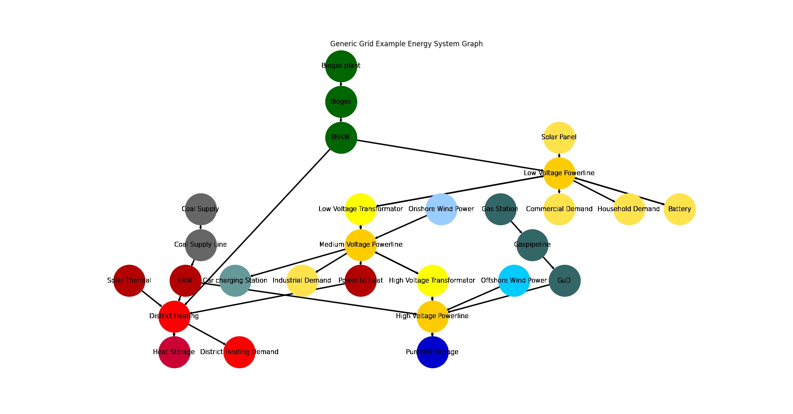

.. _AutoCompare_Grid:

Generic Grid Example (Brief)
****************************

This example briefly illustrates the auto comparative features of the
:mod:`~tessif.analyze` module. For a more detailed example please refer to
the :ref:`examples_auto_comparison_fpwe`.

.. contents:: Contents
   :local:
   :backlinks: top

Initial code to do the comparison
=================================

>>> # change spellings_logging_level to debug to declutter output
>>> import tessif.frused.configurations as configurations
>>> configurations.spellings_logging_level = 'debug'

>>> # Import hardcoded tessif energy system using the example hub:
>>> import tessif.examples.data.tsf.py_hard as tsf_examples

>>> # Choose the underlying energy system
>>> tsf_es = tsf_examples.create_grid_es()

>>> # write it to disk, so the comparatier can read it out
>>> import os
>>> from tessif.frused.paths import write_dir
>>> #
>>> output_msg = tsf_es.to_hdf5(
...     directory=os.path.join(write_dir, 'tsf'),
...     filename='grid_comparison.hdf5',
... )

>>> # let the comparatier to the auto comparison:
>>> import tessif.analyze, tessif.parse
>>> #
>>> comparatier = tessif.analyze.Comparatier(
...     path=os.path.join(write_dir, 'tsf', 'grid_comparison.hdf5'),
...     parser=tessif.parse.hdf5,
...     models=('oemof', 'pypsa', 'fine', 'calliope'),
... )

Code accessing the results
==========================
Following section provides examples on how to use the
:class:`Comparatier interface <tessif.analyze.Comparatier>` to access the
auto generated comparison results.

Models
------

>>> # show the models compared:
>>> for model in sorted(comparatier.models):
...     print(model)
cllp
fine
omf
ppsa

Energy System Graph
-------------------
>>> import matplotlib.pyplot as plt
>>> import tessif.visualize.nxgrph as nxv

>>> grph = comparatier.graph
>>> drawing_data = nxv.draw_graph(
...     grph,
...     node_color={
...         'Coal Supply': '#666666',
...         'Coal Supply Line': '#666666',
...         'HKW': '#b30000',
...         'Solar Thermal': '#b30000',
...         'Heat Storage': '#cc0033',
...         'District Heating': 'Red',
...         'District Heating Demand': 'Red',
...         'Power to Heat': '#b30000',
...         'Biogas plant': '#006600',
...         'Biogas': '#006600',
...         'BHKW': '#006600',
...         'Onshore Wind Power': '#99ccff',
...         'Offshore Wind Power': '#00ccff',
...         'Gas Station': '#336666',
...         'Gaspipeline': '#336666',
...         'GuD': '#336666',
...         'Solar Panel': '#ffe34d',
...         'Commercial Demand': '#ffe34d',
...         'Household Demand': '#ffe34d',
...         'Industrial Demand': '#ffe34d',
...         'Battery': '#ffe34d',
...         'Car charging Station': '#669999',
...         'Low Voltage Powerline': '#ffcc00',
...         'Medium Voltage Powerline': '#ffcc00',
...         'High Voltage Powerline': '#ffcc00',
...         'High Voltage Transformator': 'yellow',
...         'Low Voltage Transformator': 'yellow',
...         'Pumped Storage': '#0000cc',
...     },
...     title='Generic Grid Example Energy System Graph',
... )
>>> # plt.show()  # commented out for simpler doctesting

Comparative Model Results
-------------------------
Following sections show how to utilize to built-in
:class:`~tessif.analyze.ComparativeResultier` to access results conveniently
among models.

Splitting the result dataframes for better printabilitiy:

>>> cllp_results = comparatier.optimization_results['cllp']
>>> fn_results = comparatier.optimization_results['fine']
>>> omf_results = comparatier.optimization_results['omf']
>>> ppsa_results = comparatier.optimization_results['ppsa']

Load Results
^^^^^^^^^^^^
>>> print(omf_results.node_load['High Voltage Powerline'])
High Voltage Powerline        GuD        HKW  High Voltage Transformator  Offshore Wind Power  Pumped Storage  High Voltage Transformator  Pumped Storage
1990-07-13 00:00:00      -0.00000 -175.00000                        -0.0               -120.0      -23.500000                   318.50000        0.000000
1990-07-13 01:00:00      -0.00000 -168.58542                        -0.0               -140.0       -0.000000                   258.00000       50.585418
1990-07-13 02:00:00    -149.02545 -175.00000                        -0.0                -70.0      -62.474189                   456.49964        0.000000

>>> print(ppsa_results.node_load['High Voltage Powerline'])
High Voltage Powerline       GuD         HKW  High Voltage Transformator  Offshore Wind Power  Pumped Storage  High Voltage Transformator  Pumped Storage
1990-07-13 00:00:00      -0.0000 -157.179967                        -0.0               -120.0       -7.683668                   284.86364             0.0
1990-07-13 01:00:00      -0.0000  -84.363636                        -0.0               -140.0       -0.000000                   224.36364             0.0
1990-07-13 02:00:00    -134.0473 -175.000000                        -0.0                -70.0      -37.316332                   416.36364             0.0

>>> print(fn_results.node_load['High Voltage Powerline'])
High Voltage Powerline         GuD         HKW  High Voltage Transformator  Offshore Wind Power  Pumped Storage  High Voltage Transformator  Pumped Storage
1990-07-13 00:00:00     -30.985997 -143.377640                        -0.0               -120.0            -0.0                   294.36364             0.0
1990-07-13 01:00:00      -0.000000 -103.018867                        -0.0               -140.0            -0.0                   243.01887             0.0
1990-07-13 02:00:00    -153.641166 -175.000000                        -0.0                -70.0            -0.0                   398.64117             0.0

>>> print(cllp_results.node_load['High Voltage Powerline'])
High Voltage Powerline       GuD        HKW  High Voltage Transformator  Offshore Wind Power  Pumped Storage  High Voltage Transformator  Pumped Storage
1990-07-13 00:00:00      -0.0000 -175.00000                        -0.0               -120.0      -23.175285                   318.17528        0.000000
1990-07-13 01:00:00      -0.0000 -152.56397                        -0.0               -140.0       -0.000000                   249.37320       43.190765
1990-07-13 02:00:00    -184.5894 -175.00000                        -0.0                -70.0      -56.809235                   486.39864        0.000000

>>> print(omf_results.node_inflows['Medium Voltage Powerline'])
Medium Voltage Powerline  High Voltage Transformator  Low Voltage Transformator  Onshore Wind Power
1990-07-13 00:00:00                        318.50000                        0.0                60.0
1990-07-13 01:00:00                        258.00000                        0.0                80.0
1990-07-13 02:00:00                        456.49964                        0.0                34.0

>>> print(ppsa_results.node_inflows['Medium Voltage Powerline'])
Medium Voltage Powerline  High Voltage Transformator  Low Voltage Transformator  Onshore Wind Power
1990-07-13 00:00:00                        284.86364                        0.0                60.0
1990-07-13 01:00:00                        224.36364                        0.0                80.0
1990-07-13 02:00:00                        416.36364                        0.0                34.0

>>> print(fn_results.node_inflows['Medium Voltage Powerline'])
Medium Voltage Powerline  High Voltage Transformator  Low Voltage Transformator  Onshore Wind Power
1990-07-13 00:00:00                        294.36364                        0.0                60.0
1990-07-13 01:00:00                        243.01887                        0.0                80.0
1990-07-13 02:00:00                        398.64117                        0.0                34.0

>>> print(cllp_results.node_inflows['Medium Voltage Powerline'])
Medium Voltage Powerline  High Voltage Transformator  Low Voltage Transformator  Onshore Wind Power
1990-07-13 00:00:00                        318.17528                        0.0                60.0
1990-07-13 01:00:00                        249.37320                        0.0                80.0
1990-07-13 02:00:00                        486.39864                        0.0                34.0

.. note::
   Note the small differences between models. These stem from the fact that
   transformers, chps and storages are modeled slightly differently and thus
   are parameterized differently between models.

   The  :ref:`Overall Results <grid_overall_results>` however are quite similar.

.. _grid_overall_results:
   
Integrated Global Results (IGR)
-------------------------------
Following section demonstrate how to access the
:attr:`integrated global results
<tessif.analyze.Comparatier.integrated_global_results>` of the models compared.

>>> # show the integrated global results of the storage example:
>>> comparatier.integrated_global_results.drop(
...     ['time (s)', 'memory (MB)'], axis='index')
                    cllp     fine      omf     ppsa
emissions (sim)  16979.0  16573.0  17032.0  15937.0
costs (sim)      23440.0  22339.0  23215.0  21071.0
opex (ppcd)      23440.0  22339.0  23215.0  21071.0
capex (ppcd)         0.0      0.0      0.0      0.0

Memory and timing results are dropped because they vary slightly between runs.
The original results look something like::

  comparatier.integrated_global_results

                      cllp     fine      omf     ppsa
  emissions (sim)  16979.0  16599.0  17032.0  15937.0
  costs (sim)      23440.0  22347.0  23215.0  21071.0
  opex (ppcd)      23440.0  22347.0  23215.0  21071.0
  capex (ppcd)         0.0      0.0      0.0      0.0
  time (s)             3.2      2.5      2.0      2.5
  memory (MB)          8.5      2.9      1.8      2.0
