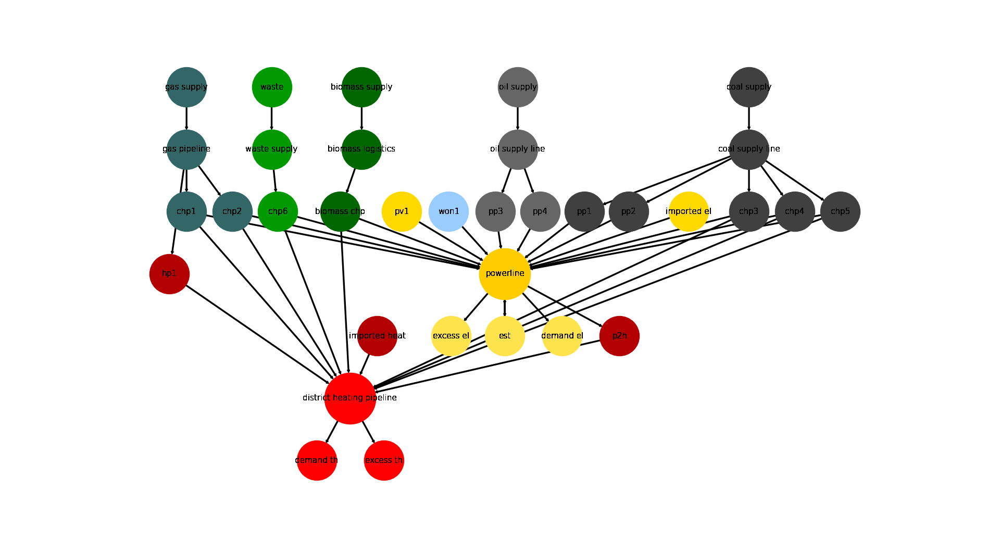

.. _AutoCompare_HH:

Hamburg Energy System Example (Brief)
*************************************

This example briefly illustrates the auto comparative features of the
:mod:`~tessif.analyze` module. For a more detailed example please refer to
the :ref:`examples_auto_comparison_fpwe`.

.. contents:: Contents
   :local:
   :backlinks: top

Initial code to do the comparison
=================================

>>> # change spellings_logging_level to debug to declutter output
>>> import tessif.frused.configurations as configurations
>>> configurations.spellings_logging_level = 'debug'

>>> # Import hardcoded tessif energy system using the example hub:
>>> import tessif.examples.data.tsf.py_hard as tsf_examples

>>> # Choose the underlying energy system
>>> tsf_es = tsf_examples.create_hhes()

>>> # write it to disk, so the comparatier can read it out
>>> import os
>>> from tessif.frused.paths import write_dir
>>> #
>>> output_msg = tsf_es.to_hdf5(
...     directory=os.path.join(write_dir, 'tsf'),
...     filename='hhes_comparison.hdf5',
... )

>>> # let the comparatier to the auto comparison:
>>> import tessif.analyze, tessif.parse, functools
>>> from tessif.frused.hooks.tsf import reparameterize_components
>>> #
>>> comparatier = tessif.analyze.Comparatier(
...     path=os.path.join(write_dir, 'tsf', 'hhes_comparison.hdf5'),
...     parser=tessif.parse.hdf5,
...     models=('oemof', 'pypsa', 'fine', 'calliope'),
...     hooks={
...         'oemof': functools.partial(
...             reparameterize_components,
...             components={
...                 'pp1': {
...                     'flow_emissions': {'electricity': 0, 'coal': 0},
...                 },
...                 'pp2': {
...                     'flow_emissions': {'electricity': 0, 'coal': 0},
...                 },
...             }
...         ),
...         'fine': functools.partial(
...             reparameterize_components,
...             components={
...                 'pp1': {
...                     'flow_emissions': {'electricity': 0, 'coal': 0},
...                 },
...                 'pp2': {
...                     'flow_emissions': {'electricity': 0, 'coal': 0},
...                 },
...             }
...         ),
...         'calliope': functools.partial(
...             reparameterize_components,
...             components={
...                 'pp1': {
...                     'flow_emissions': {'electricity': 0, 'coal': 0},
...                 },
...                 'pp2': {
...                     'flow_emissions': {'electricity': 0, 'coal': 0},
...                 },
...             }
...         )
...     },
... )

Code accessing the results
==========================
Following section provides examples on how to use the
:class:`Comparatier interface <tessif.analyze.Comparatier>` to access the
auto generated comparison results.

Models
------

>>> # show the models compared:
>>> for model in sorted(comparatier.models):
...     print(model)
cllp
fine
omf
ppsa

Energy System Graph
-------------------
>>> import matplotlib.pyplot as plt
>>> import tessif.visualize.nxgrph as nxv

>>> grph = comparatier.graph
>>> drawing_data = nxv.draw_graph(
...     grph,
...     node_color={
...         'coal supply': '#404040',
...         'coal supply line': '#404040',
...         'pp1': '#404040',
...         'pp2': '#404040',
...         'chp3': '#404040',
...         'chp4': '#404040',
...         'chp5': '#404040',
...         'hp1': '#b30000',
...         'imported heat': '#b30000',
...         'district heating pipeline': 'Red',
...         'demand th': 'Red',
...         'excess th': 'Red',
...         'p2h': '#b30000',
...         'biomass chp': '#006600',
...         'biomass supply': '#006600',
...         'biomass logistics': '#006600',
...         'won1': '#99ccff',
...         'gas supply': '#336666',
...         'gas pipeline': '#336666',
...         'chp1': '#336666',
...         'chp2': '#336666',
...         'waste': '#009900',
...         'waste supply': '#009900',
...         'chp6': '#009900',
...         'oil supply': '#666666',
...         'oil supply line': '#666666',
...         'pp3': '#666666',
...         'pp4': '#666666',
...         'pv1': '#ffd900',
...         'imported el': '#ffd900',
...         'demand el': '#ffe34d',
...         'excess el': '#ffe34d',
...         'est': '#ffe34d',
...         'powerline': '#ffcc00',
...     },
...     node_size={
...         'powerline': 5000,
...         'district heating pipeline': 5000
...     },
... )
>>> # plt.show()  # commented out for simpler doctesting

         
Comparative Model Results
-------------------------
Following sections show how to utilize to built-in
:class:`~tessif.analyze.ComparativeResultier` to access results conveniently
among models.

Splitting the result dataframes for better printabilitiy:

>>> cllp_results = comparatier.optimization_results['cllp']
>>> fn_results = comparatier.optimization_results['fine']
>>> omf_results = comparatier.optimization_results['omf']
>>> ppsa_results = comparatier.optimization_results['ppsa']

Load Results
^^^^^^^^^^^^
>>> calliope_df = cllp_results.node_load['powerline']
>>> fine_df = fn_results.node_load['powerline']
>>> oemof_df = omf_results.node_load['powerline']
>>> ppsa_df = ppsa_results.node_load['powerline']

Show non zero reuslts:

>>> print(oemof_df.loc[:, (oemof_df != 0).any(axis=0)])
powerline            biomass chp        chp3        chp4       chp5  est         pp1         pp2       pv1       won1  demand el
2019-01-01 00:00:00   -48.224838   -0.000000   -0.000000  -0.000000 -1.0 -784.000000 -152.459550 -0.000000 -104.64961   1090.334
2019-01-01 01:00:00   -48.400000   -0.000000   -0.000000  -6.138987 -0.0 -784.000000 -120.971460 -0.000000 -111.16856   1070.679
2019-01-01 02:00:00   -48.400000   -8.213162   -0.000000  -0.000000 -0.0 -784.000000  -61.209535 -0.000000 -118.96330   1020.786
2019-01-01 03:00:00   -48.400000   -0.000000  -18.399644  -0.000000 -0.0  -14.693526 -784.000000 -0.000000 -120.27883    985.772
2019-01-01 04:00:00   -48.400000  -54.595831   -0.000000  -0.000000 -0.0 -751.402380   -0.000000 -0.000000 -121.92579    976.324
2019-01-01 05:00:00   -48.400000 -143.508260   -0.000000  -0.000000 -0.0 -660.400950   -0.000000 -0.000000 -122.18779    974.497
2019-01-01 06:00:00   -48.400000 -167.736170   -0.000000  -0.000000 -0.0 -664.330320   -0.000000 -0.000000 -122.34151   1002.808
2019-01-01 07:00:00   -48.400000 -157.864480   -0.000000  -0.000000 -0.0   -0.000000 -717.236480 -0.000000 -122.29804   1045.799
2019-01-01 08:00:00   -48.400000 -147.336720   -0.000000  -0.000000 -0.0 -756.032900   -0.000000 -0.000000 -122.22038   1073.990
2019-01-01 09:00:00   -48.400000 -139.933460   -0.000000  -0.000000 -0.0 -769.830150   -0.000000 -0.332485 -122.11590   1080.612
2019-01-01 10:00:00   -48.400000 -130.029170   -0.000000  -0.000000 -0.0 -784.000000  -15.691057 -1.866911 -121.56686   1101.554
2019-01-01 11:00:00   -48.400000 -121.276070   -0.000000  -0.000000 -0.0  -77.394878 -784.000000 -4.676047 -122.44000   1158.187
2019-01-01 12:00:00   -48.400000   -0.000000 -117.958010  -0.000000 -0.0 -124.433730 -784.000000 -6.387745 -122.38152   1203.561
2019-01-01 13:00:00   -48.400000   -0.000000 -115.201270  -0.000000 -0.0 -165.148820 -784.000000 -5.736912 -122.44000   1240.927
2019-01-01 14:00:00   -48.400000   -0.000000 -117.677850  -0.000000 -0.0 -784.000000 -174.251740 -4.627410 -122.44000   1251.397
2019-01-01 15:00:00   -48.400000   -0.000000 -119.498360  -0.000000 -0.0 -784.000000 -198.808640 -0.000000 -122.44000   1273.147
2019-01-01 16:00:00   -48.400000 -130.494740   -0.000000  -0.000000 -0.0 -784.000000 -216.075260 -0.000000 -122.44000   1301.410
2019-01-01 17:00:00   -48.400000 -141.118270   -0.000000  -0.000000 -0.0 -784.000000 -262.493730 -0.000000 -122.44000   1358.452
2019-01-01 18:00:00   -48.400000 -145.837120   -0.000000  -0.000000 -0.0 -784.000000 -288.954880 -0.000000 -122.44000   1389.632
2019-01-01 19:00:00   -48.400000 -145.999100   -0.000000  -0.000000 -0.0 -784.000000 -250.030900 -0.000000 -122.44000   1350.870
2019-01-01 20:00:00   -48.400000 -140.128040   -0.000000  -0.000000 -0.0 -784.000000 -205.200960 -0.000000 -122.44000   1300.169
2019-01-01 21:00:00   -48.400000 -115.192100   -0.000000  -0.000000 -0.0 -191.346940 -784.000000 -0.000000 -122.41696   1261.356
2019-01-01 22:00:00   -48.400000   -0.000000   -0.000000 -69.714081 -0.0 -784.000000 -206.852870 -0.000000 -119.78805   1228.755
2019-01-01 23:00:00   -48.400000   -0.000000   -0.000000 -19.771900 -0.0 -784.000000 -194.549890 -0.000000 -117.67221   1164.394
    
>>> print(ppsa_df.loc[:, (ppsa_df != 0).any(axis=0)])
powerline            biomass chp        chp3        chp4        chp5  est         pp1         pp2       pv1       won1  demand el
2019-01-01 00:00:00   -48.224838   -0.000000   -0.000000   -0.000000 -1.0 -784.000000 -152.459550 -0.000000 -104.64961   1090.334
2019-01-01 01:00:00   -48.400000   -0.000000   -6.138987   -0.000000 -0.0 -784.000000 -120.971460 -0.000000 -111.16856   1070.679
2019-01-01 02:00:00   -48.400000   -0.000000   -0.000000   -8.213162 -0.0  -61.209535 -784.000000 -0.000000 -118.96330   1020.786
2019-01-01 03:00:00   -48.400000   -0.000000   -0.000000  -18.399644 -0.0  -14.693526 -784.000000 -0.000000 -120.27883    985.772
2019-01-01 04:00:00   -48.400000   -0.000000   -0.000000  -54.595831 -0.0   -0.000000 -751.402380 -0.000000 -121.92579    976.324
2019-01-01 05:00:00   -48.400000 -143.508256   -0.000000   -0.000000 -0.0 -660.400950   -0.000000 -0.000000 -122.18779    974.497
2019-01-01 06:00:00   -48.400000 -167.736169   -0.000000   -0.000000 -0.0 -664.330320   -0.000000 -0.000000 -122.34151   1002.808
2019-01-01 07:00:00   -48.400000 -157.864481   -0.000000   -0.000000 -0.0   -0.000000 -717.236480 -0.000000 -122.29804   1045.799
2019-01-01 08:00:00   -48.400000 -147.336719   -0.000000   -0.000000 -0.0   -0.000000 -756.032900 -0.000000 -122.22038   1073.990
2019-01-01 09:00:00   -48.400000 -139.933462   -0.000000   -0.000000 -0.0   -0.000000 -769.830150 -0.332485 -122.11590   1080.612
2019-01-01 10:00:00   -48.400000   -0.000000 -130.029175   -0.000000 -0.0 -784.000000  -15.691057 -1.866911 -121.56686   1101.554
2019-01-01 11:00:00   -48.400000   -0.000000 -121.276075   -0.000000 -0.0  -77.394878 -784.000000 -4.676047 -122.44000   1158.187
2019-01-01 12:00:00   -48.400000   -0.000000   -0.000000 -117.958006 -0.0 -784.000000 -124.433730 -6.387745 -122.38152   1203.561
2019-01-01 13:00:00   -48.400000   -0.000000   -0.000000 -115.201269 -0.0 -784.000000 -165.148820 -5.736912 -122.44000   1240.927
2019-01-01 14:00:00   -48.400000   -0.000000   -0.000000 -117.677850 -0.0 -174.251740 -784.000000 -4.627410 -122.44000   1251.397
2019-01-01 15:00:00   -48.400000   -0.000000 -119.498356   -0.000000 -0.0 -198.808640 -784.000000 -0.000000 -122.44000   1273.147
2019-01-01 16:00:00   -48.400000   -0.000000 -130.494744   -0.000000 -0.0 -784.000000 -216.075260 -0.000000 -122.44000   1301.410
2019-01-01 17:00:00   -48.400000 -141.118269   -0.000000   -0.000000 -0.0 -262.493730 -784.000000 -0.000000 -122.44000   1358.452
2019-01-01 18:00:00   -48.400000 -145.837119   -0.000000   -0.000000 -0.0 -784.000000 -288.954880 -0.000000 -122.44000   1389.632
2019-01-01 19:00:00   -48.400000 -145.999100   -0.000000   -0.000000 -0.0 -250.030900 -784.000000 -0.000000 -122.44000   1350.870
2019-01-01 20:00:00   -48.400000 -140.128044   -0.000000   -0.000000 -0.0 -205.200960 -784.000000 -0.000000 -122.44000   1300.169
2019-01-01 21:00:00   -48.400000   -0.000000 -115.192100   -0.000000 -0.0 -784.000000 -191.346940 -0.000000 -122.41696   1261.356
2019-01-01 22:00:00   -48.400000   -0.000000   -0.000000  -69.714081 -0.0 -206.852870 -784.000000 -0.000000 -119.78805   1228.755
2019-01-01 23:00:00   -48.400000   -0.000000   -0.000000  -19.771900 -0.0 -784.000000 -194.549890 -0.000000 -117.67221   1164.394

>>> print(fine_df.loc[:, (fine_df != 0).any(axis=0)])
powerline            biomass chp        chp3        chp4        chp5         pp1         pp2       pv1       won1  demand el
2019-01-01 00:00:00   -48.224838   -0.000000   -0.000000   -0.000000 -153.459553 -783.999984 -0.000000 -104.64961   1090.334
2019-01-01 01:00:00   -48.400000   -0.000000   -6.138987   -0.000000 -120.971454 -783.999984 -0.000000 -111.16856   1070.679
2019-01-01 02:00:00   -48.400000   -0.000000   -8.213162   -0.000000  -61.209535 -783.999984 -0.000000 -118.96330   1020.786
2019-01-01 03:00:00   -48.400000   -0.000000   -0.000000  -18.399644 -783.999984  -14.693526 -0.000000 -120.27883    985.772
2019-01-01 04:00:00   -48.400000   -0.000000  -54.595831   -0.000000   -0.000000 -751.402383 -0.000000 -121.92579    976.324
2019-01-01 05:00:00   -48.400000   -0.000000 -132.437500  -11.070756   -0.000000 -660.400929 -0.000000 -122.18779    974.497
2019-01-01 06:00:00   -48.400000 -167.736169   -0.000000   -0.000000 -664.330329   -0.000000 -0.000000 -122.34151   1002.808
2019-01-01 07:00:00   -48.400000 -157.864481   -0.000000   -0.000000   -0.000000 -717.236490 -0.000000 -122.29804   1045.799
2019-01-01 08:00:00   -48.400000 -147.336719   -0.000000   -0.000000   -0.000000 -756.032886 -0.000000 -122.22038   1073.990
2019-01-01 09:00:00   -48.400000   -0.000000 -132.437500   -7.495962 -769.830140   -0.000000 -0.332485 -122.11590   1080.612
2019-01-01 10:00:00   -48.400000   -0.000000 -130.029175   -0.000000  -15.691058 -783.999984 -1.866911 -121.56686   1101.554
2019-01-01 11:00:00   -48.400000   -0.000000 -121.276075   -0.000000  -77.394880 -783.999984 -4.676047 -122.44000   1158.187
2019-01-01 12:00:00   -48.400000   -0.000000   -0.000000 -117.958006 -783.999984 -124.433729 -6.387745 -122.38152   1203.561
2019-01-01 13:00:00   -48.400000   -0.000000   -0.000000 -115.201269 -165.148820 -783.999984 -5.736912 -122.44000   1240.927
2019-01-01 14:00:00   -48.400000   -0.000000 -117.677850   -0.000000 -783.999984 -174.251741 -4.627410 -122.44000   1251.397
2019-01-01 15:00:00   -48.400000   -0.000000 -119.498356   -0.000000 -198.808645 -783.999984 -0.000000 -122.44000   1273.147
2019-01-01 16:00:00   -48.400000   -0.000000 -130.494744   -0.000000 -783.999984 -216.075255 -0.000000 -122.44000   1301.410
2019-01-01 17:00:00   -48.400000 -141.118269   -0.000000   -0.000000 -262.493730 -783.999984 -0.000000 -122.44000   1358.452
2019-01-01 18:00:00   -48.400000 -145.837119   -0.000000   -0.000000 -288.954881 -783.999984 -0.000000 -122.44000   1389.632
2019-01-01 19:00:00   -48.400000   -0.000000 -132.437500  -13.561600 -783.999984 -250.030899 -0.000000 -122.44000   1350.870
2019-01-01 20:00:00   -48.400000   -0.000000 -132.437500   -7.690544 -205.200955 -783.999984 -0.000000 -122.44000   1300.169
2019-01-01 21:00:00   -48.400000   -0.000000 -115.192100   -0.000000 -191.346943 -783.999984 -0.000000 -122.41696   1261.356
2019-01-01 22:00:00   -48.400000   -0.000000  -69.714081   -0.000000 -206.852866 -783.999984 -0.000000 -119.78805   1228.755
2019-01-01 23:00:00   -48.400000   -0.000000   -0.000000  -19.771900 -194.549890 -783.999984 -0.000000 -117.67221   1164.394

>>> print(calliope_df.loc[:, (calliope_df != 0).any(axis=0)])
powerline            biomass chp        chp3   chp4  est        pp1         pp2       pv1       won1  demand el
2019-01-01 00:00:00   -48.224838   -0.000000   -0.0 -1.0 -784.00000 -152.459550 -0.000000 -104.64961   1090.334
2019-01-01 01:00:00   -48.400000   -6.138987   -0.0 -0.0 -784.00000 -120.971460 -0.000000 -111.16856   1070.679
2019-01-01 02:00:00   -48.400000   -8.213162   -0.0 -0.0 -784.00000  -61.209535 -0.000000 -118.96330   1020.786
2019-01-01 03:00:00   -48.400000  -18.399644   -0.0 -0.0 -784.00000  -14.693526 -0.000000 -120.27883    985.772
2019-01-01 04:00:00   -48.400000  -54.595831   -0.0 -0.0 -751.40238   -0.000000 -0.000000 -121.92579    976.324
2019-01-01 05:00:00   -48.400000 -143.508260   -0.0 -0.0 -660.40095   -0.000000 -0.000000 -122.18779    974.497
2019-01-01 06:00:00   -48.400000  -37.736169 -130.0 -0.0 -664.33032   -0.000000 -0.000000 -122.34151   1002.808
2019-01-01 07:00:00   -48.400000 -157.864480   -0.0 -0.0 -717.23648   -0.000000 -0.000000 -122.29804   1045.799
2019-01-01 08:00:00   -48.400000 -147.336720   -0.0 -0.0 -756.03290   -0.000000 -0.000000 -122.22038   1073.990
2019-01-01 09:00:00   -48.400000 -139.933460   -0.0 -0.0 -769.83015   -0.000000 -0.332485 -122.11590   1080.612
2019-01-01 10:00:00   -48.400000 -130.029170   -0.0 -0.0 -784.00000  -15.691057 -1.866911 -121.56686   1101.554
2019-01-01 11:00:00   -48.400000 -121.276070   -0.0 -0.0 -784.00000  -77.394878 -4.676047 -122.44000   1158.187
2019-01-01 12:00:00   -48.400000 -117.958010   -0.0 -0.0 -784.00000 -124.433730 -6.387745 -122.38152   1203.561
2019-01-01 13:00:00   -48.400000 -115.201270   -0.0 -0.0 -784.00000 -165.148820 -5.736912 -122.44000   1240.927
2019-01-01 14:00:00   -48.400000 -117.677850   -0.0 -0.0 -784.00000 -174.251740 -4.627410 -122.44000   1251.397
2019-01-01 15:00:00   -48.400000 -119.498360   -0.0 -0.0 -784.00000 -198.808640 -0.000000 -122.44000   1273.147
2019-01-01 16:00:00   -48.400000 -130.494740   -0.0 -0.0 -784.00000 -216.075260 -0.000000 -122.44000   1301.410
2019-01-01 17:00:00   -48.400000 -141.118270   -0.0 -0.0 -784.00000 -262.493730 -0.000000 -122.44000   1358.452
2019-01-01 18:00:00   -48.400000 -145.837120   -0.0 -0.0 -784.00000 -288.954880 -0.000000 -122.44000   1389.632
2019-01-01 19:00:00   -48.400000 -145.999100   -0.0 -0.0 -784.00000 -250.030900 -0.000000 -122.44000   1350.870
2019-01-01 20:00:00   -48.400000 -140.128040   -0.0 -0.0 -784.00000 -205.200960 -0.000000 -122.44000   1300.169
2019-01-01 21:00:00   -48.400000 -115.192100   -0.0 -0.0 -784.00000 -191.346940 -0.000000 -122.41696   1261.356
2019-01-01 22:00:00   -48.400000  -69.714081   -0.0 -0.0 -784.00000 -206.852870 -0.000000 -119.78805   1228.755
2019-01-01 23:00:00   -48.400000  -19.771900   -0.0 -0.0 -784.00000 -194.549890 -0.000000 -117.67221   1164.394

.. note::
   Note how the models solve the problems slightly differently. This is
   attributed to the fact that components like storages and chps are
   parameterized slightly differently.
   
   The  :ref:`Overall Results <hhes_overall_results>` however are very similar
   (at stated accuracy).

.. _hhes_storing_results:

Storing the Load Results
<<<<<<<<<<<<<<<<<<<<<<<<

>>> from tessif.frused.paths import write_dir
>>> calliope_path = os.path.join(
...     write_dir, 'tsf', 'hhes_results_cllp.csv')
>>> fine_path = os.path.join(
...     write_dir, 'tsf', 'hhes_results_fn.csv')
>>> omf_path = os.path.join(
...     write_dir, 'tsf', 'hhes_results_omf.csv')
>>> ppsa_path = os.path.join(
...     write_dir, 'tsf', 'hhes_results_ppsa.csv')

Export the data as csv:

>>> calliope_df.to_csv(calliope_path)
>>> fine_df.to_csv(fine_path)
>>> oemof_df.to_csv(omf_path)
>>> ppsa_df.to_csv(ppsa_path)

.. _hhes_overall_results:

Integrated Global Results (IGR)
-------------------------------
Following section demonstrate how to access the
:attr:`integrated global results
<tessif.analyze.Comparatier.integrated_global_results>` of the models compared.

>>> comparatier.integrated_global_results.drop(
...     ['time (s)', 'memory (MB)'], axis='index')
                      cllp       fine        omf       ppsa
emissions (sim)    17791.0    17792.0    17791.0    17791.0
costs (sim)      2311086.0  2311148.0  2311086.0  2311086.0
opex (ppcd)      2311086.0  2311148.0  2311086.0  2311086.0
capex (ppcd)          -0.0        0.0        0.0       -0.0

Memory and timing results are dropped because they vary slightly between runs.
The original results look something like::

  comparatier.integrated_global_results

                        cllp       fine        omf       ppsa
  emissions (sim)    17791.0    17792.0    17791.0    17791.0
  costs (sim)      2311086.0  2311148.0  2311086.0  2311086.0
  opex (ppcd)      2311086.0  2311148.0  2311086.0  2311087.0
  capex (ppcd)          -0.0        0.0        0.0       -0.0
  time (s)               3.2        3.5        2.9        3.2
  memory (MB)            4.5        6.2        3.7        4.8
  

Adding CO-2 Emission Constraints
================================

Create new constraints:

>>> tsf_es = tsf_examples.create_hhes()
>>> # use the existing constraints ...
>>> new_constraints = tsf_es.global_constraints.copy()
>>> # ... to modify them
>>> new_constraints['emissions'] = 600

Build the new energy system:

>>> from tessif.model.energy_system import AbstractEnergySystem
>>> new_tsf_es = AbstractEnergySystem.from_components(
...     uid='constrained_hhes',
...     components=tsf_es.nodes,
...     timeframe=tsf_es.timeframe,
...     global_constraints=new_constraints,
... )

Redo the comparison:

>>> # write it to disk, so the comparatier can read it out
>>> output_msg = new_tsf_es.to_hdf5(
...     directory=os.path.join(write_dir, 'tsf'),
...     filename='hhes_comparison.hdf5',
... )

>>> # let the comparatier to the auto comparison:
>>> import tessif.analyze, tessif.parse, functools
>>> from tessif.frused.hooks.tsf import reparameterize_components
>>> #
>>> comparatier = tessif.analyze.Comparatier(
...     path=os.path.join(write_dir, 'tsf', 'hhes_comparison.hdf5'),
...     parser=tessif.parse.hdf5,
...     models=('oemof', 'pypsa', 'fine', 'calliope'),
...     hooks={
...         'oemof': functools.partial(
...             reparameterize_components,
...             components={
...                 'pp1': {
...                     'flow_emissions': {'electricity': 0, 'coal': 0},
...                 },
...                 'pp2': {
...                     'flow_emissions': {'electricity': 0, 'coal': 0},
...                 },
...             }
...         ),
...         'fine': functools.partial(
...             reparameterize_components,
...             components={
...                 'pp1': {
...                     'flow_emissions': {'electricity': 0, 'coal': 0},
...                 },
...                 'pp2': {
...                     'flow_emissions': {'electricity': 0, 'coal': 0},
...                 },
...             }
...         ),
...         'calliope': functools.partial(
...             reparameterize_components,
...             components={
...                 'pp1': {
...                     'flow_emissions': {'electricity': 0, 'coal': 0},
...                 },
...                 'pp2': {
...                     'flow_emissions': {'electricity': 0, 'coal': 0},
...                 },
...             }
...         )
...     },
... )

Check the integrated global results again:

>>> comparatier.integrated_global_results.drop(
...     ['time (s)', 'memory (MB)'], axis='index')
                        cllp         fine          omf         ppsa
emissions (sim)        600.0        600.0        600.0        600.0
costs (sim)      150727489.0  150001712.0  150687813.0  142313929.0
opex (ppcd)        2796765.0    2756873.0    2733169.0    4020738.0
capex (ppcd)     147930731.0  147244807.0  147954645.0  138293192.0

Memory and timing results are dropped because they vary slightly between runs.
The original results look something like::

  comparatier.integrated_global_results

                          cllp         fine          omf         ppsa
  emissions (sim)        600.0        600.0        600.0        600.0
  costs (sim)      150727489.0  150001712.0  150687813.0  142313929.0
  opex (ppcd)        2796765.0    2756873.0    2733169.0    4020738.0
  capex (ppcd)     147930731.0  147244807.0  147954645.0  138293192.0
  time (s)                 3.7          3.5          2.8          3.5
  memory (MB)              5.8          6.2          3.8          4.8
