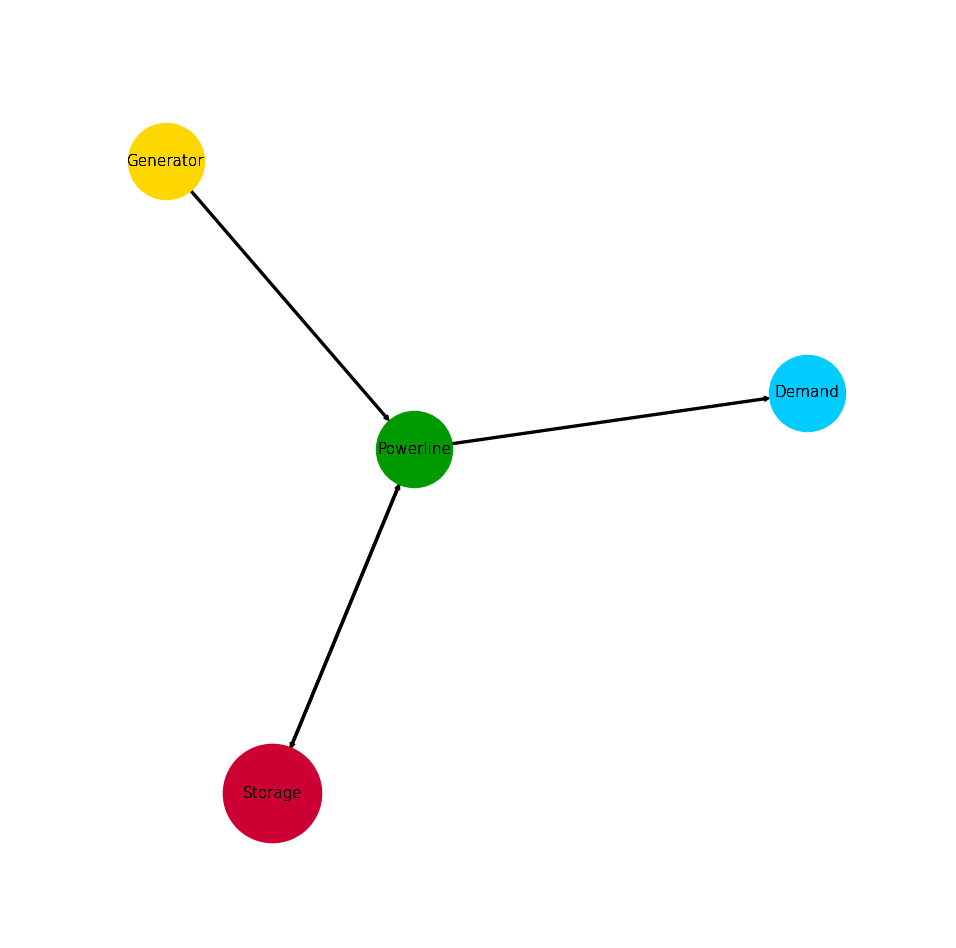

.. _AutoCompare_Storage:

Storage Example (Brief)
***********************

This example briefly illustrates the auto comparative features of the
:mod:`~tessif.analyze` module. For a more detailed example please refer to
the :ref:`examples_auto_comparison_fpwe`.

.. contents:: Contents
   :local:
   :backlinks: top

Initial code to do the comparison
=================================

>>> # change spellings_logging_level to debug to declutter output
>>> import tessif.frused.configurations as configurations
>>> configurations.spellings_logging_level = 'debug'

>>> # Import hardcoded tessif energy system using the example hub:
>>> import tessif.examples.data.tsf.py_hard as tsf_examples

>>> # Choose the underlying energy system
>>> tsf_es = tsf_examples.create_storage_example()

>>> # write it to disk, so the comparatier can read it out
>>> import os
>>> from tessif.frused.paths import write_dir
>>> #
>>> output_msg = tsf_es.to_hdf5(
...     directory=os.path.join(write_dir, 'tsf'),
...     filename='storage_comparison.hdf5',
... )

>>> # let the comparatier to the auto comparison:
>>> import tessif.analyze, tessif.parse
>>> #
>>> comparatier = tessif.analyze.Comparatier(
...     path=os.path.join(write_dir, 'tsf', 'storage_comparison.hdf5'),
...     parser=tessif.parse.hdf5,
...     models=('oemof', 'pypsa', 'fine', 'calliope'),
... )

Code accessing the results
==========================
Following section provides examples on how to use the
:class:`Comparatier interface <tessif.analyze.Comparatier>` to access the
auto generated comparison results.

Models
------

>>> # show the models compared:
>>> for model in sorted(comparatier.models):
...     print(model)
cllp
fine
omf
ppsa

Energy System Graph
-------------------
>>> import matplotlib.pyplot as plt
>>> import tessif.visualize.nxgrph as nxv

>>> grph = comparatier.graph

>>> drawing_data = nxv.draw_graph(
...     grph,
...     node_color={
...         'Powerline': '#009900',
...         'Storage': '#cc0033',
...         'Demand': '#00ccff',
...         'Generator': '#ffD700',
...     },
... )
>>> # plt.show()  # commented out for simpler doctesting

Comparative Model Results
-------------------------
Following sections show how to utilize to built-in
:class:`~tessif.analyze.ComparativeResultier` to access results conveniently
among models.

Installed Capacity Results
^^^^^^^^^^^^^^^^^^^^^^^^^^
>>> print(comparatier.comparative_results.capacities['Storage'])
cllp    27.0
fine    27.0
omf     27.0
ppsa    27.0
Name: Storage, dtype: float64

Load Results
^^^^^^^^^^^^
>>> print(comparatier.comparative_results.loads['Powerline'])
                         cllp                             fine                              omf                             ppsa                       
Powerline           Generator Storage Demand Storage Generator Storage Demand Storage Generator Storage Demand Storage Generator Storage Demand Storage
1990-07-13 00:00:00     -19.0    -0.0   10.0     9.0     -19.0    -0.0   10.0     9.0     -19.0    -0.0   10.0     9.0     -19.0    -0.0   10.0     9.0
1990-07-13 01:00:00     -19.0    -0.0   10.0     9.0     -19.0    -0.0   10.0     9.0     -19.0    -0.0   10.0     9.0     -19.0    -0.0   10.0     9.0
1990-07-13 02:00:00     -19.0    -0.0    7.0    12.0     -19.0    -0.0    7.0    12.0     -19.0    -0.0    7.0    12.0     -19.0    -0.0    7.0    12.0
1990-07-13 03:00:00      -0.0   -10.0   10.0     0.0      -0.0   -10.0   10.0     0.0      -0.0   -10.0   10.0     0.0      -0.0   -10.0   10.0     0.0
1990-07-13 04:00:00      -0.0   -10.0   10.0     0.0      -0.0   -10.0   10.0     0.0      -0.0   -10.0   10.0     0.0      -0.0   -10.0   10.0     0.0

State of Charge Results
^^^^^^^^^^^^^^^^^^^^^^^
>>> print(comparatier.comparative_results.socs['Storage'])
Storage                   cllp     fine        omf       ppsa
1990-07-13 00:00:00   8.100000   0.0000   8.100000   8.100000
1990-07-13 01:00:00  16.200000   8.1000  16.200000  16.200000
1990-07-13 02:00:00  27.000000  16.2000  27.000000  27.000000
1990-07-13 03:00:00  15.888889  27.0000  15.888889  15.888889
1990-07-13 04:00:00   4.777778  15.8889   4.777778   4.777778

Flow Cost Results
^^^^^^^^^^^^^^^^^
>>> print(comparatier.comparative_results.costs[('Generator', 'Powerline')])
cllp    2.0
fine    2.0
omf     2.0
ppsa    2.0
Name: (Generator, Powerline), dtype: float64

>>> print(comparatier.comparative_results.costs[('Powerline', 'Demand')])
cllp    0.0
fine    0.0
omf     0.0
ppsa    0.0
Name: (Powerline, Demand), dtype: float64

>>> print(comparatier.comparative_results.costs[('Storage', 'Powerline')])
cllp    1.0
fine    1.0
omf     1.0
ppsa    1.0
Name: (Storage, Powerline), dtype: float64

>>> print(comparatier.comparative_results.costs[('Powerline', 'Storage')])
cllp    0.0
fine    0.0
omf     0.0
ppsa    0.0
Name: (Powerline, Storage), dtype: float64

Flow Emission Results
^^^^^^^^^^^^^^^^^^^^^
>>> print(comparatier.comparative_results.emissions[('Generator', 'Powerline')])
cllp    0.0
fine    0.0
omf     0.0
ppsa    0.0
Name: (Generator, Powerline), dtype: float64
    
>>> print(comparatier.comparative_results.emissions[('Powerline', 'Demand')])
cllp    0.0
fine    0.0
omf     0.0
ppsa    0.0
Name: (Powerline, Demand), dtype: float64

>>> print(comparatier.comparative_results.emissions[('Storage', 'Powerline')])
cllp    0.5
fine    0.5
omf     0.5
ppsa    0.5
Name: (Storage, Powerline), dtype: float64

>>> print(comparatier.comparative_results.emissions[('Powerline', 'Storage')])
cllp    0.0
fine    0.0
omf     0.0
ppsa    0.0
Name: (Powerline, Storage), dtype: float64

Installed Capacity Results
^^^^^^^^^^^^^^^^^^^^^^^^^^
>>> print(comparatier.comparative_results.capacities['Storage'])
cllp    27.0
fine    27.0
omf     27.0
ppsa    27.0
Name: Storage, dtype: float64

Original Capacity Values
^^^^^^^^^^^^^^^^^^^^^^^^
>>> print(comparatier.comparative_results.original_capacities['Storage'])
cllp    0.0
fine    0.0
omf     0.0
ppsa    0.0
Name: Storage, dtype: float64

Expansion Cost Results
^^^^^^^^^^^^^^^^^^^^^^
>>> print(comparatier.comparative_results.expansion_costs['Storage'])
cllp    0.0
fine    0.0
omf     0.0
ppsa    0.0
Name: Storage, dtype: float64

Integrated Global Results (IGR)
-------------------------------
Following section demonstrate how to access the
:attr:`integrated global results
<tessif.analyze.Comparatier.integrated_global_results>` of the models compared.

>>> # show the integrated global results of the storage example:
>>> comparatier.integrated_global_results.drop(
...     ['time (s)', 'memory (MB)'], axis='index')
                  cllp   fine    omf   ppsa
emissions (sim)   10.0   10.0   10.0   10.0
costs (sim)      134.0  134.0  134.0  134.0
opex (ppcd)      134.0  134.0  134.0  134.0
capex (ppcd)       0.0    0.0    0.0    0.0

Memory and timing results are dropped because they vary slightly between runs.
The original results look something like::

  comparatier.integrated_global_results

                    cllp   fine    omf   ppsa
  emissions (sim)   10.0   10.0   10.0   10.0
  costs (sim)      134.0  134.0  134.0  134.0
  opex (ppcd)      134.0  134.0  134.0  134.0
  capex (ppcd)       0.0    0.0    0.0    0.0
  time (s)           0.5    0.7    0.4    0.9
  memory (MB)        0.9    1.1    0.5    1.4
