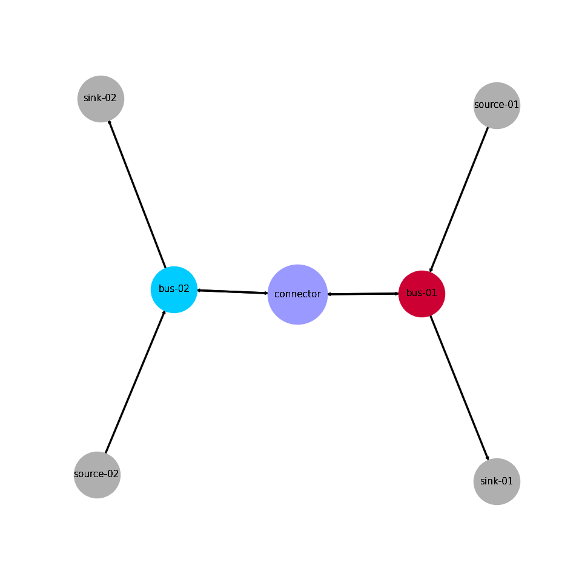

.. _AutoCompare_Transshipment:

Transshipment Problem Example (Brief)
*************************************

This example briefly illustrates the auto comparative features of the
:mod:`~tessif.analyze` module. For a more detailed example please refer to
the :ref:`examples_auto_comparison_fpwe`.

.. contents:: Contents
   :local:
   :backlinks: top

Initial code to do the comparison
=================================

>>> # change spellings_logging_level to debug to declutter output
>>> import tessif.frused.configurations as configurations
>>> configurations.spellings_logging_level = 'debug'

>>> # Import hardcoded tessif energy system using the example hub:
>>> import tessif.examples.data.tsf.py_hard as tsf_examples

>>> # Choose the underlying energy system
>>> tsf_es = tsf_examples.create_connected_es()

>>> # write it to disk, so the comparatier can read it out
>>> import os
>>> from tessif.frused.paths import write_dir
>>> #
>>> output_msg = tsf_es.to_hdf5(
...     directory=os.path.join(write_dir, 'tsf'),
...     filename='transshipment_comparison.hdf5',
... )

>>> # let the comparatier to the auto comparison:
>>> import tessif.analyze, tessif.parse
>>> #
>>> comparatier = tessif.analyze.Comparatier(
...     path=os.path.join(write_dir, 'tsf', 'transshipment_comparison.hdf5'),
...     parser=tessif.parse.hdf5,
...     models=('oemof', 'pypsa', 'fine', 'calliope'),
... )

Code accessing the results
==========================
Following section provides examples on how to use the
:class:`Comparatier interface <tessif.analyze.Comparatier>` to access the
auto generated comparison results.

Models
------

>>> # show the models compared:
>>> for model in sorted(comparatier.models):
...     print(model)
cllp
fine
omf
ppsa

Energy System Graph
-------------------
>>> import matplotlib.pyplot as plt
>>> import tessif.visualize.nxgrph as nxv

>>> grph = comparatier.graph

>>> drawing_data = nxv.draw_graph(
...     grph,
...     node_color={
...         'connector': '#9999ff',
...         'bus-01': '#cc0033',
...         'bus-02': '#00ccff',
...     },
...     node_size={'connector': 5000},
... )
>>> # plt.show()  # commented out for simpler doctesting

Comparative Model Results
-------------------------
Following sections show how to utilize to built-in
:class:`~tessif.analyze.ComparativeResultier` to access results conveniently
among models.

Load Results
^^^^^^^^^^^^
>>> print(comparatier.comparative_results.loads['connector'])
                         cllp                           fine                            omf                        ppsa                     
connector              bus-01 bus-02 bus-01 bus-02    bus-01 bus-02 bus-01 bus-02    bus-01 bus-02 bus-01 bus-02 bus-01 bus-02 bus-01 bus-02
1990-07-13 00:00:00 -5.555556  -0.00    0.0    5.0 -5.555556  -0.00    0.0    5.0 -5.555556  -0.00    0.0    5.0   -5.0   -0.0    0.0    5.0
1990-07-13 01:00:00 -0.000000  -6.25    5.0    0.0 -0.000000  -6.25    5.0    0.0 -0.000000  -6.25    5.0    0.0   -0.0  -10.0   10.0    0.0
1990-07-13 02:00:00 -0.000000  -0.00    0.0    0.0 -0.000000  -0.00    0.0    0.0 -0.000000  -0.00    0.0    0.0   -0.0   -0.0    0.0    0.0

.. note::
   Note how connector flows vary between models. This is due to the fact, that
   :attr:`pypsa connectors <tessif.transform.es2es.ppsa.create_pypsa_connectors>`
   do not handle bidirectional flows well with efficiencies other than 1.0, whereas
   :attr:`oemof connectors <tessif.transform.es2es.omf.generate_oemof_links>` do.
   Hence tessif sets bidirectional tessif connector efficiencies to 1.0 when
   transforming into :attr:`pypsa connectors
   <tessif.transform.es2es.ppsa.create_pypsa_connectors>`.
   
>>> print(comparatier.comparative_results.loads['bus-01'])
                         cllp                                   fine                                    omf                                   ppsa                            
bus-01              connector  source-01 connector sink-01 connector  source-01 connector sink-01 connector  source-01 connector sink-01 connector source-01 connector sink-01
1990-07-13 00:00:00      -0.0  -5.555556  5.555556     0.0      -0.0  -5.555556  5.555556     0.0      -0.0  -5.555556  5.555556     0.0      -0.0      -5.0       5.0     0.0
1990-07-13 01:00:00      -5.0 -10.000000  0.000000    15.0      -5.0 -10.000000  0.000000    15.0      -5.0 -10.000000  0.000000    15.0     -10.0      -5.0       0.0    15.0
1990-07-13 02:00:00      -0.0 -10.000000  0.000000    10.0      -0.0 -10.000000  0.000000    10.0      -0.0 -10.000000  0.000000    10.0      -0.0     -10.0       0.0    10.0

>>> print(comparatier.comparative_results.loads['bus-02'])
                         cllp                                  fine                                   omf                                  ppsa                            
bus-02              connector source-02 connector sink-02 connector source-02 connector sink-02 connector source-02 connector sink-02 connector source-02 connector sink-02
1990-07-13 00:00:00      -5.0    -10.00      0.00    15.0      -5.0    -10.00      0.00    15.0      -5.0    -10.00      0.00    15.0      -5.0     -10.0       0.0    15.0
1990-07-13 01:00:00      -0.0     -6.25      6.25     0.0      -0.0     -6.25      6.25     0.0      -0.0     -6.25      6.25     0.0      -0.0     -10.0      10.0     0.0
1990-07-13 02:00:00      -0.0    -10.00      0.00    10.0      -0.0    -10.00      0.00    10.0      -0.0    -10.00      0.00    10.0      -0.0     -10.0       0.0    10.0

Flow Cost Results
^^^^^^^^^^^^^^^^^

Connectors related flows:

>>> print(comparatier.comparative_results.costs[('connector', 'bus-01')])
cllp    0.0
fine    0.0
omf     0.0
ppsa    0.0
Name: (connector, bus-01), dtype: float64

>>> print(comparatier.comparative_results.costs[('bus-01', 'connector')])
cllp    0.0
fine    0.0
omf     0.0
ppsa    0.0
Name: (bus-01, connector), dtype: float64

>>> print(comparatier.comparative_results.costs[('connector', 'bus-02')])
cllp    0.0
fine    0.0
omf     0.0
ppsa    0.0
Name: (connector, bus-02), dtype: float64

>>> print(comparatier.comparative_results.costs[('bus-02', 'connector')])
cllp    0.0
fine    0.0
omf     0.0
ppsa    0.0
Name: (bus-02, connector), dtype: float64

Source related flows:

>>> print(comparatier.comparative_results.costs[('source-01', 'bus-01')])
cllp    1.0
fine    1.0
omf     1.0
ppsa    1.0
Name: (source-01, bus-01), dtype: float64

>>> print(comparatier.comparative_results.costs[('source-02', 'bus-02')])
cllp    1.0
fine    1.0
omf     1.0
ppsa    1.0
Name: (source-02, bus-02), dtype: float64

Flow Emission Results
^^^^^^^^^^^^^^^^^^^^^

Connectors related flows:

>>> print(comparatier.comparative_results.emissions[('connector', 'bus-01')])
cllp    0.0
fine    0.0
omf     0.0
ppsa    0.0
Name: (connector, bus-01), dtype: float64

>>> print(comparatier.comparative_results.emissions[('bus-01', 'connector')])
cllp    0.0
fine    0.0
omf     0.0
ppsa    0.0
Name: (bus-01, connector), dtype: float64

>>> print(comparatier.comparative_results.emissions[('connector', 'bus-02')])
cllp    0.0
fine    0.0
omf     0.0
ppsa    0.0
Name: (connector, bus-02), dtype: float64

>>> print(comparatier.comparative_results.emissions[('bus-02', 'connector')])
cllp    0.0
fine    0.0
omf     0.0
ppsa    0.0
Name: (bus-02, connector), dtype: float64

Source related flows:

>>> print(comparatier.comparative_results.emissions[('source-01', 'bus-01')])
cllp    0.8
fine    0.8
omf     0.8
ppsa    0.8
Name: (source-01, bus-01), dtype: float64

>>> print(comparatier.comparative_results.emissions[('source-02', 'bus-02')])
cllp    1.2
fine    1.2
omf     1.2
ppsa    1.2
Name: (source-02, bus-02), dtype: float64

Integrated Global Results (IGR)
-------------------------------
Following section demonstrate how to access the
:attr:`integrated global results
<tessif.analyze.Comparatier.integrated_global_results>` of the models compared.

>>> # show the integrated global results of the storage example:
>>> comparatier.integrated_global_results.drop(
...     ['time (s)', 'memory (MB)'], axis='index')
                 cllp  fine   omf  ppsa
emissions (sim)  52.0  52.0  52.0  52.0
costs (sim)      52.0  52.0  52.0  50.0
opex (ppcd)      52.0  52.0  52.0  50.0
capex (ppcd)      0.0   0.0   0.0   0.0

Memory and timing results are dropped because they vary slightly between runs.
The original results look something like::

  comparatier.integrated_global_results

                   cllp  fine   omf  ppsa
  emissions (sim)  52.0  52.0  52.0  52.0
  costs (sim)      52.0  52.0  52.0  50.0
  opex (ppcd)      52.0  52.0  52.0  50.0
  capex (ppcd)      0.0   0.0   0.0   0.0
  time (s)          0.6   0.7   0.5   1.0
  memory (MB)       0.9   1.1   0.5   1.4
