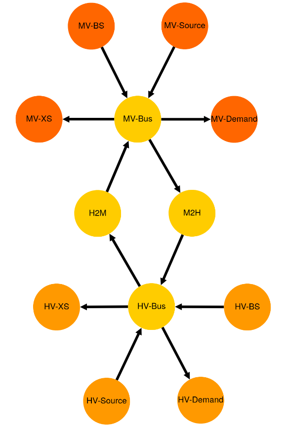

.. _AutoCompare_2T_Grid:

***********************************
2-Transformers Grid Example (Brief)
***********************************
This example briefly illustrates the auto comparative features of the
:mod:`~tessif.analyze` module. For a more detailed example please refer to
the :ref:`examples_auto_comparison_fpwe`.

.. contents:: Contents
   :local:
   :backlinks: top

Commitment Scenario
*******************

The underlying model-scenario-combination emulates common grid (congestion)
behaviours, during its 6 timesteps:

    1. Everything provided by HV-Source
    2. Too much provided by HV-Source; H2M grid congests
       and MV-BS and MV-XS need to compensate
    3. Too little provided, so MV-BS needs to provide
    4. Everything provided by MV-Source
    5. Too much provided by MV-Source, M2H grid congests
       and HV-BS and HV-XS need to compensate
    6. Too little provided, so MV-BS needs to provide

Initial code to do the comparison
=================================
>>> SOFTWARES = ('calliope', 'fine', 'oemof', 'pypsa',)
>>> TRANS_OPS = {
...     "ppsa": {
...         "forced_links": ("H2M", "M2H"),
...         "excess_sinks": ("HV-XS", "MV-XS"),
...     }
... }

>>> # change spellings_logging_level to debug to declutter output
>>> import tessif.frused.configurations as configurations  # nopep8
>>> configurations.spellings_logging_level = 'debug'

>>> # Import hardcoded tessif energy system using the example hub:
>>> import tessif.examples.data.tsf.py_hard as tsf_examples  # nopep8

>>> # Choose the underlying energy system
>>> tsf_es = tsf_examples.create_simple_transformer_grid_es()

>>> # write it to disk, so the comparatier can read it out
>>> import os  # nopep8
>>> from tessif.frused.paths import write_dir  # nopep8
>>> #
>>> output_msg = tsf_es.to_cfg(
...     directory=os.path.join(write_dir, 'tsf', "two_transformers_grid"),
... )

>>> # let the comparatier to the auto comparison:
>>> import tessif.analyze, tessif.parse  # nopep8
>>> #
>>> comparatier = tessif.analyze.Comparatier(
...     path=os.path.join(write_dir, 'tsf', 'two_transformers_grid'),
...     parser=tessif.parse.flat_config_folder,
...     models=SOFTWARES,
...     trans_ops=TRANS_OPS,
... )

Energy System Graph
-------------------
>>> import tessif.visualize.dcgrph as dcv

>>> app = dcv.draw_generic_graph(
...     energy_system=comparatier.baseline_es,
...     color_group={
...         'HV-Demand': '#ff9900',
...         'HV-BS': '#ff9900',
...         'HV-XS': '#ff9900',
...         'HV-Source': '#ff9900',
...         'H2M': '#ffcc00',
...         'M2H': '#ffcc00',
...         'MV-Bus': '#ffcc00',
...         'HV-Bus': '#ffcc00',
...         'MV-Demand': '#ff6600',
...         'MV-Source': '#ff6600',
...         'MV-BS': '#ff6600',
...         'MV-XS': '#ff6600',
...     }
... )
>>> # app.run_server(debug=False)  # commented out for simpler doctesting

	 

High Voltage Bus Load Results
=============================
>>> from pandas import option_context  # nopep8
>>> neat_print_pandas = option_context(
...     'display.max_rows', 10,
...     'display.max_columns', 9000,
...     'display.width', 70,
... )

>>> with neat_print_pandas:
...     print(comparatier.comparative_results.loads["HV-Bus"])
                     cllp                                        \
HV-Bus              HV-BS HV-Source   M2H   H2M HV-Demand HV-XS   
1990-07-13 00:00:00  -0.0     -22.0  -0.0  12.0      10.0   0.0   
1990-07-13 01:00:00  -0.0     -30.0  -0.0  12.0      10.0   8.0   
1990-07-13 02:00:00  -0.0     -10.0  -0.0   0.0      10.0   0.0   
1990-07-13 03:00:00  -0.0      -0.0 -10.0   0.0      10.0   0.0   
1990-07-13 04:00:00  -2.0      -0.0 -10.0   0.0      12.0   0.0   
1990-07-13 05:00:00 -10.0      -0.0  -0.0   0.0      10.0   0.0   
<BLANKLINE>
                     fine                                        \
HV-Bus              HV-BS HV-Source   M2H   H2M HV-Demand HV-XS   
1990-07-13 00:00:00  -0.0     -22.0  -0.0  12.0      10.0   0.0   
1990-07-13 01:00:00  -0.0     -30.0  -0.0  12.0      10.0   8.0   
1990-07-13 02:00:00  -0.0     -10.0  -0.0   0.0      10.0   0.0   
1990-07-13 03:00:00  -0.0      -0.0 -10.0   0.0      10.0   0.0   
1990-07-13 04:00:00  -2.0      -0.0 -10.0   0.0      12.0   0.0   
1990-07-13 05:00:00 -10.0      -0.0  -0.0   0.0      10.0   0.0   
<BLANKLINE>
                      omf                                        \
HV-Bus              HV-BS HV-Source   M2H   H2M HV-Demand HV-XS   
1990-07-13 00:00:00  -0.0     -22.0  -0.0  12.0      10.0   0.0   
1990-07-13 01:00:00  -0.0     -30.0  -0.0  12.0      10.0   8.0   
1990-07-13 02:00:00  -0.0     -10.0  -0.0   0.0      10.0   0.0   
1990-07-13 03:00:00  -0.0      -0.0 -10.0   0.0      10.0   0.0   
1990-07-13 04:00:00  -2.0      -0.0 -10.0   0.0      12.0   0.0   
1990-07-13 05:00:00 -10.0      -0.0  -0.0   0.0      10.0   0.0   
<BLANKLINE>
                     ppsa                                        
HV-Bus              HV-BS HV-Source   M2H   H2M HV-Demand HV-XS  
1990-07-13 00:00:00  -0.0     -22.0  -0.0  12.0      10.0   0.0  
1990-07-13 01:00:00  -0.0     -30.0  -0.0  12.0      10.0   8.0  
1990-07-13 02:00:00  -0.0     -10.0  -0.0   0.0      10.0   0.0  
1990-07-13 03:00:00  -0.0      -0.0 -10.0   0.0      10.0   0.0  
1990-07-13 04:00:00  -2.0      -0.0 -10.0   0.0      12.0   0.0  
1990-07-13 05:00:00 -10.0      -0.0  -0.0   0.0      10.0   0.0  

Medium Voltage Bus Load Results
===============================

>>> with neat_print_pandas:
...     print(comparatier.comparative_results.loads["MV-Bus"])
                     cllp                                        \
MV-Bus                H2M MV-BS MV-Source   M2H MV-Demand MV-XS   
1990-07-13 00:00:00 -10.0  -0.0      -0.0   0.0      10.0   0.0   
1990-07-13 01:00:00 -10.0  -2.0      -0.0   0.0      12.0   0.0   
1990-07-13 02:00:00  -0.0 -10.0      -0.0   0.0      10.0   0.0   
1990-07-13 03:00:00  -0.0  -0.0     -21.0  11.0      10.0   0.0   
1990-07-13 04:00:00  -0.0  -0.0     -30.0  11.0      10.0   9.0   
1990-07-13 05:00:00  -0.0  -0.0     -10.0   0.0      10.0   0.0   
<BLANKLINE>
                     fine                                        \
MV-Bus                H2M MV-BS MV-Source   M2H MV-Demand MV-XS   
1990-07-13 00:00:00 -10.0  -0.0      -0.0   0.0      10.0   0.0   
1990-07-13 01:00:00 -10.0  -2.0      -0.0   0.0      12.0   0.0   
1990-07-13 02:00:00  -0.0 -10.0      -0.0   0.0      10.0   0.0   
1990-07-13 03:00:00  -0.0  -0.0     -21.0  11.0      10.0   0.0   
1990-07-13 04:00:00  -0.0  -0.0     -30.0  11.0      10.0   9.0   
1990-07-13 05:00:00  -0.0  -0.0     -10.0   0.0      10.0   0.0   
<BLANKLINE>
                      omf                                        \
MV-Bus                H2M MV-BS MV-Source   M2H MV-Demand MV-XS   
1990-07-13 00:00:00 -10.0  -0.0      -0.0   0.0      10.0   0.0   
1990-07-13 01:00:00 -10.0  -2.0      -0.0   0.0      12.0   0.0   
1990-07-13 02:00:00  -0.0 -10.0      -0.0   0.0      10.0   0.0   
1990-07-13 03:00:00  -0.0  -0.0     -21.0  11.0      10.0   0.0   
1990-07-13 04:00:00  -0.0  -0.0     -30.0  11.0      10.0   9.0   
1990-07-13 05:00:00  -0.0  -0.0     -10.0   0.0      10.0   0.0   
<BLANKLINE>
                     ppsa                                        
MV-Bus                H2M MV-BS MV-Source   M2H MV-Demand MV-XS  
1990-07-13 00:00:00 -10.0  -0.0      -0.0   0.0      10.0   0.0  
1990-07-13 01:00:00 -10.0  -2.0      -0.0   0.0      12.0   0.0  
1990-07-13 02:00:00  -0.0 -10.0      -0.0   0.0      10.0   0.0  
1990-07-13 03:00:00  -0.0  -0.0     -21.0  11.0      10.0   0.0  
1990-07-13 04:00:00  -0.0  -0.0     -30.0  11.0      10.0   9.0  
1990-07-13 05:00:00  -0.0  -0.0     -10.0   0.0      10.0   0.0  

Integrated Global Results
=========================

>>> # show the integrated global results of the chp example:
>>> comparatier.integrated_global_results.drop(
...     ['time (s)', 'memory (MB)'], axis='index')
                  cllp   fine    omf   ppsa
emissions (sim)    0.0    0.0    0.0    0.0
costs (sim)      410.0  410.0  410.0  410.0
opex (ppcd)      410.0  410.0  410.0  410.0
capex (ppcd)       0.0    0.0    0.0    0.0

Memory and timing results are dropped because they vary slightly between runs.
The original results look something like::

    comparatier.integrated_global_results
                      cllp   fine    omf   ppsa
    emissions (sim)    0.0    0.0    0.0    0.0
    costs (sim)      410.0  410.0  410.0  410.0
    opex (ppcd)      410.0  410.0  410.0  410.0
    capex (ppcd)       0.0    0.0    0.0    0.0
    time (s)           2.8    0.9    0.6    1.2
    memory (MB)        2.9    1.4    0.8    1.6

Calculating Required Redispatch
===============================

Define a small helper function:

>>> def calc_redispatch(loads_spbus, loads_lackbus, uid_spsink, uid_lacksource):
...     """Calc redispatch between surpluss bus and lack bus."""
...     # select all indices where surplus sink gets used
...     congestion_occasions = loads_spbus[loads_spbus[uid_spsink] > 0].index
... 
...     # access all lack bus loads, of prior selected indices
...     pot_redispatch = loads_lackbus.loc[congestion_occasions][uid_lacksource]
... 
...     # redispatch = the amount of suprlus energy provided on timesteps where
...     # excess energy was dumped
...     redispatch = pot_redispatch[pot_redispatch.abs() > 0].abs()
... 
...     return redispatch

Acces load resultiers for more convenience:

>>> hvbus = comparatier.comparative_results.loads["HV-Bus"]["cllp"]
>>> mvbus = comparatier.comparative_results.loads["MV-Bus"]["fine"]

Redispatch high -> medium
-------------------------
>>> print(calc_redispatch(hvbus, mvbus, "HV-XS", "MV-BS"))
1990-07-13 01:00:00    2.0
Name: MV-BS, dtype: float64

Redispatch medium -> high
-------------------------
>>> print(calc_redispatch(mvbus, hvbus, "MV-XS", "HV-BS"))    
1990-07-13 04:00:00    2.0
Name: HV-BS, dtype: float64

Expansion Scenario
******************

The two transformers grid model-scenario-combination can be changed into an
expansion scenario by overriding the respective default argument ``expansion``
as can bee seen below.

The modifications alters the second of the six timesteps from above:

    1. Everything provided by HV-Source
    2. Too much provided by HV-Source; It's enough to
       also satisfy the MV-Demand, since the high to medium connection
       gets expanded. The HV-XS takes the excess indicating the amount
       of surpluss that would get capped in a real world application.       
    3. Too little provided, so MV-BS needs to provide
    4. Everything provided by MV-Source
    5. Too much provided by MV-Source, M2H grid congests
       and HV-BS and HV-XS need to compensate
    6. Too little provided, so MV-BS needs to provide

It does so by allowing the connection High -> Medium Voltage to be expanded at
the cost of 5 per capacity. At the same time the Medium -> High voltage
connection can be expanded at the cost of 100  per capacity unit.

This leads to the first beeing expanded, avoiding the need of redispatch. The
later however will not be expanded, since redispatching from medium to high is
more cost efficient in this case.

Initial code to do the comparison
=================================
>>> SOFTWARES = ('calliope', 'fine', 'oemof', 'pypsa',)
>>> TRANS_OPS = {
...     "ppsa": {
...         "forced_links": ("H2M", "M2H"),
...         "excess_sinks": ("HV-XS", "MV-XS"),
...     }
... }

>>> # change spellings_logging_level to debug to declutter output
>>> import tessif.frused.configurations as configurations  # nopep8
>>> configurations.spellings_logging_level = 'debug'

>>> # Import hardcoded tessif energy system using the example hub:
>>> import tessif.examples.data.tsf.py_hard as tsf_examples  # nopep8

>>> # Choose the underlying energy system
>>> tsf_es = tsf_examples.create_simple_transformer_grid_es(expansion=True)

>>> # write it to disk, so the comparatier can read it out
>>> import os  # nopep8
>>> from tessif.frused.paths import write_dir  # nopep8
>>> #
>>> output_msg = tsf_es.to_cfg(
...     directory=os.path.join(write_dir, 'tsf', "two_transformers_grid"),
... )

>>> # let the comparatier to the auto comparison:
>>> import tessif.analyze, tessif.parse  # nopep8
>>> #
>>> comparatier = tessif.analyze.Comparatier(
...     path=os.path.join(write_dir, 'tsf', 'two_transformers_grid'),
...     parser=tessif.parse.flat_config_folder,
...     models=SOFTWARES,
...     trans_ops=TRANS_OPS,
... )

High Voltage Bus Load Results
=============================
>>> from pandas import option_context  # nopep8
>>> neat_print_pandas = option_context(
...     'display.max_rows', 10,
...     'display.max_columns', 9000,
...     'display.width', 70,
... )

>>> print(comparatier.comparative_results.loads["HV-Bus"]["cllp"])
HV-Bus               HV-BS  HV-Source   M2H   H2M  HV-Demand  HV-XS
1990-07-13 00:00:00   -0.0      -22.0  -0.0  12.0       10.0    0.0
1990-07-13 01:00:00   -0.0      -30.0  -0.0  14.4       10.0    5.6
1990-07-13 02:00:00   -0.0      -10.0  -0.0   0.0       10.0    0.0
1990-07-13 03:00:00   -0.0       -0.0 -10.0   0.0       10.0    0.0
1990-07-13 04:00:00   -2.0       -0.0 -10.0   0.0       12.0    0.0
1990-07-13 05:00:00  -10.0       -0.0  -0.0   0.0       10.0    0.0

>>> print(comparatier.comparative_results.loads["HV-Bus"]["fine"])
HV-Bus                   HV-BS  HV-Source       M2H   H2M  HV-Demand  HV-XS
1990-07-13 00:00:00  -0.000000      -22.0 -0.000000  12.0       10.0    0.0
1990-07-13 01:00:00  -0.000000      -30.0 -0.000000  14.4       10.0    5.6
1990-07-13 02:00:00  -0.000000      -10.0 -0.000000   0.0       10.0    0.0
1990-07-13 03:00:00  -0.909091       -0.0 -9.090909   0.0       10.0    0.0
1990-07-13 04:00:00  -2.909091       -0.0 -9.090909   0.0       12.0    0.0
1990-07-13 05:00:00 -10.000000       -0.0 -0.000000   0.0       10.0    0.0

>>> print(comparatier.comparative_results.loads["HV-Bus"]["omf"])
HV-Bus               HV-BS  HV-Source   M2H   H2M  HV-Demand  HV-XS
1990-07-13 00:00:00   -0.0      -22.0  -0.0  12.0       10.0    0.0
1990-07-13 01:00:00   -0.0      -30.0  -0.0  14.4       10.0    5.6
1990-07-13 02:00:00   -0.0      -10.0  -0.0   0.0       10.0    0.0
1990-07-13 03:00:00   -0.0       -0.0 -10.0   0.0       10.0    0.0
1990-07-13 04:00:00   -2.0       -0.0 -10.0   0.0       12.0    0.0
1990-07-13 05:00:00  -10.0       -0.0  -0.0   0.0       10.0    0.0
    
>>> print(comparatier.comparative_results.loads["HV-Bus"]["ppsa"])
HV-Bus               HV-BS  HV-Source   M2H   H2M  HV-Demand  HV-XS
1990-07-13 00:00:00   -0.0      -22.0  -0.0  12.0       10.0    0.0
1990-07-13 01:00:00   -0.0      -30.0  -0.0  14.4       10.0    5.6
1990-07-13 02:00:00   -0.0      -10.0  -0.0   0.0       10.0    0.0
1990-07-13 03:00:00   -0.0       -0.0 -10.0   0.0       10.0    0.0
1990-07-13 04:00:00   -2.0       -0.0 -10.0   0.0       12.0    0.0
1990-07-13 05:00:00  -10.0       -0.0  -0.0   0.0       10.0    0.0

Medium Voltage Bus Load Results
===============================

>>> with neat_print_pandas:
...     print(comparatier.comparative_results.loads["MV-Bus"])
                     cllp                                        \
MV-Bus                H2M MV-BS MV-Source   M2H MV-Demand MV-XS   
1990-07-13 00:00:00 -10.0  -0.0      -0.0   0.0      10.0   0.0   
1990-07-13 01:00:00 -12.0  -0.0      -0.0   0.0      12.0   0.0   
1990-07-13 02:00:00  -0.0 -10.0      -0.0   0.0      10.0   0.0   
1990-07-13 03:00:00  -0.0  -0.0     -21.0  11.0      10.0   0.0   
1990-07-13 04:00:00  -0.0  -0.0     -30.0  11.0      10.0   9.0   
1990-07-13 05:00:00  -0.0  -0.0     -10.0   0.0      10.0   0.0   
<BLANKLINE>
                     fine                                        \
MV-Bus                H2M MV-BS MV-Source   M2H MV-Demand MV-XS   
1990-07-13 00:00:00 -10.0  -0.0      -0.0   0.0      10.0   0.0   
1990-07-13 01:00:00 -12.0  -0.0      -0.0   0.0      12.0   0.0   
1990-07-13 02:00:00  -0.0 -10.0      -0.0   0.0      10.0   0.0   
1990-07-13 03:00:00  -0.0  -0.0     -21.0  10.0      10.0   1.0   
1990-07-13 04:00:00  -0.0  -0.0     -30.0  10.0      10.0  10.0   
1990-07-13 05:00:00  -0.0  -0.0     -10.0   0.0      10.0   0.0   
<BLANKLINE>
                      omf                                        \
MV-Bus                H2M MV-BS MV-Source   M2H MV-Demand MV-XS   
1990-07-13 00:00:00 -10.0  -0.0      -0.0   0.0      10.0   0.0   
1990-07-13 01:00:00 -12.0  -0.0      -0.0   0.0      12.0   0.0   
1990-07-13 02:00:00  -0.0 -10.0      -0.0   0.0      10.0   0.0   
1990-07-13 03:00:00  -0.0  -0.0     -21.0  11.0      10.0   0.0   
1990-07-13 04:00:00  -0.0  -0.0     -30.0  11.0      10.0   9.0   
1990-07-13 05:00:00  -0.0  -0.0     -10.0   0.0      10.0   0.0   
<BLANKLINE>
                     ppsa                                        
MV-Bus                H2M MV-BS MV-Source   M2H MV-Demand MV-XS  
1990-07-13 00:00:00 -10.0  -0.0      -0.0   0.0      10.0   0.0  
1990-07-13 01:00:00 -12.0  -0.0      -0.0   0.0      12.0   0.0  
1990-07-13 02:00:00  -0.0 -10.0      -0.0   0.0      10.0   0.0  
1990-07-13 03:00:00  -0.0  -0.0     -21.0  11.0      10.0   0.0  
1990-07-13 04:00:00  -0.0  -0.0     -30.0  11.0      10.0   9.0  
1990-07-13 05:00:00  -0.0  -0.0     -10.0   0.0      10.0   0.0  

   

Integrated Global Results
=========================

>>> # show the integrated global results of the chp example:
>>> comparatier.integrated_global_results.drop(
...     ['time (s)', 'memory (MB)'], axis='index')
                  cllp   fine    omf   ppsa
emissions (sim)    0.0    0.0    0.0    0.0
costs (sim)      376.0  423.0  376.0  376.0
opex (ppcd)      366.0  404.0  366.0  366.0
capex (ppcd)      10.0   18.0   10.0   10.0

Memory and timing results are dropped because they vary slightly between runs.
The original results look something like::

    comparatier.integrated_global_results
                      cllp   fine    omf   ppsa
    emissions (sim)    0.0    0.0    0.0    0.0
    costs (sim)      376.0  423.0  376.0  376.0
    opex (ppcd)      366.0  404.0  366.0  366.0
    capex (ppcd)      10.0   18.0   10.0   10.0
    time (s)           2.9    0.9    0.6    1.5
    memory (MB)        2.9    1.4    0.9    1.7

    

Calculating Required Redispatch
===============================

Acces load resultiers for more convenience:

Fine Redispatch
---------------

>>> hvbus = comparatier.comparative_results.loads["HV-Bus"]["fine"]
>>> mvbus = comparatier.comparative_results.loads["MV-Bus"]["fine"]

Redispatch high -> medium
^^^^^^^^^^^^^^^^^^^^^^^^^
>>> print(calc_redispatch(hvbus, mvbus, "HV-XS", "MV-BS"))
Series([], Name: MV-BS, dtype: float64)

Redispatch medium -> high
^^^^^^^^^^^^^^^^^^^^^^^^^
>>> print(calc_redispatch(mvbus, hvbus, "MV-XS", "HV-BS"))    
1990-07-13 03:00:00    0.909091
1990-07-13 04:00:00    2.909091
Name: HV-BS, dtype: float64

Others Redispatch
-----------------

>>> hvbus = comparatier.comparative_results.loads["HV-Bus"]["cllp"]
>>> mvbus = comparatier.comparative_results.loads["MV-Bus"]["ppsa"]

Redispatch high -> medium
^^^^^^^^^^^^^^^^^^^^^^^^^
>>> print(calc_redispatch(hvbus, mvbus, "HV-XS", "MV-BS"))
Series([], Name: MV-BS, dtype: float64)

Redispatch medium -> high
^^^^^^^^^^^^^^^^^^^^^^^^^
>>> print(calc_redispatch(mvbus, hvbus, "MV-XS", "HV-BS"))
1990-07-13 04:00:00    2.0
Name: HV-BS, dtype: float64

