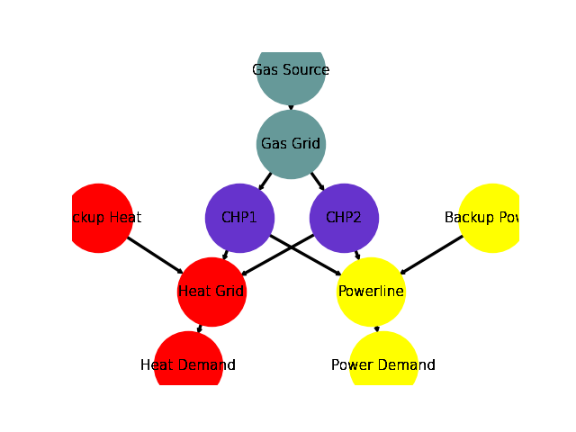

.. _AutoCompare_Variable_CHP:

CHP with variable conversion factors Example (Brief)
****************************************************

This example briefly illustrates the auto comparative features of the
:mod:`~tessif.analyze` module. For a more detailed example please refer to
the :ref:`examples_auto_comparison_fpwe`.

.. contents:: Contents
   :local:
   :backlinks: top

Initial code to do the comparison
=================================

>>> # change spellings_logging_level to debug to declutter output
>>> import tessif.frused.configurations as configurations
>>> configurations.spellings_logging_level = 'debug'

>>> # Import hardcoded tessif energy system using the example hub:
>>> import tessif.examples.data.tsf.py_hard as tsf_examples

>>> # Choose the underlying energy system
>>> tsf_es = tsf_examples.create_variable_chp()

>>> # write it to disk, so the comparatier can read it out
>>> import os
>>> from tessif.frused.paths import write_dir
>>> #
>>> output_msg = tsf_es.to_hdf5(
...     directory=os.path.join(write_dir, 'tsf'),
...     filename='chp_comparison.hdf5',
... )

>>> # let the comparatier to the auto comparison:
>>> import tessif.analyze, tessif.parse
>>> #
>>> comparatier = tessif.analyze.Comparatier(
...     path=os.path.join(write_dir, 'tsf', 'chp_comparison.hdf5'),
...     parser=tessif.parse.hdf5,
...     models=('oemof', ),
... )

Code accessing the results
==========================
Following section provides examples on how to use the
:class:`Comparatier interface <tessif.analyze.Comparatier>` to access the
auto generated comparison results.

Models
------

>>> # show the models compared:
>>> for model in sorted(comparatier.models):
...     print(model)
omf

Energy System Objects
---------------------

>>> # access the model based energy system objects
>>> # (type(es) printed here for doctesting)
>>> # 
>>> for model, es in comparatier.energy_systems.items():
...     print(f'{model}: {type(es)}')
omf: <class 'oemof.solph.network.energy_system.EnergySystem'>

Energy System Graph
-------------------
>>> import matplotlib.pyplot as plt
>>> import tessif.visualize.nxgrph as nxv

>>> grph = comparatier.graph

>>> drawing_data = nxv.draw_graph(
...     grph,
...     node_color={
...         'Gas Source': '#669999',
...         'Gas Grid': '#669999',
...         'CHP1': '#6633cc',
...         'CHP2': '#6633cc',
...         'Backup Heat': 'red',
...         'Heat Grid': 'red',
...         'Heat Demand': 'red',
...         'Backup Power': 'yellow',
...         'Powerline': 'yellow',
...         'Power Demand': 'yellow',
...     },
... )
>>> # plt.show()  # commented out for simpler doctesting

Comparative Model Results
-------------------------
Following sections show how to utilize to built-in
:class:`~tessif.analyze.ComparativeResultier` to access results conveniently
among models.

Installed Capacity Results
^^^^^^^^^^^^^^^^^^^^^^^^^^
>>> print(comparatier.comparative_results.capacities['CHP1'])
CHP1       omf
Heat Grid    6
Powerline    9

>>> print(comparatier.comparative_results.capacities['CHP2'])
CHP2        omf
Heat Grid   4.0
Powerline  11.0

Original Capacity Values
^^^^^^^^^^^^^^^^^^^^^^^^
>>> print(comparatier.comparative_results.original_capacities['CHP1'])
CHP1       omf
Heat Grid    6
Powerline    9

>>> print(comparatier.comparative_results.original_capacities['CHP2'])
CHP2       omf
Heat Grid    0
Powerline    0

Expansion Cost Results
^^^^^^^^^^^^^^^^^^^^^^
>>> print(comparatier.comparative_results.expansion_costs['CHP1'])
CHP1       omf
Heat Grid  0.0
Powerline  0.0

>>> print(comparatier.comparative_results.expansion_costs['CHP2'])
CHP2       omf
Heat Grid  0.0
Powerline  0.0

Flow Cost Results
^^^^^^^^^^^^^^^^^
>>> print(comparatier.comparative_results.costs[('CHP1', 'Powerline')])
omf    3
Name: (CHP1, Powerline), dtype: int64

>>> print(comparatier.comparative_results.costs[('CHP2', 'Powerline')])
omf    3
Name: (CHP2, Powerline), dtype: int64

>>> print(comparatier.comparative_results.costs[('CHP1', 'Heat Grid')])
omf    2
Name: (CHP1, Heat Grid), dtype: int64

>>> print(comparatier.comparative_results.costs[('CHP2', 'Heat Grid')])
omf    2
Name: (CHP2, Heat Grid), dtype: int64

Characteristic Value Results
^^^^^^^^^^^^^^^^^^^^^^^^^^^^
>>> print(comparatier.comparative_results.cvs['CHP1'])
CHP1       omf
Heat Grid  1.0
Powerline  1.0

>>> print(comparatier.comparative_results.cvs['CHP2'])
CHP2       omf
Heat Grid  1.0
Powerline  1.0

Flow Emission Results
^^^^^^^^^^^^^^^^^^^^^
>>> print(comparatier.comparative_results.emissions[('CHP1', 'Powerline')])
omf    2
Name: (CHP1, Powerline), dtype: int64

>>> print(comparatier.comparative_results.emissions[('CHP2', 'Powerline')])
omf    2
Name: (CHP2, Powerline), dtype: int64

>>> print(comparatier.comparative_results.emissions[('CHP1', 'Heat Grid')])
omf    3
Name: (CHP1, Heat Grid), dtype: int64

>>> print(comparatier.comparative_results.emissions[('CHP2', 'Heat Grid')])
omf    3
Name: (CHP2, Heat Grid), dtype: int64

.. _AutoCompare_Variable_CHP_Unconstrained_Loads:

Load Results
^^^^^^^^^^^^
>>> print(comparatier.comparative_results.loads['CHP1'])
                         omf                    
CHP1                Gas Grid Heat Grid Powerline
1990-07-13 00:00:00    -30.0       6.0       9.0
1990-07-13 01:00:00    -30.0       6.0       9.0
1990-07-13 02:00:00    -30.0       6.0       9.0
1990-07-13 03:00:00    -30.0       6.0       9.0

>>> print(comparatier.comparative_results.loads['CHP2'])
                           omf                    
CHP2                  Gas Grid Heat Grid Powerline
1990-07-13 00:00:00 -24.599093       4.0      11.0
1990-07-13 01:00:00 -24.599093       4.0      11.0
1990-07-13 02:00:00 -24.599093       4.0      11.0
1990-07-13 03:00:00 -24.599093       4.0      11.0

.. _AutoCompare_Variable_CHP_Unconstrained_Results:

Integrated Global Results (IGR)
-------------------------------
Following section demonstrate how to access the
:attr:`integrated global results
<tessif.analyze.Comparatier.integrated_global_results>` of the models compared.

>>> # show the integrated global results of the chp example:
>>> comparatier.integrated_global_results.drop(
...     ['time (s)', 'memory (MB)'], axis='index')
                   omf
capex (ppcd)       0.0
costs (sim)      320.0
emissions (sim)  280.0
opex (ppcd)      320.0

Memory and timing results are dropped because they vary slightly between runs.
The original results look something like::

  comparatier.integrated_global_results
  
                     omf
  capex (ppcd)       0.0
  costs (sim)      320.0
  emissions (sim)  280.0
  memory (MB)        0.9
  opex (ppcd)      320.0
  time (s)           0.7

.. _AutoCompare_Variable_CHP_Constrained:

Adding CO-2 Emission Constraints
================================

>>> tsf_es = tsf_examples.create_variable_chp()
>>> # use the existing constraints ...
>>> new_constraints = tsf_es.global_constraints.copy()
>>> # ... to modify them
>>> new_constraints['emissions'] = 100

Build the new energy system:

>>> from tessif.model.energy_system import AbstractEnergySystem  # nopep8
>>> new_tsf_es = AbstractEnergySystem.from_components(
...     uid='constrained_chp_example',
...     components=tsf_es.nodes,
...     timeframe=tsf_es.timeframe,
...     global_constraints=new_constraints,
... )

Redo the comparison:

>>> # write it to disk, so the comparatier can read it out
>>> output_msg = new_tsf_es.to_hdf5(
...     directory=os.path.join(write_dir, 'tsf'),
...     filename='constrained_chp_example.hdf5',
... )

>>> # let the comparatier to the auto comparison:
>>> #
>>> comparatier = tessif.analyze.Comparatier(
...     path=os.path.join(write_dir, 'tsf', 'constrained_chp_example.hdf5'),
...     parser=tessif.parse.hdf5,
...     models=('oemof', ),
... )

Constrained Results
-------------------

.. _AutoCompare_Variable_CHP_Constrained_Loads:

CHP Loads
^^^^^^^^^

>>> print(comparatier.comparative_results.loads['CHP1'])
                         omf                    
CHP1                Gas Grid Heat Grid Powerline
1990-07-13 00:00:00    -18.0       0.0       9.0
1990-07-13 01:00:00     -8.0       0.0       4.0
1990-07-13 02:00:00    -18.0       0.0       9.0
1990-07-13 03:00:00    -18.0       0.0       9.0

>>> print(comparatier.comparative_results.loads['CHP2'])
                           omf                    
CHP2                  Gas Grid Heat Grid Powerline
1990-07-13 00:00:00 -18.604651       0.0       8.0
1990-07-13 01:00:00  -0.000000       0.0       0.0
1990-07-13 02:00:00  -0.000000       0.0       0.0
1990-07-13 03:00:00 -23.387451       0.0      11.0

.. _AutoCompare_Variable_CHP_Constrained_Results:

Integrated Global Results
^^^^^^^^^^^^^^^^^^^^^^^^^

>>> comparatier.integrated_global_results.drop(
...     ['time (s)', 'memory (MB)'], axis='index')
                   omf
capex (ppcd)       0.0
costs (sim)      850.0
emissions (sim)  100.0
opex (ppcd)      850.0

Memory and timing results are dropped because they vary slightly between runs.
The original results look something like::

  comparatier.integrated_global_results
  
                     omf
  capex (ppcd)       0.0
  costs (sim)      850.0
  emissions (sim)  100.0
  memory (MB)        0.8
  opex (ppcd)      850.0
  time (s)           0.7
