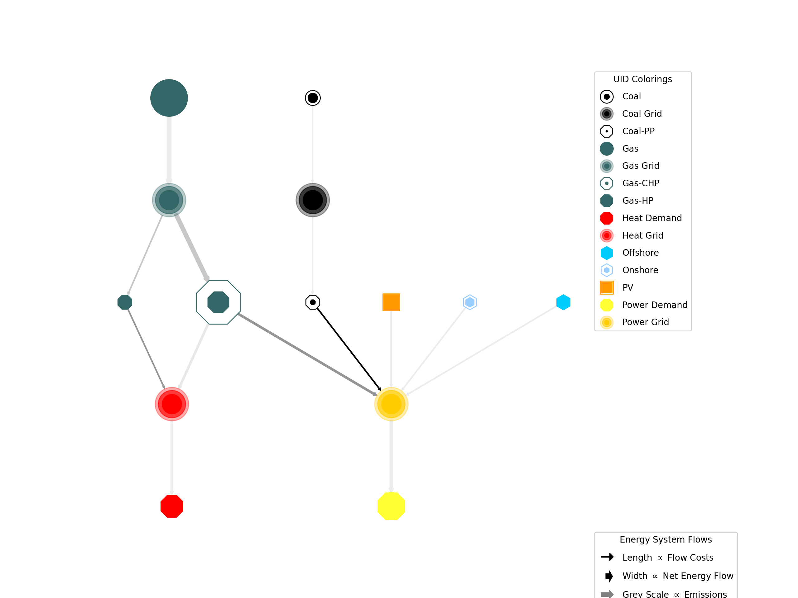

.. _DataExport:

***********
Data Export
***********

Exporting data from :mod:`tessif` is handled by the :mod:`~tessif.write`
module. It provides utilities for various different data formats. Following
sections provide detailed information on how to use them.

.. note::
   The current support of the various export capabilities can be
   gauged and expanded using the :mod:`tessif.write` module.

.. contents::
   :local:

Energy System Parameters
************************
Storing a parameterized energy system is usefull in between (potentially) long simulation runs.
Following sections show how to store an already parameterized energy system.

Binary Output
=============
Storing (intermediate) results in the form of an energy system object as binary is quick and simple.
The fact of binaries beeing hard to interprete for applications other than those they were defined for can be both an advantage as well as a disadvantage. Following sections provide overview and examples on how to store (and restore) different energy system objects as binaries.

Tessif
------
A parameterized energy system modeled using :mod:`tessif's model <tessif.model.energy_system>` can be stored as binary using it's :meth:`dump <tessif.model.energy_system.AbstractEnergySystem.dump>` function:

1. Using the :attr:`hardcoded fully parameterized example <tessif.examples.data.tsf.py_hard.create_fpwe>`

   >>> import tessif.examples.data.tsf.py_hard as tsf_examples
   >>> es = tsf_examples.create_fpwe()
   >>> print(es.uid)
   Fully_Parameterized_Working_Example
   >>> msg = es.dump()

2. Print out default storage location (relative to tessif's :attr:`root directory
   <tessif.frused.paths.root_dir>`):

   >>> import os
   >>> print("Stored Tessif Energy System to",
   ...       "tessif" + "/".join([*msg.split('tessif')[-1].split(os.path.sep)]))
   Stored Tessif Energy System to tessif/write/tsf/energy_system.tsf

3. Double check if file is present:
   
   >>> from tessif.frused.paths import write_dir
   >>> print(os.path.isfile(os.path.join(
   ...     write_dir, 'tsf', 'energy_system.tsf')))
   True

4. To reload data from the dumped energy system use it's :meth:`restore <tessif.model.energy_system.AbstractEnergySystem.restore>` function:

   >>> from tessif.model.energy_system import AbstractEnergySystem
   >>> restored_es = AbstractEnergySystem('restored energy system')
   >>> msg = restored_es.restore(directory=os.path.join(write_dir, 'tsf'),
   ...                     filename='energy_system.tsf')
   >>> print(restored_es.uid)
   Fully_Parameterized_Working_Example

Oemof
-----
A parameterized energy system modeled using `oemof
<https://oemof.readthedocs.io/en/v0.0.4/index.html>`_ can be stored as
binary using it's :meth:`dump <oemof.core.energy_system.EnergySystem.dump>` function:

1. Using :func:`tessif.examples.data.omg.py_hard.create_mwe` to quickly access
   an optimized oemof energy system (For a step by step explanation see
   :ref:`Models_Oemof_Examples_Mwe`):

   >>> import tessif.examples.data.omf.py_hard as omf_py
   >>> optimized_es = omf_py.create_mwe()

2. Stating a path where to dump the energy system:
   
   >>> from tessif.frused.paths import write_dir
   >>> msg = optimized_es.dump(dpath=os.path.join(write_dir, 'omf'),
   ...                  filename='oemof_data_export_example.oemof')
   >>> print(os.path.isfile(os.path.join(
   ...     write_dir, 'omf', 'oemof_data_export_example.oemof')))
   True

3. To reload data from the dumped energy system use it's :meth:`restore
   <tessif.model.energy_system.AbstractEnergySystem.restore>` function:

   >>> from oemof.solph import EnergySystem
   >>> restored_es = EnergySystem()
   >>> msg = restored_es.restore(dpath=os.path.join(write_dir, 'omf'),
   ...                     filename='oemof_data_export_example.oemof')
   >>> for e in restored_es.entities:
   ...     print(e.label.name)
   Power Line
   Demand
   Renewable
   CBET
   CBE
   Transformer

Numerical Results
*****************
Storing (result) data in the form of numerical results is useful for sharing information between
different machines but also between different softwares of the same machine. It also has some used
for information exchange between humans.

Following sections provide explanations and examples on how numerical data is intended to be exported using tessif.

Inside :mod:`tessif` every bulk of logically grouped data is realised as `mapping <https://en.wikipedia.org/wiki/Associative_array>`_. At the very core of each of these bulks of data is a :class:`pandas.DataFrame` (For more on tessif's data concept see: :ref:`SupportedDataFormats_Concept`).
These DataFrames are easily exported into any number of data formats. For a list of poossible ``writers`` as they are called in pandas see: `pandas IO tools
<https://pandas.pydata.org/pandas-docs/stable/user_guide/io.html>`_.

.. _DataExport_CSV:

csv
===
A common use case for numerical data export could like as follows:

1. Setting :attr:`spellings.get_from's <tessif.frused.spellings.get_from>`
   logging level to debug for decluttering doctest output:

   >>> from tessif.frused import configurations
   >>> configurations.spellings_logging_level = 'debug'

2. Perform simulation :

   >>> # used for reading in the data
   >>> from tessif.frused.paths import example_dir
   >>> import os

   >>> # used for  parsing the data
   >>> from tessif import parse
   >>> import functools

   >>> # used for simulation
   >>> import tessif.simulate as simulate
   >>> es = simulate.omf(
   ...     path=os.path.join(
   ...         example_dir, 'data', 'omf', 'xlsx', 'generic_storage.ods'),
   ...     parser=functools.partial(parse.xl_like, sheet_name=None,
   ...                              engine='odf'),
   ...     solver='glpk')

3. Logically group the result data by using the :mod:`~tessif.transform.es2mapping` subpackage:

   >>> # used for transforming the results into a convenience mapping
   >>> import tessif.transform.es2mapping.omf as transform_oemof
   
   >>> resultier = transform_oemof.LoadResultier(es)

4. Query arbitrary energy system components for their load data:

   >>> print(resultier.node_load['Power Grid'])
   Power Grid           Onshore  Power  Storage  Power Demand  Storage
   2016-01-01 00:00:00   -250.0   -0.0     -0.0         200.0     50.0
   2016-01-01 01:00:00   -250.0   -0.0     -0.0         200.0     50.0
   2016-01-01 02:00:00   -250.0   -0.0     -0.0         140.0    110.0
   2016-01-01 03:00:00   -250.0   -0.0     -0.0         200.0     50.0
   2016-01-01 04:00:00   -250.0   -0.0     -0.0         200.0     50.0

5. Figure out which path to store the csv file at:
   
   >>> from tessif.frused.paths import doc_dir
   >>> path_to_store_the_csv_file = os.path.join(
   ...     doc_dir, 'source', 'usage', 'csvs',
   ...     'csv_export_example.csv')

6. Export the data as csv:

   >>> resultier.node_load['Power Grid'].to_csv(path_to_store_the_csv_file)

7. Show the csv in this documentation:

   .. csv-table::
      :file: csvs/csv_export_example.csv
      :stub-columns: 1

Graphical Results
*****************
Storing (result) data in the form of images is most usefull for information exchange between humans.
Following section demonstrates how tessif's third party libraries can be used to store graphical resutls.

Static Images
=============
All static images are craeted using `matplotlib <https://matplotlib.org/>`_. For storing in image file
the `matplotlib.figure.Figure.savefig <https://matplotlib.org/3.2.2/api/_as_gen/matplotlib.figure.Figure.html#matplotlib.figure.Figure.savefig>`_ function can be used:

1. Setting :attr:`spellings.get_from's <tessif.frused.spellings.get_from>` logging level to debug for decluttering doctest output:

   >>> from tessif.frused import configurations
   >>> configurations.spellings_logging_level = 'debug'

2. Create an energy system using a :ref:`simulate wrapper <Simulating_Through_Tessif>`

   >>> # Used for reading the out the energy system data
   >>> from tessif.frused.paths import example_dir
   >>> import os

   >>> # Used for parsing the read-in data
   >>> from tessif import parse

   >>> # Used for simulating the energy system
   >>> from tessif import simulate
   
   >>> es = simulate.omf(
   ...     path=os.path.join(example_dir, 'data', 'omf',
   ...                       'xlsx', 'energy_system.xlsx'),
   ...     parser=parse.xl_like)

3. Transform the results into convenience mappings for post processing:

   >>> # Usef for transforming the results into an visual parameters
   >>> from tessif.transform.es2mapping import omf as transform_oemof
   >>> formatier = transform_oemof.AllFormatier(es, cgrp='all')
   
   >>> # Used for transforming results mapping into a graph
   >>> from tessif.transform import nxgrph as transform_to_nxgraph
   >>> grph = transform_to_nxgraph.Graph(
   ...     transform_oemof.FlowResultier(es))

4. Thicken up the edges a little for a nicer look:

   >>> for key, value in formatier.edge_data()['edge_width'].items():
   ...     formatier.edge_data()['edge_width'][key] = 4 * value

5. Draw the graph using matplotlib:

   >>> from tessif.visualize import nxgrph as visualize_nxgraph
   >>> visualize_nxgraph.draw_graphical_representation(
   ...     formatier=formatier, colored_by='name')

6. Get the current figure:
   
   >>> import matplotlib.pyplot as plt
   >>> f = plt.gcf()

7. Manipulate the size, so it fits your needs:
   
   >>> default_size = f.get_size_inches()
   >>> f.set_size_inches((default_size[0]*2, default_size[1]*2))

8. Figure out (pun intended) which path to store the image:
   
   >>> from tessif.frused.paths import doc_dir
   >>> path_to_store_the_image = os.path.join(
   ...     doc_dir, 'source', 'usage', 'images',
   ...     'static_image_export_example.png')
   
9. Save the figure:
   
   >>> f.savefig(path_to_store_the_image, dpi=200)

